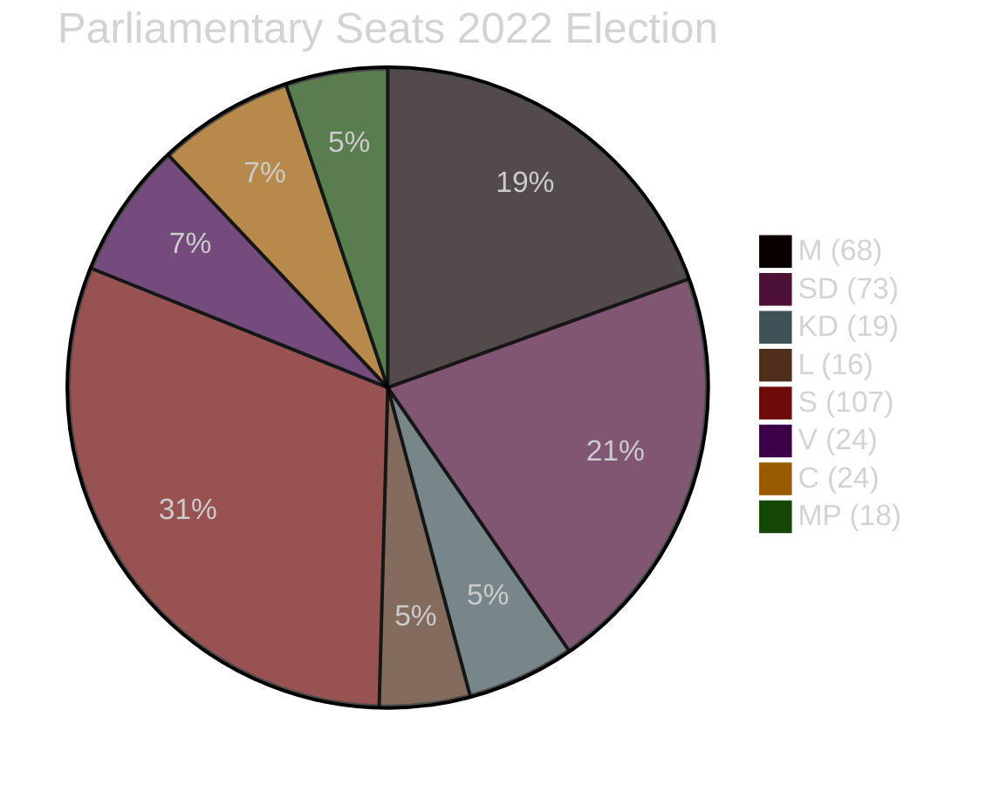

# Coalition Mathematics — Propositions 2026-05-05

**Author**: James Pether Sörling  
**Date**: 2026-05-05  

---

## Current Parliamentary Arithmetic (2025/26)

| Party | Seats (2022 election) | Bloc |
|-------|----------------------|------|
| Moderaterna (M) | 68 | Tidö (government) |
| Sverigedemokraterna (SD) | 73 | Tidö (support) |
| Kristdemokraterna (KD) | 19 | Tidö (government) |
| Liberalerna (L) | 16 | Tidö (government) |
| **Tidö majority total** | **176** | |
| — | — | — |
| Socialdemokraterna (S) | 107 | Opposition |
| Vänsterpartiet (V) | 24 | Opposition |
| Centerpartiet (C) | 24 | Opposition |
| Miljöpartiet (MP) | 18 | Opposition |
| **Opposition total** | **173** | |
| **Total seats** | **349** | |
| **Majority threshold** | **175** | |

**Government majority**: 176 seats (Tidö coalition). Majority is one seat above threshold without any cross-bloc support.

## HD03255 Passage Mathematics

For HD03255 to pass at kammarvotering 2026-06-15:

**Minimum required**: 175 aye votes  
**Expected Tidö bloc votes**: 176 (if full attendance and party discipline)  
**Risk factor**: Any Tidö member absence or defection could narrow margin

| Scenario | Aye votes | Outcome |
|----------|-----------|---------|
| Full Tidö bloc attendance | 176 | Passes (margin: 1) |
| 3 Tidö members absent, SD compensates | ~175 | Passes (margin: 0) |
| Cross-bloc support (S supportive) | 176–283 | Passes comfortably |
| Major Tidö defection (>2 members) | <175 | Fails |

**Assessment**: HD03255 passage is HIGHLY LIKELY given:
1. Routine, non-controversial financial regulation
2. Government majority holds for routine votes
3. S likely to provide tacit support (financial stability consensus)
4. No recorded dissent from any party

## Post-Election 2026 Coalition Scenarios Relevant to Implementation

If election produces government change (probability ~30–40% based on polling trends):

| Scenario | Impact on HD03255 post-passage |
|----------|-------------------------------|
| S-led government (S+C+MP) | Implementation proceeds — S supports |
| Tidö re-elected | Implementation proceeds as planned |
| Hung parliament | Implementation authority already enacted; FI proceeds |

**Conclusion**: The proposition will pass regardless of election outcome (vote precedes election). FI authority is durable across government changes.

