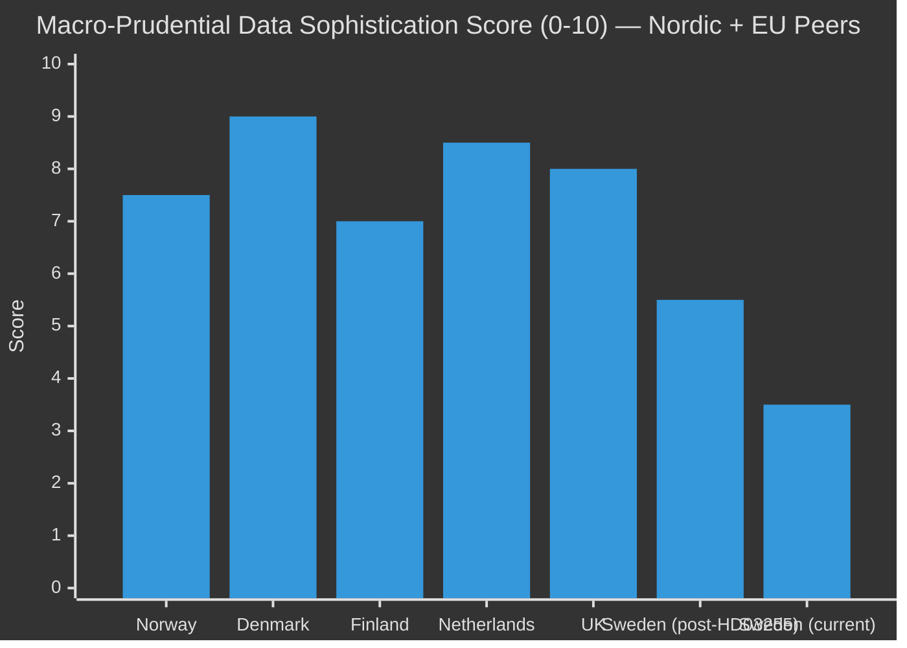

# Comparative International Analysis — Propositions 2026-05-05

**Author**: James Pether Sörling  
**Date**: 2026-05-05  

---

## Comparator Set

Sweden's proposed household debt sample-survey authority (HD03255) is assessed against comparable macro-prudential data frameworks in peer economies.

| Country | Instrument | Year | Scope | Outcome | Comparability |
|---------|-----------|------|-------|---------|---------------|
| **Norway** | Finanstilsynet sample surveys (established) | ~2015+ | Annual household debt/income from banks; linked administrative data | ESRB-compliant; strong LTI/DSTI calibration | HIGH — Nordic peer, similar banking structure |
| **Denmark** | Finanstilsynet (DK) + Statistics Denmark linkage | Established | Administrative data linkage for full-population household debt | Richer than sample approach; full census | HIGH — most advanced Nordic model |
| **Finland** | Finanssivalvonta (FIN-FSA) surveys | Established | Sample surveys of household finances; Statistics Finland | Survey + admin data combination | HIGH — Nordic peer |
| **Netherlands** | DNB (De Nederlandsche Bank) household surveys | Established | Detailed household financial survey (DHF) | Multi-year panel; gold standard in EU | MEDIUM — larger economy, more complex |
| **UK** | FCA Financial Lives Survey + PRA data | Established | Large-scale household financial resilience survey | Post-Brexit adaptation; ESRB decoupled | MEDIUM — non-EU; independent calibration |

### Key Findings

1. **Sweden is behind Nordic peers**: Norway, Denmark, and Finland all have established household debt data collection frameworks. Sweden's HD03255, if passed, fills a gap that Nordic peers filled 5–10 years ago.

2. **Sample survey is the right starting architecture**: Norway and Finland both began with sample approaches before moving to more comprehensive data. Denmark's full administrative linkage is a long-term evolution path for Sweden.

3. **Constitutional difference**: Sweden's RF 2:6 creates a more stringent constitutional privacy threshold than equivalent provisions in Denmark or Norway, explaining why Sweden requires a Lagrådet review for this specific instrument.

4. **ESRB gap-fill**: All ESRB member states are expected to have household debt monitoring data. Sweden's current gap is documented in FI and Riksbank FSR publications.

