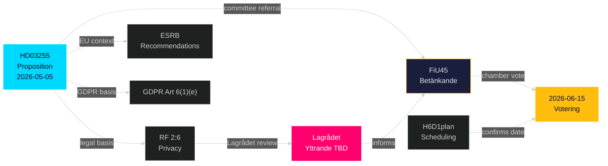

# Cross-Reference Map — Propositions 2026-05-05

**Author**: James Pether Sörling  
**Date**: 2026-05-05  

---

## Document Network

### Core Documents

| dok_id | Type | Title | Relation to HD03255 |
|--------|------|-------|---------------------|
| HD03255 | prop | Stickprovsinsamling av uppgifter om hushållens skulder | PRIMARY |
| H6D1FiU45 | bet | FiU45 betänkande (committee report) | Committee treatment of HD03255 |
| HDC120260615vo | voteFöredragningslista | Voteringsagenda 2026-06-15 | Chamber vote including FiU45 |
| H6D1plan | plan | FiU planeringsdokument 2025/26 | Scheduling context |

### Legislative Lineage

| Instrument | Reference | Description |
|-----------|-----------|-------------|
| Lag (198x:xx) FI-lagen | Prior statute | Finansinspektionen enabling act — HD03255 amends or supplements |
| RF 2:6 | Constitutional | Privacy protection — Lagrådet scrutiny basis |
| GDPR Art. 6(1)(e) | EU regulation | Lawful basis for personal data processing |
| ESRB Recommendations | EU soft law | Macro-prudential data gap context |

### Parliamentary History

| Phase | dok_id / Reference | Date | Status |
|-------|-------------------|------|--------|
| Proposition filed | HD03255 | 2026-05-05 | Filed |
| FiU committee referral | FiU | ~2026-05-07 | Pending |
| FiU45 betänkande | H6D1FiU45 | ~2026-06-05 | Pending |
| Kammarvotering | HDC120260615vo | 2026-06-15 | Scheduled |
| Lagrådet referral | (not found as of 2026-05-05) | TBD | Pending |

