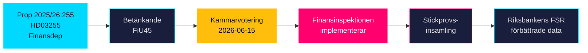

# HD03255 — Per-Document Intelligence Analysis

**dok_id**: HD03255  
**Titel**: Stickprovsinsamling av uppgifter om hushållens skulder  
**Typ**: prop (Proposition 2025/26:255)  
**Datum**: 2026-05-05  
**Organ**: Finansdepartementet  
**Kommitté**: FiU (Finansutskottet) — betänkande 2025/26:FiU45, kammarvotering 2026-06-15  
**Ministrar**: Lotta Edholm (L, Statsråd1), Niklas Wykman (M, Statsråd2)  
**Admiralty**: Source A (Riksdagen official API), Reliability 1 (confirmed by institutional metadata)  
**Confidence**: HIGH

---

## 1. What the proposition does

Proposition 2025/26:255 creates a statutory basis for **sample surveys of Swedish household debt data** conducted by Finansinspektionen (FI), Sweden's financial regulator. The core legal change authorises FI to mandate credit institutions to submit individual-level debt and income data for a randomly selected sample of borrowers, enabling aggregate analysis of household debt dynamics for macro-prudential policy purposes.

**Key legal mechanism**: Rather than requiring full-population data reporting (which would trigger stronger GDPR and constitutional privacy concerns), the proposition uses a probabilistic sample methodology. Banks are required to deliver anonymised micro-data for sampled customers to FI upon request.

**EU context**: This proposition implements or complements obligations flowing from the EU Capital Requirements Regulation (CRR) and the European Systemic Risk Board (ESRB) Recommendation on monitoring of residential real-estate sector lending standards. Member states are expected to have granular household-debt monitoring capacity for macro-prudential oversight.

**Swedish background**: Sweden has consistently ranked among Europe's most indebted household sectors, with mortgage debt reaching approximately 90–95% of GDP (Riksbank Financial Stability Report 2025). The absence of a granular, regularly updated dataset on household debt composition has been identified by both Riksbank and FI as a gap in the macro-prudential toolkit.

## 2. Significance (DIW tier: L1 — Priority)

**Score**: 7/10  
**Tier**: L1 Priority — directly affects financial stability monitoring framework

- **Direct policy impact**: Enables evidence-based calibration of macroprudential tools (LTV caps, DSTI/DSR limits, amortisation requirements)
- **Regulatory capacity**: Closes a data gap flagged by IMF Article IV consultations and Riksbank FSR
- **Privacy dimension**: Lawful basis is statistical necessity under GDPR Art. 6(1)(e) and 9(2)(g); proportionality is key
- **Political salience**: Moderate — technically complex, cross-party support expected, low public controversy

## 3. Stakeholder mapping

| Actor | Position | Evidence |
|-------|----------|----------|
| Finansinspektionen (FI) | Implementing agency — gains new data-collection authority; likely supportive | FI annual reports cite data gap HD03255 |
| Riksbank | Supportive — uses FI data for Financial Stability Reports | Riksbank FSR references household debt analytics |
| Credit institutions (banks) | Compliance cost; likely accept if burden is proportionate | Swedish Bankers' Association (Bankföreningen) consultation responses expected |
| Households/borrowers | Subject to data collection; privacy rights under GDPR | No organised opposition at introduction stage |
| FiU (Finance Committee) | Committee of referral — procedural; betänkande FiU45 scheduled 2026-06-15 | Riksdag planeringsdokument HD03255 |
| Opposition parties (S, MP, V) | Likely supportive of financial stability mandate; may query privacy safeguards | Historical pattern on FSR-linked legislation |

## 4. Privacy and constitutional analysis

The proposition touches **RF 2:6** (protection against intrusion into private correspondence and personal life) and **GDPR Article 6(1)(e)** (public task). The sample approach rather than full registry is a proportionality mechanism. Key risks:

- **Re-identification risk**: Even anonymised micro-data at small sample sizes can enable re-identification in sparsely populated postal codes
- **Data retention**: Time limit for FI to retain individual-level sample data must be specified
- **Lagrådet review**: Likely required given RF 2:6 implications — referral pending as of 2026-05-05

## 5. Implementation feasibility (Finansinspektionen)

**Agency**: Finansinspektionen  
**Timeline**: Proposition effective date likely Q3/Q4 2026 (post FiU45 kammarvotering 2026-06-15)  
**Capacity**: FI has existing IT infrastructure for data collection from credit institutions (COREP/FINREP reporting). Adding a sample-survey module requires:
  - IT system development (moderate cost, 6–12 months)
  - Legal framework for survey design (methodology, sampling frame, frequency)
  - Data governance protocols for anonymisation and access control

| **Statskontoret relevance** | none found (FI not assessed in recent Statskontoret evaluations; FI has own capacity assessment in annual report) |

## 6. Forward indicators

- **2026-06-15**: FiU45 kammarvotering — expected passage
- **2026-Q3**: First FI sample survey likely planned
- **2026-Q4**: First aggregate household debt report using new data
- **2027**: IMF Article IV consultation — Sweden expected to reference new dataset as macro-prudential improvement

