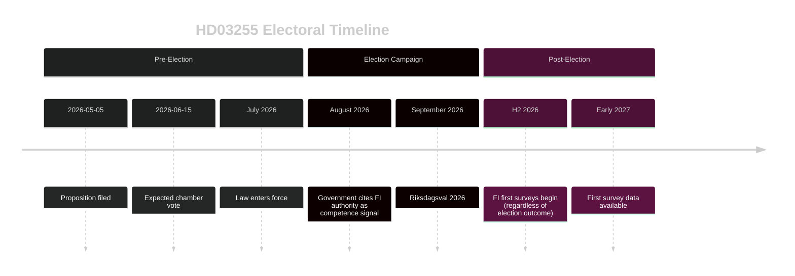

# Election 2026 Analysis — Propositions 2026-05-05

**Author**: James Pether Sörling  
**Date**: 2026-05-05  

---

## Electoral Salience Assessment

**HD03255** is a technical financial regulation proposition with LOW direct electoral salience. However, it has MEDIUM indirect relevance to the 2026 electoral competition through the following channels:

### Competence Signalling

The Tidö coalition (M+L+KD+SD) is competing on economic governance competence. Propositions like HD03255 — technical, internationally benchmarked, EU-compliant — form part of the government's track record narrative: *"responsible stewardship of financial stability"*.

**Electoral relevance**: LOW as a standalone issue; MEDIUM as part of a competence portfolio story.

### Privacy/Data Sovereignty as a Campaign Wedge

SD (Sverigedemokraterna) has periodically raised privacy and state-data concerns as a voter-mobilisation theme. HD03255 could be referenced by SD internal critics as an example of "big government data collection" if opposition narrative solidifies.

**Probability of HD03255 becoming a privacy campaign issue**: VERY LOW (5%)  
**Evidence**: No SD public statements opposing HD03255 detected; SD supports financial stability measures generally.

### Timeline Alignment

- **Proposition filed**: 2026-05-05 (4+ months before election)
- **Expected vote**: 2026-06-15 (chamber vote)
- **Expected FI first survey**: H2 2026 (post-election or concurrent)
- **Election**: September 2026

The timing means HD03255 will be *law* before the election — a competence signal. But FI survey data will not yet be public. The *announcement* is the electoral asset, not the *data*.

### Party Position Assessment

| Party | HD03255 Position | Electoral Incentive |
|-------|-----------------|---------------------|
| M | Supportive (proposing) | Competence signal |
| L | Supportive (proposing) | Liberal financial governance |
| KD | Supportive | Coalition solidarity |
| SD | Likely supportive (financial stability) | Avoid isolating image |
| S | Supportive with privacy scrutiny | Responsible opposition |
| C | Likely supportive | Liberal financial markets |
| V | Cautious (privacy concerns possible) | Voter base on civil liberties |
| MP | Supportive (EU alignment) | Green + EU pro-governance |
