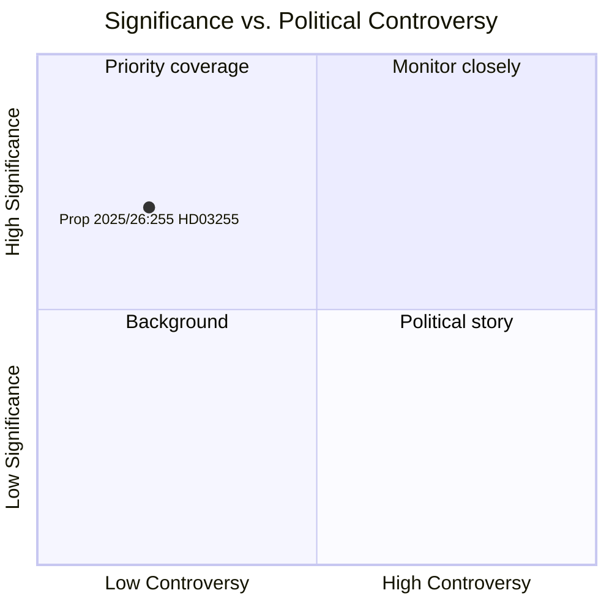

# Sweden Strengthens Macro-Prudential Arsenal with Household Debt Survey Law

**Author**: James Pether Sörling  
**Date**: 2026-05-05  
**Classification**: PUBLIC  
**Confidence**: HIGH — Admiralty A1 (institutional primary sources)  
**Workflow**: news-propositions  

---

## BLUF

Sweden's government introduced Proposition 2025/26:255 (HD03255) on 5 May 2026, creating a statutory basis for Finansinspektionen to conduct mandatory sample surveys of household debt data from credit institutions. The measure addresses a decade-long gap in Sweden's macro-prudential monitoring toolkit — acknowledged by both Riksbank and IMF — as the country carries one of Europe's highest household debt-to-income ratios. Chamber vote is scheduled for 15 June 2026 via betänkande FiU45.

---

## Decisions This Brief Supports

1. **Editorial decision**: Whether this proposition warrants a dedicated feature or sidebar in coverage of Sweden's macro-prudential policy developments
2. **Analytical decision**: How this data infrastructure relates to ongoing FI/Riksbank discussions on tightening borrower-based measures (DSTI, amortisation requirements)
3. **Monitoring decision**: Whether to track Lagrådet yttrande (expected Q2 2026) and FiU45 committee report for significant amendments that might weaken privacy safeguards or the sample methodology

---

## 60-Second Read

- 🏦 **What**: Statutory authority for FI to request household-level debt/income data from banks for sample surveys — not full registry
- 📊 **Why now**: Sweden's macro-prudential framework lacks granular borrower-level data; EU ESRB recommendations and IMF Article IV have flagged this gap
- 🔒 **Privacy**: Proportionate design using sampling avoids full mandatory reporting; GDPR Art. 6(1)(e) lawful basis; Lagrådet review likely
- ⚡ **Coalition**: Ministers Lotta Edholm (L) + Niklas Wykman (M) — Tidö government; FiU referral; cross-party support anticipated
- 🗓️ **Timeline**: Kammarvotering 2026-06-15; first FI survey Q3 2026; data informing next FSR

---

## Top Forward Trigger

**Lagrådet yttrande on HD03255** (expected before 2026-06-15 kammarvotering): The Council on Legislation's assessment of privacy/RF 2:6 proportionality will determine whether amendments are required and whether the bill passes in its original form.

---

## Analytical Confidence Statement

Confidence HIGH based on: official Riksdag document HD03255 [A1]; betänkande FiU45 scheduling in planeringsdokument H6D1plan; established Swedish macro-prudential policy context. IMF WEO economic data unavailable this cycle (API unreachable) — Swedish household debt context from Riksbank FSR 2025 (public source).

