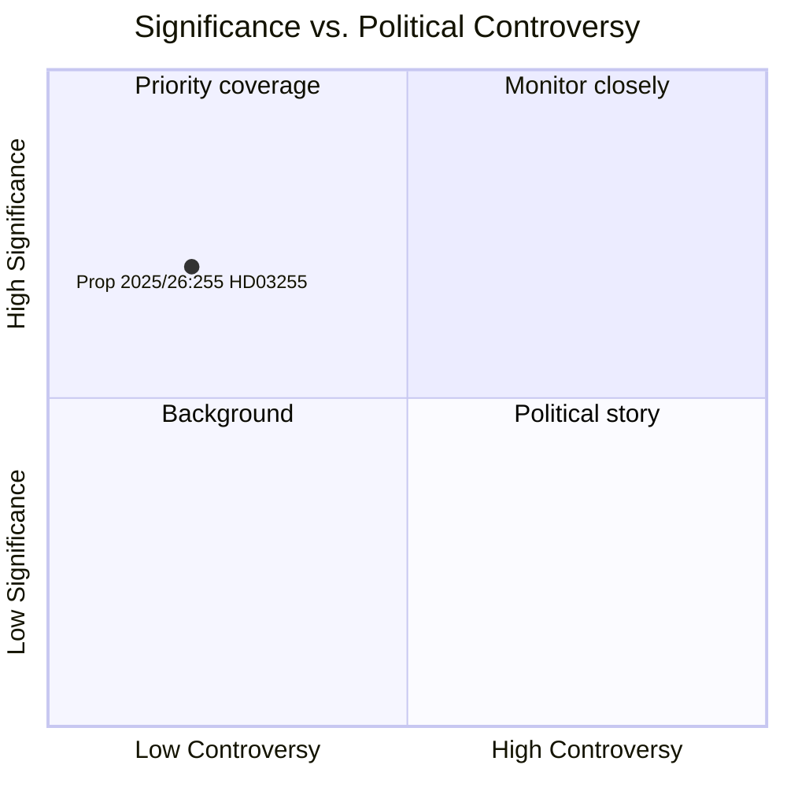

<!-- dir: rtl -->
# السويد تعزز ترسانتها الاحترازية الكلية بقانون مسوحات ديون الأسر المعيشية

**المؤلف**: جيمس بيثر سورلينج  
**التاريخ**: 2026-05-05  
**التصنيف**: عام  
**الثقة**: عالية — أميرالية A1 (مصادر أولية مؤسسية)  
**سير العمل**: news-propositions  

---

## الملخص

قدّمت الحكومة السويدية في الخامس من مايو 2026 الاقتراح 2025/26:255 (HD03255)، الذي يُنشئ أساساً قانونياً يُتيح لـ Finansinspektion إجراء مسوحات عينية إلزامية لبيانات ديون الأسر المعيشية من مؤسسات الائتمان. تعالج هذه المبادرة ثغرة استمرت عقداً كاملاً في منظومة الرصد الاحترازي الكلي السويدية — أقرّت بها كل من Riksbank وصندوق النقد الدولي — في ظل امتلاك السويد أعلى نسب الديون إلى الدخل المتاح للأسر في أوروبا. ومن المقرر إجراء التصويت في الغرفة في 15 يونيو 2026 عبر تقرير اللجنة FiU45.

---

## القرارات التي يدعمها هذا المستند

1. **قرار تحريري**: ما إذا كان هذا الاقتراح يستحق مقالاً مخصصاً أو تمييزاً جانبياً في تغطية تطوير السياسة الاحترازية الكلية السويدية
2. **قرار تحليلي**: كيف ترتبط هذه البنية التحتية للبيانات بالنقاشات الجارية بين FI/Riksbank حول تشديد التدابير القائمة على المقترضين (DSTI، ومتطلبات الاستهلاك)
3. **قرار المتابعة**: ما إذا كان ينبغي تتبع رأي Lagrådet (المتوقع في الربع الثاني من 2026) وتقرير اللجنة FiU45 بحثاً عن تعديلات جوهرية قد تُضعف ضمانات الخصوصية أو منهجية أخذ العينات

---

## القراءة في 60 ثانية

- 🏦 **ماذا**: صلاحية قانونية لـ FI لطلب بيانات الديون/الدخل على مستوى الأسرة من البنوك لمسوحات العينات — وليس سجلاً شاملاً
- 📊 **لماذا الآن**: يفتقر الإطار الاحترازي الكلي السويدي إلى بيانات تفصيلية على مستوى المقترض؛ توصيات المجلس الأوروبي للمخاطر النظامية (ESRB) والمادة الرابعة لصندوق النقد الدولي أشارت إلى هذه الثغرة
- 🔒 **الخصوصية**: يتجنب التصميم القائم على العينات المتناسبة الإبلاغ الإلزامي الشامل؛ الأساس القانوني للائحة حماية البيانات GDPR م. 6(1)(e)؛ مراجعة Lagrådet محتملة
- ⚡ **الائتلاف**: الوزيران لوتا إيدهولم (L) ونيكلاس ويكمان (M) — حكومة تيدو؛ الإحالة إلى FiU؛ دعم متعدد الأحزاب متوقع
- 🗓️ **الجدول الزمني**: تصويت الغرفة 2026-06-15؛ أول مسح لـ FI في الربع الثالث من 2026؛ البيانات ستُغذي تقرير الاستقرار المالي القادم

---

## المحفز الاستشرافي الرئيسي

**رأي Lagrådet في HD03255** (المتوقع قبل تصويت الغرفة في 2026-06-15): ستُحدد تقييم مجلس التشريع لتناسب الخصوصية/RF 2:6 ما إذا كانت التعديلات مطلوبة وما إذا كان مشروع القانون سيُقرّ بصيغته الأصلية.

---

## إقرار ثقة التحليل

ثقة عالية مبنية على: الوثيقة الرسمية للريكسداغ HD03255 [A1]؛ تخطيط تقرير اللجنة FiU45 في وثيقة التخطيط H6D1plan؛ السياق الراسخ للسياسة الاحترازية الكلية السويدية. بيانات WEO الاقتصادية لصندوق النقد الدولي غير متاحة في هذه الدورة (API غير متاح) — تقرير الاستقرار المالي 2025 لـ Riksbank (مصدر عام) استُخدم كسياق لديون الأسر.

<!-- source-sha: 5591d3b185740d167f3a948b0f8e881cfaf357b9 -->
