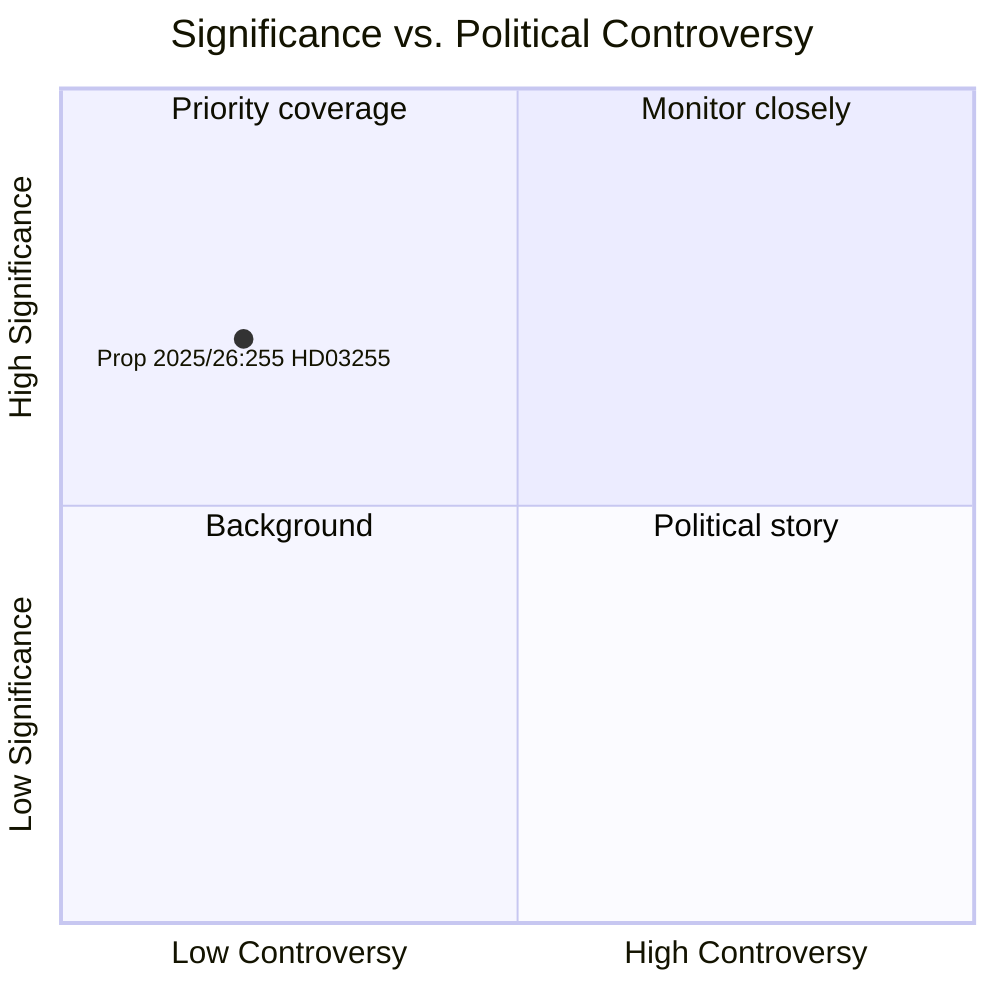

# Sverige styrker sit makroprudentielle arsenal med lov om husholdningsgældsundersøgelse

**Author**: James Pether Sörling  
**Date**: 2026-05-05  
**Classification**: PUBLIC  
**Confidence**: HIGH — Admiralty A1 (institutionelle primærkilder)  
**Workflow**: news-propositions  

---

## Resumé

Sveriges regering fremsatte den 5. maj 2026 Proposition 2025/26:255 (HD03255), der skaber et lovbestemt grundlag for Finansinspektionen til at gennemføre obligatoriske stikprøveundersøgelser af husholdningsgældsdata fra kreditinstitutter. Foranstaltningen adresserer et årti-langt hul i Sveriges makroprudentielle overvågningsværktøj — anerkendt af både Riksbank og IMF — da landet bærer en af Europas højeste husholdningsgæld-til-indkomst-kvoter. Kammervotering er planlagt til den 15. juni 2026 via betænkning FiU45.

---

## Beslutninger dette dokument understøtter

1. **Redaktionel beslutning**: Hvorvidt denne proposition berettiger en dedikeret artikel eller sidestykke i dækningen af Sveriges makroprudentielle politikudvikling
2. **Analytisk beslutning**: Hvordan denne datainfrastruktur relaterer til igangværende FI/Riksbank-diskussioner om at stramme låntagerbaserede foranstaltninger (DSTI, afdragskrav)
3. **Overvågningsbeslutning**: Hvorvidt man skal følge Lagrådet-udtalelsen (forventet Q2 2026) og FiU45-udvalgsrapporten for væsentlige ændringer, der kan svække privatlivsbeskyttelse eller stikprøvemetodologi

---

## 60-sekunders læsning

- 🏦 **Hvad**: Lovbestemt bemyndigelse for FI til at anmode om husholdningsniveau gælds/indkomstdata fra banker til stikprøveundersøgelser — ikke fuldt register
- 📊 **Hvorfor nu**: Sveriges makroprudentielle ramme mangler granulære data på låntagerniveau; EU ESRB-anbefalinger og IMF Artikel IV har markeret dette hul
- 🔒 **Privatliv**: Proportionel udformning med stikprøver undgår fuld obligatorisk rapportering; GDPR art. 6(1)(e) retsgrundlag; Lagrådet-gennemgang sandsynlig
- ⚡ **Koalition**: Ministrene Lotta Edholm (L) + Niklas Wykman (M) — Tidö-regeringen; FiU-høring; tværpolitisk støtte forventet
- 🗓️ **Tidslinje**: Kammervotering 2026-06-15; første FI-undersøgelse Q3 2026; data der informerer næste FSR

---

## Vigtigste fremadskuende udløser

**Lagrådet-udtalelse om HD03255** (forventet inden kammervoteringen 2026-06-15): Lovgivningsrådets vurdering af privatliv/RF 2:6-proportionalitet vil afgøre, om ændringer er nødvendige, og om lovforslaget vedtages i sin ursprunglige form.

---

## Analytisk konfidensredegørelse

Konfidens HØJ baseret på: officielt Riksdag-dokument HD03255 [A1]; betænkning FiU45-planlægning i planlægningsdokument H6D1plan; etableret svensk makroprudentiel politisk kontekst. IMF WEO-data ikke tilgængelige denne cyklus (API utilgængeligt) — Riksbankens FSR 2025 (offentlig kilde) anvendes til husholdningsgælds-kontekst.

<!-- source-sha: 5591d3b185740d167f3a948b0f8e881cfaf357b9 -->
