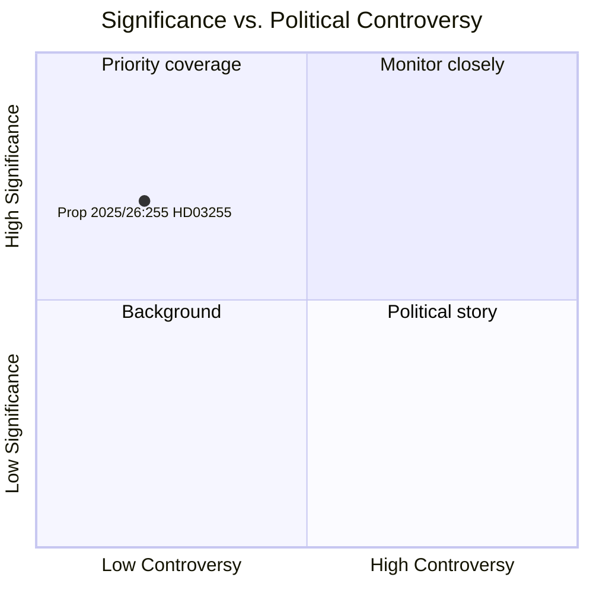

# Suecia refuerza su arsenal macroprudencial con la ley de encuestas de deuda de hogares

**Author**: James Pether Sörling  
**Date**: 2026-05-05  
**Classification**: PUBLIC  
**Confidence**: HIGH — Admiralty A1 (fuentes primarias institucionales)  
**Workflow**: news-propositions  

---

## Resumen

El gobierno sueco presentó el 5 de mayo de 2026 la Proposición 2025/26:255 (HD03255), que crea una base legal para que la Finansinspektion realice encuestas muestrales obligatorias sobre datos de deuda de hogares de entidades de crédito. La medida aborda una brecha de una década en el conjunto de herramientas de seguimiento macroprudencial de Suecia —reconocida por el Riksbank y el FMI— ya que el país tiene una de las ratios de deuda de hogares en relación con la renta disponible más altas de Europa. La votación en el Parlamento está prevista para el 15 de junio de 2026 a través del dictamen de la comisión FiU45.

---

## Decisiones que apoya este documento

1. **Decisión editorial**: Si esta proposición justifica un artículo dedicado o un recuadro en la cobertura del desarrollo de la política macroprudencial de Suecia
2. **Decisión analítica**: Cómo esta infraestructura de datos se relaciona con las discusiones en curso entre FI/Riksbank sobre el endurecimiento de las medidas basadas en el prestatario (DSTI, requisitos de amortización)
3. **Decisión de seguimiento**: Si seguir el dictamen del Lagrådet (esperado Q2 2026) y el informe de la comisión FiU45 en busca de enmiendas significativas que puedan debilitar las salvaguardas de privacidad o la metodología de muestreo

---

## Lectura en 60 segundos

- 🏦 **Qué**: Autoridad legal para que FI solicite datos de deuda/renta a nivel de hogar a los bancos para encuestas muestrales —no un registro completo
- 📊 **Por qué ahora**: El marco macroprudencial sueco carece de datos granulares a nivel de prestatario; las recomendaciones de la JERS de la UE y el Artículo IV del FMI han señalado esta brecha
- 🔒 **Privacidad**: El diseño proporcional mediante muestreo evita la notificación obligatoria completa; base jurídica del RGPD art. 6(1)(e); revisión probable del Lagrådet
- ⚡ **Coalición**: Ministros Lotta Edholm (L) + Niklas Wykman (M) —gobierno Tidö; remisión a FiU; apoyo transpartidista esperado
- 🗓️ **Cronograma**: Votación en el Parlamento 2026-06-15; primera encuesta de FI Q3 2026; datos que informan el próximo FSR

---

## Principal detonante prospectivo

**Dictamen del Lagrådet sobre HD03255** (esperado antes de la votación parlamentaria del 2026-06-15): La evaluación del Consejo de Legislación sobre la proporcionalidad privacidad/RF 2:6 determinará si se requieren enmiendas y si el proyecto de ley se aprueba en su forma original.

---

## Declaración de confianza analítica

Confianza ALTA basada en: documento oficial del Riksdag HD03255 [A1]; planificación del dictamen FiU45 en el documento de planificación H6D1plan; contexto macroprudencial sueco establecido. Datos económicos del WEO del FMI no disponibles en este ciclo (API inaccesible) —FSR 2025 del Riksbank (fuente pública) utilizado para el contexto de deuda de hogares.

<!-- source-sha: 5591d3b185740d167f3a948b0f8e881cfaf357b9 -->
