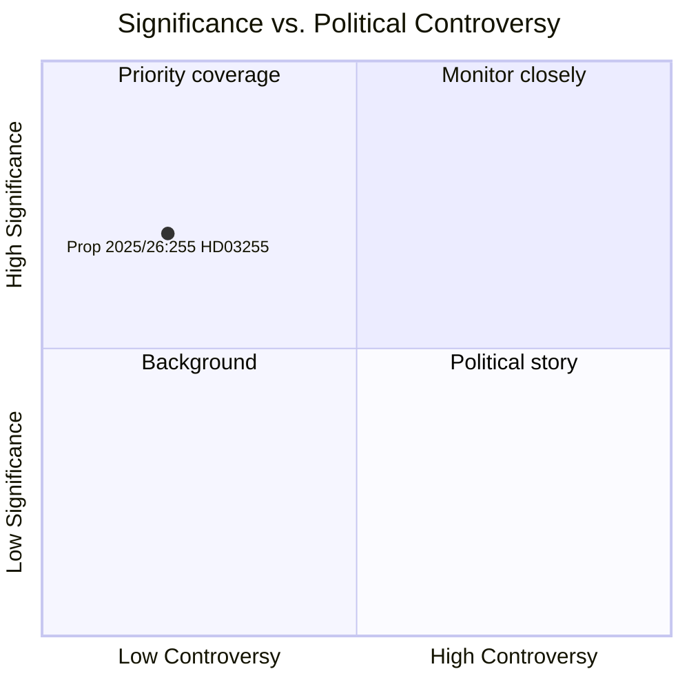

<!-- dir: rtl -->
# שוודיה מחזקת את ארסנל האמצעים הפרודנציאלי-מאקרו שלה עם חוק סקרי חובות משקי הבית

**מחבר**: ג'יימס פת'ר סורלינג  
**תאריך**: 2026-05-05  
**סיווג**: ציבורי  
**ביטחון**: גבוה — אדמירליות A1 (מקורות ראשוניים מוסדיים)  
**תהליך עבודה**: news-propositions  

---

## תקציר

הממשלה השוודית הגישה ב-5 במאי 2026 את הצעת החוק 2025/26:255 (HD03255), היוצרת בסיס חוקי ל-Finansinspektion לקיים סקרי דגימה חובה של נתוני חובות משקי בית ממוסדות אשראי. הצעד מטפל בפערת עשור בארסנל הניטור הפרודנציאלי-מאקרו של שוודיה — שהוכרה על ידי ה-Riksbank וקרן המטבע הבינלאומית — כאשר המדינה נושאת אחת מיחסות החוב הגבוהות ביותר להכנסה פנויה של משקי בית באירופה. הצבעת הכנסת מתוכננת ל-15 ביוני 2026 באמצעות דוח ועדת FiU45.

---

## החלטות שמסמך זה תומך בהן

1. **החלטה עריכתית**: האם הצעה זו מצדיקה מאמר ייעודי או תיבה בסיקור פיתוח המדיניות הפרודנציאלית-מאקרו של שוודיה
2. **החלטה אנליטית**: כיצד תשתית הנתונים הזאת קשורה לדיוני ה-FI/Riksbank השוטפים על הידוק אמצעים מבוססי לווים (DSTI, דרישות פירעון)
3. **החלטת מעקב**: האם לעקוב אחרי חוות דעת ה-Lagrådet (צפויה ברבעון 2 2026) ודוח ועדת FiU45 לאיתור תיקונים משמעותיים שעשויים להחליש אמצעי הגנת פרטיות או מתודולוגיית דגימה

---

## קריאה של 60 שניות

- 🏦 **מה**: סמכות חוקית ל-FI לבקש מהבנקים נתוני חוב/הכנסה ברמת משק הבית לסקרי דגימה — לא רגיסטר מלא
- 📊 **למה עכשיו**: המסגרת הפרודנציאלית-מאקרו של שוודיה חסרה נתונים גרנולריים ברמת הלווה; המלצות ה-ESRB של האיחוד האירופי וסעיף IV של קרן המטבע הבינלאומית סימנו פער זה
- 🔒 **פרטיות**: עיצוב דגימה פרופורציונלי מונע דיווח חובה מקיף; בסיס משפטי GDPR סעיף 6(1)(e); בדיקת Lagrådet צפויה
- ⚡ **קואליציה**: שרים לוטה אדהולם (L) + ניקלאס ויקמן (M) — ממשלת Tidö; הפניה ל-FiU; תמיכה חוצת-מפלגות צפויה
- 🗓️ **לוח זמנים**: הצבעת כנסת 2026-06-15; סקר ה-FI הראשון ברבעון 3 2026; נתונים מחזקים את ה-FSR הבא

---

## הטריגר העתידי העיקרי

**חוות דעת Lagrådet על HD03255** (צפויה לפני הצבעת הכנסת ב-2026-06-15): הערכת מועצת החקיקה לגבי פרטיות/RF 2:6 מידתיות תקבע האם נדרשים תיקונים והאם ייחקק הצעת החוק בצורתה המקורית.

---

## הצהרת אמינות אנליטית

ביטחון גבוה מבוסס על: מסמך Riksdag רשמי HD03255 [A1]; תכנון דוח ועדת FiU45 במסמך תכנון H6D1plan; הקשר מדיניות פרודנציאלית-מאקרו שוודי מבוסס. נתוני IMF WEO כלכליים אינם זמינים במחזור זה (API לא נגיש) — FSR 2025 של Riksbank (מקור ציבורי) שימש להקשר חובות משקי בית.

<!-- source-sha: 5591d3b185740d167f3a948b0f8e881cfaf357b9 -->
