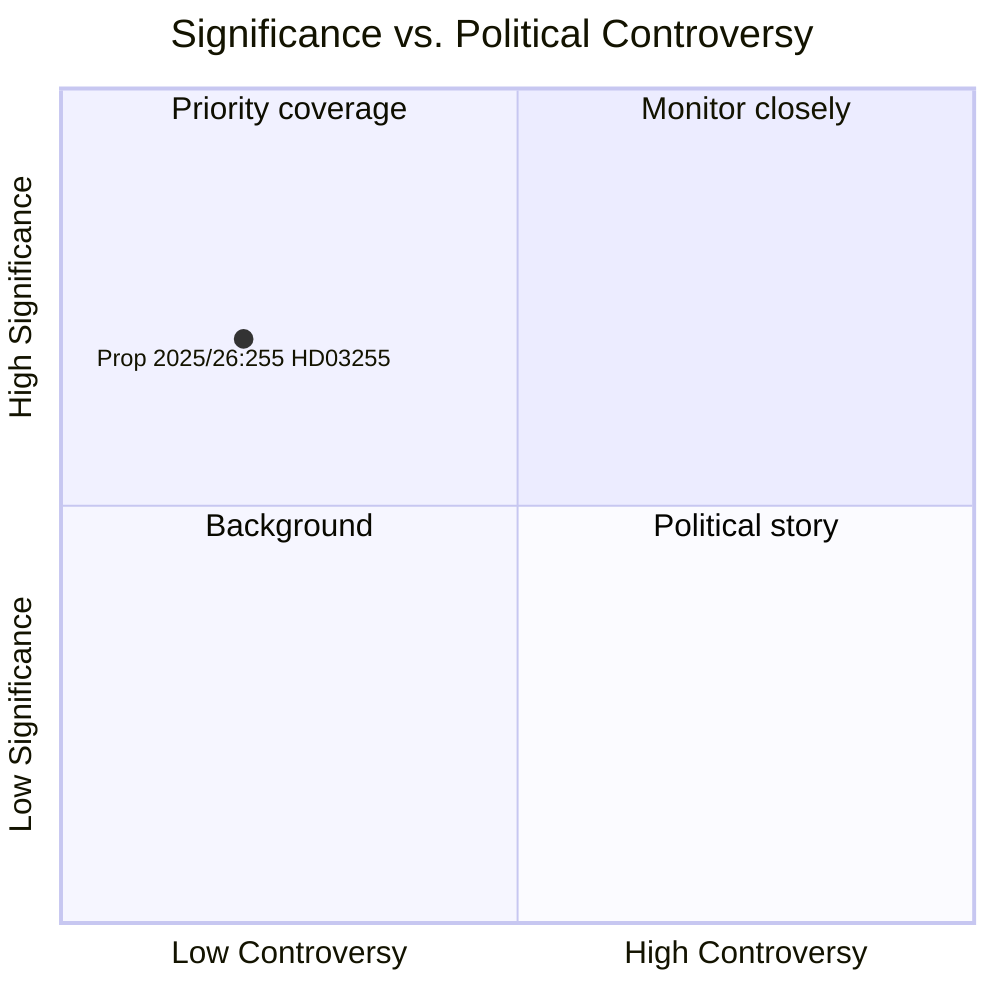

# スウェーデン、家計負債調査法でマクロプルーデンシャル政策の強化を図る

**著者**: ジェームス・ペター・ソーリング  
**日付**: 2026-05-05  
**分類**: 公開  
**信頼度**: 高 — アドミラルティA1（機関一次資料）  
**ワークフロー**: news-propositions  

---

## 概要

スウェーデン政府は2026年5月5日、提案2025/26:255（HD03255）を提出した。本提案は、Finansinspektionが金融機関から家計負債データのサンプル調査を義務的に実施するための法的根拠を創設するものである。この措置は、スウェーデンのマクロプルーデンシャル・モニタリング体制における10年来の空白を埋めるものであり、リクスバンクとIMFの双方が認識していた課題に対応する。スウェーデンは欧州で最も高い家計債務対可処分所得比率の一つを抱えている。議会での採決は、委員会報告FiU45を通じて2026年6月15日に予定されている。

---

## 本文書が支援する意思決定

1. **編集上の決定**: 本提案がスウェーデンのマクロプルーデンシャル政策の動向に関する専用記事やサイドバーに値するか否か
2. **分析上の決定**: このデータ基盤が、借り手ベースの措置（DSTI、償還要件）の強化に関するFI/リクスバンクの現在進行中の議論とどのように関連するか
3. **モニタリング上の決定**: ラーグローデット意見書（2026年第2四半期に予定）とFiU45委員会報告書を追跡し、プライバシー保護やサンプリング手法を弱体化させる可能性のある重大な修正を確認するべきか否か

---

## 60秒で読む

- 🏦 **内容**: FIが完全な登録制度ではなくサンプル調査のため、銀行から家計単位の負債・所得データを要求する法的権限
- 📊 **今なぜ**: スウェーデンのマクロプルーデンシャル枠組みは借り手レベルの詳細データを欠いており、EU ESRB勧告とIMF第4条協議がこの空白を指摘していた
- 🔒 **プライバシー**: 比例的なサンプリング設計により全面的な義務的報告を回避；GDPR第6条(1)(e)法的根拠；ラーグローデットによる審査が見込まれる
- ⚡ **連立**: ロッタ・エドホルム（L）+ニクラス・ウィクマン（M）両大臣 — ティドー政権；FiU委員会付託；超党派的支持が予想される
- 🗓️ **スケジュール**: 議会採決 2026-06-15；FI初回調査 2026年第3四半期；次期FSRへのデータ提供

---

## 主要な将来的トリガー

**HD03255に関するラーグローデット意見書**（2026-06-15の議会採決前に予定）：立法評議会によるプライバシー/RF 2:6の比例性評価が、修正が必要かどうか、および法案が原形のまま可決されるかどうかを決定する。

---

## 分析的確信の表明

高い信頼度。根拠：公式リクスダーグ文書HD03255 [A1]；計画文書H6D1planにおけるFiU45委員会報告計画；確立されたスウェーデンのマクロプルーデンシャル政策文脈。IMF WEO経済データは本サイクルでは利用不可（API到達不可）—家計負債文脈にはリクスバンクFSR 2025（公開資料）を使用。

<!-- source-sha: 5591d3b185740d167f3a948b0f8e881cfaf357b9 -->
