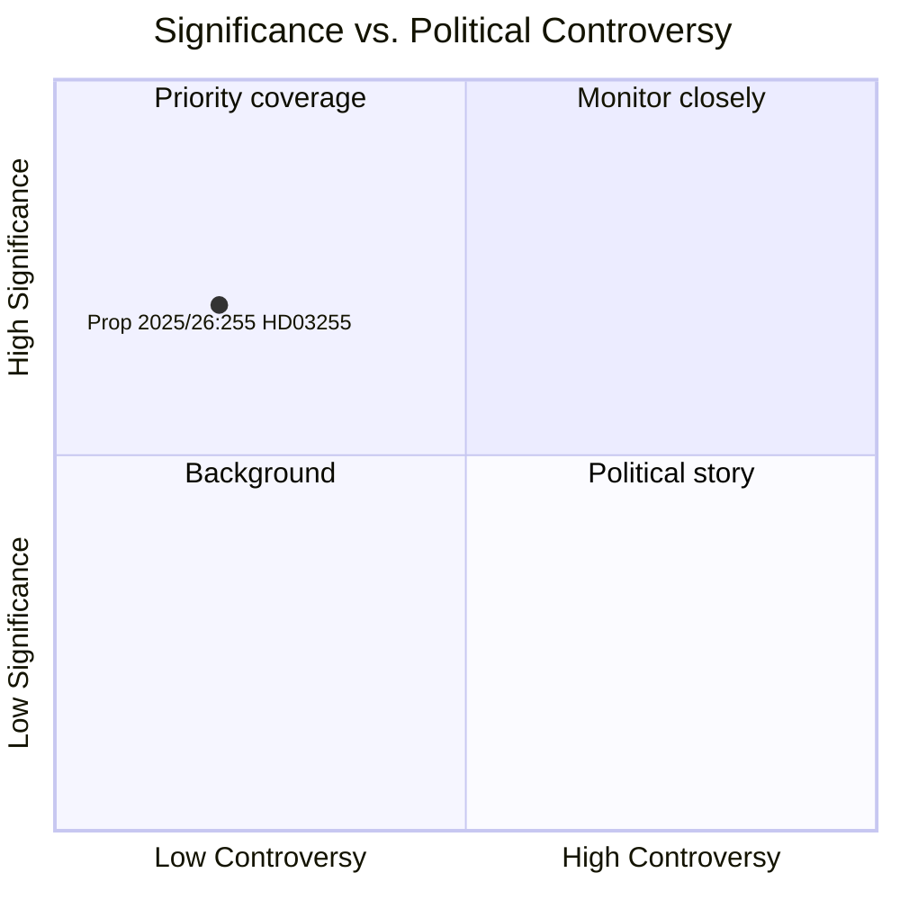

# 스웨덴, 가계부채 조사법으로 거시건전성 정책 도구 강화

**저자**: 제임스 페터 소링  
**날짜**: 2026-05-05  
**분류**: 공개  
**신뢰도**: 높음 — 어드미럴티 A1 (기관 1차 자료)  
**워크플로**: news-propositions  

---

## 요약

스웨덴 정부는 2026년 5월 5일 제안 2025/26:255 (HD03255)를 제출했다. 이 제안은 Finansinspektion이 신용기관으로부터 가계부채 데이터에 대한 의무적 표본조사를 실시할 수 있는 법적 근거를 만든다. 이 조치는 스웨덴의 거시건전성 모니터링 체계에서 10년간 존재해온 공백을 해소하는 것으로, 릭스방크와 IMF 모두가 인정한 과제이다. 스웨덴은 유럽에서 가장 높은 가계 부채-가처분소득 비율 중 하나를 보유하고 있다. 의회 표결은 위원회 보고서 FiU45를 통해 2026년 6월 15일로 예정되어 있다.

---

## 본 문서가 지원하는 의사결정

1. **편집 결정**: 이 제안이 스웨덴의 거시건전성 정책 발전 관련 전용 기사나 사이드바에 값하는지 여부
2. **분석 결정**: 이 데이터 인프라가 차입자 기반 조치(DSTI, 상환 요건) 강화에 관한 FI/릭스방크의 진행 중인 논의와 어떻게 연관되는지
3. **모니터링 결정**: 라그로데트 의견서(2026년 2분기 예상)와 FiU45 위원회 보고서를 추적하여 개인정보 보호장치나 표본추출 방법론을 약화시킬 수 있는 중대한 수정안 여부 확인 필요성

---

## 60초 요약

- 🏦 **내용**: FI가 완전한 레지스터가 아닌 표본조사를 위해 은행으로부터 가계단위 부채/소득 데이터를 요청할 수 있는 법적 권한
- 📊 **지금 왜**: 스웨덴 거시건전성 체계는 차입자 수준의 세부 데이터가 부족했으며, EU ESRB 권고사항과 IMF 4조 협의가 이 공백을 지적했음
- 🔒 **개인정보**: 비례적 표본 설계로 전면 의무 보고 회피; GDPR 6조(1)(e) 법적 근거; 라그로데트 심사 예상
- ⚡ **연립**: 롯타 에드홀름(L) + 니클라스 비크만(M) 장관 — 티도 정부; FiU 회부; 초당적 지지 예상
- 🗓️ **일정**: 의회 표결 2026-06-15; FI 첫 조사 2026년 3분기; 차기 FSR 데이터 반영

---

## 주요 선행 트리거

**HD03255에 대한 라그로데트 의견서** (2026-06-15 의회 표결 전 예상): 입법 평의회의 개인정보/RF 2:6 비례성 평가가 수정안 필요 여부와 법안의 원안 통과 여부를 결정한다.

---

## 분석 신뢰도 선언

높은 신뢰도. 근거: 공식 릭스다그 문서 HD03255 [A1]; 계획 문서 H6D1plan의 FiU45 위원회 보고서 계획; 확립된 스웨덴 거시건전성 정책 맥락. IMF WEO 경제 데이터는 이번 주기 미이용 가능(API 접속 불가) — 가계부채 맥락으로 릭스방크 FSR 2025(공개 자료) 사용.

<!-- source-sha: 5591d3b185740d167f3a948b0f8e881cfaf357b9 -->
