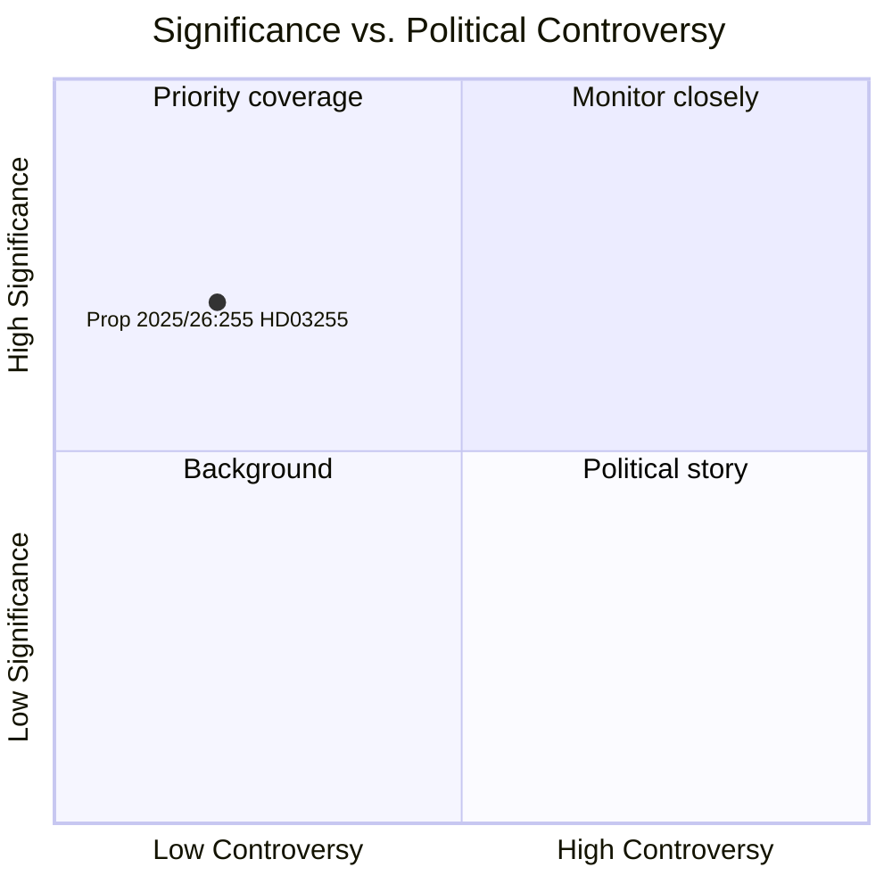

# Zweden versterkt zijn macroprudentieel arsenaal met de wet op huishoudensschuldonderzoek

**Author**: James Pether Sörling  
**Date**: 2026-05-05  
**Classification**: PUBLIC  
**Confidence**: HIGH — Admiralty A1 (institutionele primaire bronnen)  
**Workflow**: news-propositions  

---

## Samenvatting

De Zweedse regering diende op 5 mei 2026 Propositie 2025/26:255 (HD03255) in, waarmee een wettelijke basis wordt gecreëerd voor de Finansinspektion om verplichte steekproefonderzoeken van huishoudensschuldgegevens bij kredietinstellingen uit te voeren. De maatregel pakt een tien jaar lange lacune aan in het macroprudentiële monitoringinstrumentarium van Zweden — erkend door zowel de Riksbank als het IMF — aangezien het land een van de hoogste schuld-inkomensratio's van huishoudens in Europa draagt. De kammerstemming is gepland voor 15 juni 2026 via het commissierapport FiU45.

---

## Beslissingen die dit document ondersteunt

1. **Redactionele beslissing**: Of deze propositie een apart artikel of zijbalk rechtvaardigt in de berichtgeving over de macroprudentiële beleidsontwikkeling van Zweden
2. **Analytische beslissing**: Hoe deze data-infrastructuur zich verhoudt tot lopende FI/Riksbank-discussies over het aanscherpen van lenergebaseerde maatregelen (DSTI, aflossingsverplichtingen)
3. **Monitoringbeslissing**: Of het Lagrådet-advies (verwacht Q2 2026) en het FiU45-commissierapport worden gevolgd op significante wijzigingen die privacywaarborgen of steekproefmethodologie kunnen verzwakken

---

## 60 seconden lezen

- 🏦 **Wat**: Wettelijke bevoegdheid voor FI om huishoudensdata over schulden/inkomens bij banken op te vragen voor steekproefonderzoeken — geen volledig register
- 📊 **Waarom nu**: Het Zweedse macroprudentiële raamwerk mist granulaire lenerspecifieke data; EU ESRB-aanbevelingen en IMF Artikel IV hebben deze lacune gesignaleerd
- 🔒 **Privacy**: Proportioneel steekproefontwerp vermijdt volledige verplichte rapportage; AVG art. 6(1)(e) rechtsgrondslag; Lagrådet-beoordeling waarschijnlijk
- ⚡ **Coalitie**: Ministers Lotta Edholm (L) + Niklas Wykman (M) — Tidö-regering; FiU-verwijzing; transpartijdige steun verwacht
- 🗓️ **Tijdlijn**: Kammerstemming 2026-06-15; eerste FI-onderzoek Q3 2026; data die het volgende FSR informeren

---

## Belangrijkste vooruitkijkende trigger

**Lagrådet-advies over HD03255** (verwacht vóór de kammerstemming 2026-06-15): De beoordeling van de Wetgevingsraad over de privacy/RF 2:6-proportionaliteit zal bepalen of wijzigingen vereist zijn en of het wetsvoorstel in zijn oorspronkelijke vorm wordt aangenomen.

---

## Analytische betrouwbaarheidsverklaring

Betrouwbaarheid HOOG gebaseerd op: officieel Riksdag-document HD03255 [A1]; commissierapport FiU45-planning in planningsdocument H6D1plan; gevestigde Zweedse macroprudentiële beleidscontext. IMF WEO-economische gegevens niet beschikbaar in deze cyclus (API onbereikbaar) — Riksbankens FSR 2025 (publieke bron) gebruikt voor huishoudensschuldcontext.

<!-- source-sha: 5591d3b185740d167f3a948b0f8e881cfaf357b9 -->
