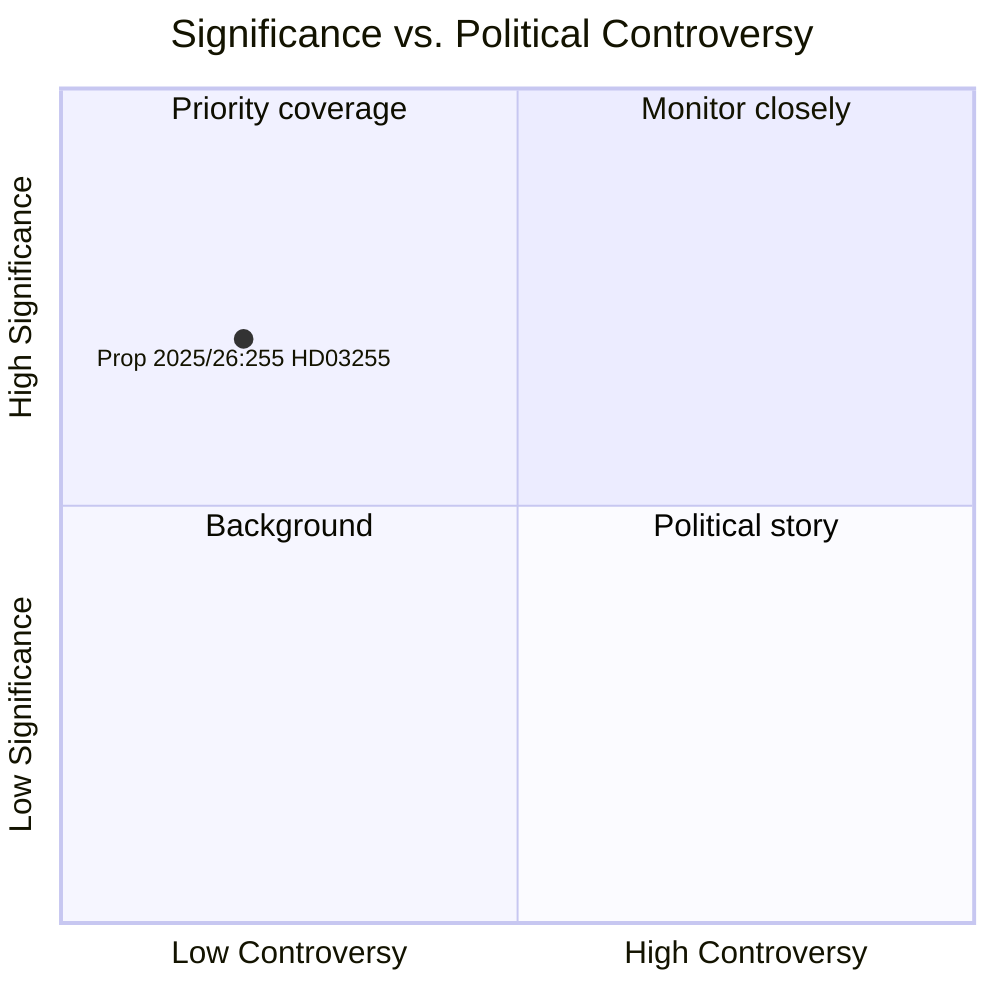

# Sverige stärker sitt makrotillsynsarsenal med lag om hushållsskuldsundersökning

**Author**: James Pether Sörling  
**Date**: 2026-05-05  
**Classification**: PUBLIC  
**Confidence**: HIGH — Admiralty A1 (institutionella primärkällor)  
**Workflow**: news-propositions  

---

## Sammanfattning

Sveriges regering lade den 5 maj 2026 fram Proposition 2025/26:255 (HD03255) som skapar en lagstiftad grund för Finansinspektionen att genomföra obligatoriska stickprovsundersökningar av hushållsskuldsdata från kreditinstitut. Åtgärden åtgärdar ett decennielångt gap i Sveriges makrotillsynsverktyg — erkänt av både Riksbanken och IMF — då landet bär ett av Europas högsta hushållsskuldkvoter i förhållande till disponibel inkomst. Kammaromröstning är planerad till den 15 juni 2026 via betänkande FiU45.

---

## Beslut som detta underlag stöder

1. **Redaktionellt beslut**: Huruvida denna proposition motiverar en dedikerad artikel eller sidospalt i bevakningen av Sveriges makrotillsynspolitik
2. **Analytiskt beslut**: Hur denna datainfrastruktur relaterar till pågående FI/Riksbank-diskussioner om att skärpa låntagarbaserade åtgärder (DSTI, amorteringskrav)
3. **Övervakningsbeslut**: Huruvida man ska följa Lagrådets yttrande (förväntat kvartal 2 2026) och FiU45:s utskottsbetänkande för väsentliga ändringar som kan försvaga integritetsskyddet eller urvalsmetodiken

---

## 60-sekundersläsning

- 🏦 **Vad**: Lagstiftad befogenhet för FI att begära hushållsnivådata om skulder/inkomst från banker för stickprovsundersökningar — inte fullständigt register
- 📊 **Varför nu**: Sveriges makrotillsynsramverk saknar granulär data på låntagarnivå; EU ESRB-rekommendationer och IMF Artikel IV har uppmärksammat detta gap
- 🔒 **Integritet**: Proportionerlig utformning med urval undviker fullständig obligatorisk rapportering; GDPR art. 6(1)(e) rättslig grund; Lagrådsgranskning trolig
- ⚡ **Koalition**: Ministrarna Lotta Edholm (L) + Niklas Wykman (M) — Tidöregeringen; FiU-remiss; tvärpolitiskt stöd förväntat
- 🗓️ **Tidslinje**: Kammarvotering 2026-06-15; första FI-undersökning kvartal 3 2026; data som informerar nästa FSR

---

## Viktigaste framåtblickande utlösare

**Lagrådets yttrande om HD03255** (förväntat före kammaromröstningen 2026-06-15): Lagstiftningsrådets bedömning av integritets/RF 2:6-proportionalitet avgör om ändringar krävs och om lagförslaget går igenom i sin ursprungliga form.

---

## Analytisk konfidensdeklaration

Konfidens HÖG baserat på: officiellt riksdagsdokument HD03255 [A1]; betänkande FiU45-planering i planeringsdokument H6D1plan; etablerat makrotillsynspolitiskt sammanhang i Sverige. IMF WEO ekonomiska data otillgängliga detta cykel (API ej nåbart) — Riksbankens FSR 2025 (offentlig källa) används för hushållsskuldskontext.

<!-- source-sha: 5591d3b185740d167f3a948b0f8e881cfaf357b9 -->
