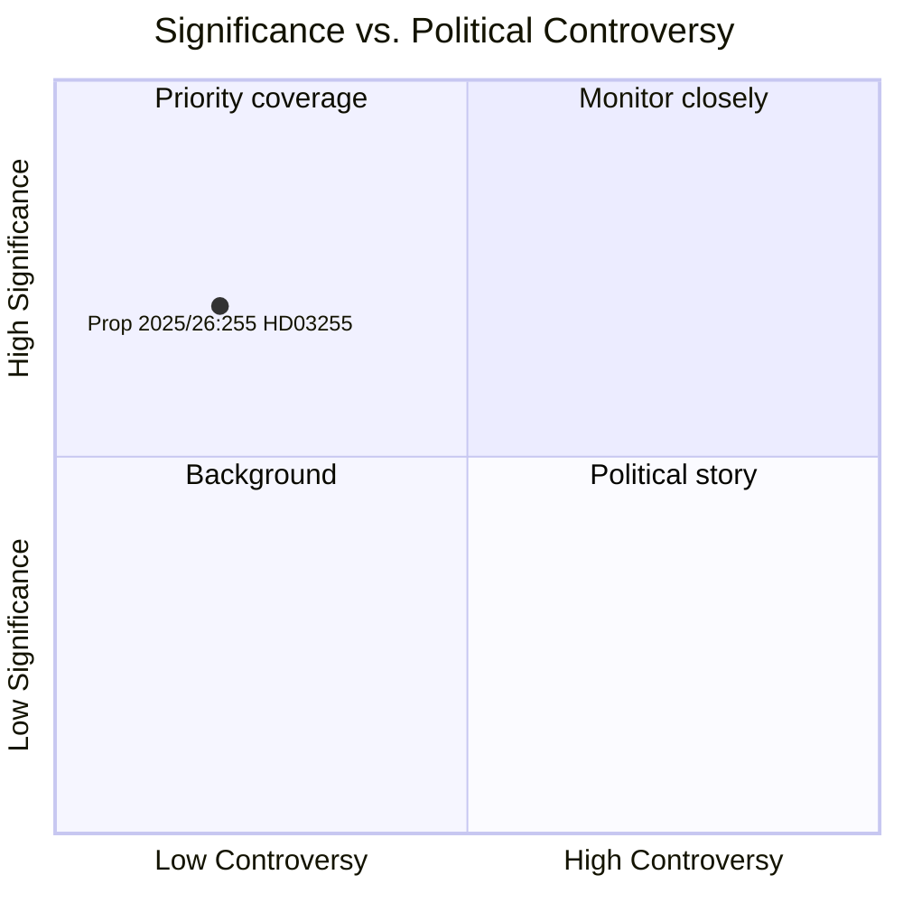

# 瑞典以家庭债务调查法强化宏观审慎政策工具箱

**作者**: 詹姆斯·彼得·索林  
**日期**: 2026-05-05  
**分类**: 公开  
**置信度**: 高 — 海军部A1（机构一次资料）  
**工作流**: news-propositions  

---

## 摘要

瑞典政府于2026年5月5日提交了第2025/26:255号提案（HD03255），为Finansinspektion从信贷机构开展强制性家庭债务数据抽样调查创造法律依据。此举填补了瑞典宏观审慎监控工具箱中长达十年的空白——瑞典央行（Riksbank）和国际货币基金组织（IMF）均已认识到这一不足——因为瑞典家庭债务与可支配收入之比是欧洲最高之一。议会表决定于2026年6月15日通过委员会报告FiU45进行。

---

## 本文件支持的决策

1. **编辑决策**: 本提案是否值得在瑞典宏观审慎政策发展报道中撰写专题文章或旁注
2. **分析决策**: 这一数据基础设施如何与FI/瑞典央行正在进行的关于加强借款人层面措施（DSTI、还款要求）的讨论相关联
3. **监测决策**: 是否需要跟踪Lagrådet意见书（预计2026年第二季度）和FiU45委员会报告，关注可能削弱隐私保障或抽样方法论的重大修订

---

## 60秒速读

- 🏦 **内容**: FI可向银行索取家庭层面债务/收入数据用于抽样调查的法律授权——而非完整登记制度
- 📊 **为何是现在**: 瑞典宏观审慎框架缺乏借款人层面的精细数据；欧盟欧洲系统性风险委员会（ESRB）建议及IMF第四条磋商均指出了这一缺口
- 🔒 **隐私**: 比例抽样设计避免了全面强制报告；GDPR第6条(1)(e)法律依据；Lagrådet审查可能进行
- ⚡ **联合政府**: 洛塔·埃德霍尔姆（L）+ 尼克拉斯·维克曼（M）部长 — 蒂多政府；提交FiU委员会；预期获得跨党派支持
- 🗓️ **时间表**: 议会表决 2026-06-15；FI首次调查 2026年第三季度；数据将纳入下一份金融稳定报告（FSR）

---

## 主要前瞻性触发因素

**Lagrådet就HD03255发布的意见书**（预计在2026-06-15议会表决前）：立法委员会对隐私/RF 2:6比例性的评估将决定是否需要修订，以及法案能否以原始形式获得通过。

---

## 分析置信度声明

高置信度。依据：瑞典议会官方文件HD03255 [A1]；规划文件H6D1plan中的FiU45委员会报告规划；已确立的瑞典宏观审慎政策背景。IMF WEO经济数据在本周期不可用（API无法访问）——家庭债务背景采用瑞典央行2025年金融稳定报告（公开资料）。

<!-- source-sha: 5591d3b185740d167f3a948b0f8e881cfaf357b9 -->
