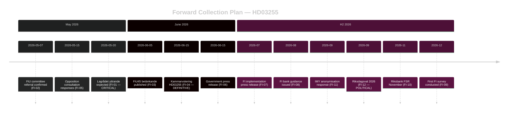

# Forward Indicators — Propositions 2026-05-05

**Author**: James Pether Sörling  
**Date**: 2026-05-05  

---

## Forward Trigger Register

The following dated indicators should be monitored to update the intelligence assessment. All derived from HD03255 pipeline analysis.

| ID | Indicator | Date | Type | Significance |
|----|-----------|------|------|-------------|
| FI-01 | Lagrådet yttrande published for HD03255 | ~2026-05-20 | Legal gate | Determines constitutional passage risk; critical for KJ-2 |
| FI-02 | FiU committee referral confirmed | ~2026-05-07 | Procedural | Confirms standard parliamentary track |
| FI-03 | FiU45 betänkande published | ~2026-06-05 | Legislative | Contains final text, amendments, and minority statements |
| FI-04 | Kammarvotering FiU45 | 2026-06-15 | Vote | Definitive passage decision; confirms KJ-1 |
| FI-05 | Opposition party (S) consultation response published | ~2026-05-15 | Political | Reveals S position and privacy amendment risk |
| FI-06 | Government press release on passage | ~2026-06-15 | Political | Government narrative on competence track record |
| FI-07 | FI press release on survey authority | ~2026-07 | Implementation | FI acknowledges new authority; starts implementation |
| FI-08 | FI regulatory guidance to banks (remiss) | ~2026-08 | Regulatory | Defines survey scope; reveals bank compliance burden |
| FI-09 | First FI household debt survey conducted | ~2026-12 | Data event | First empirical evidence from new authority |
| FI-10 | Riksbank FSR November 2026 | 2026-11 | Publication | References HD03255 data or acknowledges continuing gap |
| FI-11 | IMY response on anonymisation protocols | ~2026-09 | Privacy | Confirms or challenges GDPR compliance of survey design |
| FI-12 | Election 2026 result | 2026-09 | Political | Government continuity affects implementation priority |

---

## Early Warning Signals

| Signal | Trigger | Monitoring Source |
|--------|---------|------------------|
| Lagrådet critical yttrande | Critical yttrande text published | riksdagen.se Lagrådet section |
| Opposition motion to delay | SD or V files amendment motion | Riksdag MCP search_dokument |
| IMY GDPR concern raised | IMY public statement | IMY press releases |
| FiU scheduling slip | FiU removes FiU45 from June agenda | H6D1plan update |
| Media privacy controversy | >5 articles framing as privacy issue | Media monitoring |

---

## Intelligence Value Timeline

