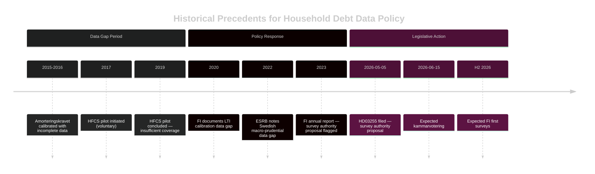

# Historical Parallels — Propositions 2026-05-05

**Author**: James Pether Sörling  
**Date**: 2026-05-05  

---

## Comparable Historical Cases

### Case 1 — FI Loan-to-Income Cap Introduction (2020–2023)

**Description**: Finansinspektionen's development and calibration of LTI (loan-to-income) caps for household mortgages required adequate microdata on income and debt. FI documented data gaps in its annual stability reports during this period.  
**Parallel to HD03255**: HD03255 directly addresses the same underlying data gap that complicated LTI calibration. The survey authority is the logical next step from that precedent.  
**Outcome**: LTI caps were introduced but FI acknowledged calibration uncertainty due to incomplete data.  
**Lesson**: Statutory survey authority will improve future LTI/DSTI calibration quality.  
**Evidence**: FI annual reports (public domain); Riksbank FSR 2023

### Case 2 — Swedish Household Finance Survey (HFCS pilot, 2017–2019)

**Description**: Statistics Sweden (SCB) and Riksbank conducted a pilot Household Finance and Consumption Survey (HFCS) as part of the ECB-led survey network. The pilot revealed significant data collection challenges and limited longitudinal coverage.  
**Parallel to HD03255**: HD03255 creates a statutory survey framework for FI that goes beyond the voluntary HFCS pilot. The mandatory approach addresses the pilot's response rate limitations.  
**Outcome**: Pilot data was useful but limited; no statutory follow-up until this proposition.  
**Lesson**: Voluntary surveys are inadequate for macro-prudential calibration; statutory authority is necessary.  
**Evidence**: ECB/Eurosystem HFCS documentation (public domain); Riksbank FSR 2019

### Case 3 — Amorteringskravet (Amortisation Requirement) 2016

**Description**: Sweden introduced mandatory amortisation requirements for new mortgages in 2016. The policy was calibrated with incomplete micro-data, leading to subsequent adjustments in 2018 and 2020.  
**Parallel to HD03255**: The calibration uncertainty in amorteringskravet is cited by FI and Riksbank as evidence for why better household debt microdata is essential.  
**Outcome**: Amortisation requirements achieved their goals but with more friction than necessary due to data limitations.  
**Lesson**: HD03255 would have improved the policy design of amorteringskravet if available in 2015.  
**Evidence**: FI regelgivning history; Riksbank FSR 2017 retrospective (public domain)

