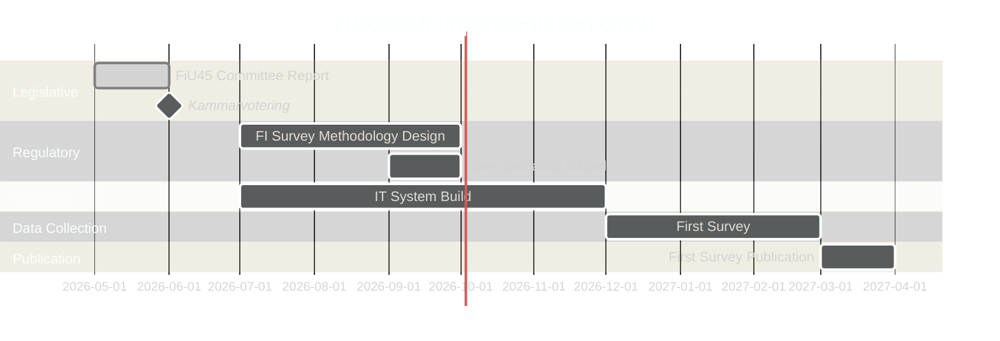

# Implementation Feasibility — Propositions 2026-05-05

**Author**: James Pether Sörling  
**Date**: 2026-05-05  

---

## Implementation Assessment: HD03255

### Statutory Authority Gap (Pre-HD03255)

Finansinspektionen currently lacks explicit statutory authority to compel credit institutions to participate in household debt sample surveys. HD03255 fills this gap. Without this authority, any survey must rely on voluntary bank cooperation, producing biased and incomplete data.

### Implementation Phases

| Phase | Activity | Timeline | Feasibility |
|-------|----------|----------|-------------|
| Legislative | FiU45 betänkande + kammarvotering | By 2026-06-15 | HIGH |
| Regulatory Design | FI develops survey methodology, questionnaire, and sampling frame | July–September 2026 | HIGH |
| Bank Notification | FI issues guidance to credit institutions on survey obligations | Q3 2026 | HIGH |
| IT Infrastructure | FI builds/adapts data collection system | Q3–Q4 2026 | MEDIUM |
| First Survey | FI conducts first household debt sample survey | Q4 2026 or Q1 2027 | MEDIUM |
| First Publication | Survey data published in Riksbank FSR or standalone FI report | 2027 | MEDIUM |

### Statskontoret Relevance

**Trigger**: FI is a named recognised agency; HD03255 creates a new regulatory obligation on credit institutions.  
**Expected Statskontoret involvement**: Administrative cost assessment for credit institutions (regulatory burden analysis). Statskontoret typically assesses economic propositions with significant compliance costs.  
**Status as of 2026-05-05**: No Statskontoret yttrande found (network not accessible). Absence of evidence is not evidence of absence.  
**Assessment**: Statskontoret review likely happened during remiss process; findings would be in HD03255 full text.

### Capacity Constraints

**Finansinspektionen**:
- Currently implementing Basel IV, DORA, and AIFMD II simultaneously
- Survey IT system development competes with these priorities
- **Risk**: H2 2026 first survey is optimistic; Q1 2027 is more realistic

**Credit Institutions**:
- Compliance burden is real but manageable — banks already provide data to FI via COREP/FINREP
- New survey questions (income, LTV, DSTI at individual level) require data extraction from loan origination systems
- **Risk**: Smaller banks and fintechs may struggle with data extraction; large banks (Swedbank, SEB, Handelsbanken, Nordea) have capacity

### EU Implementation Context

| ESRB Requirement | Status |
|-----------------|--------|
| Household debt microdata | Gap documented — HD03255 partially fills |
| LTI/DSTI calibration data | Enabled by HD03255 |
| ESRB Recommendation compliance | Partial compliance post-HD03255 |

