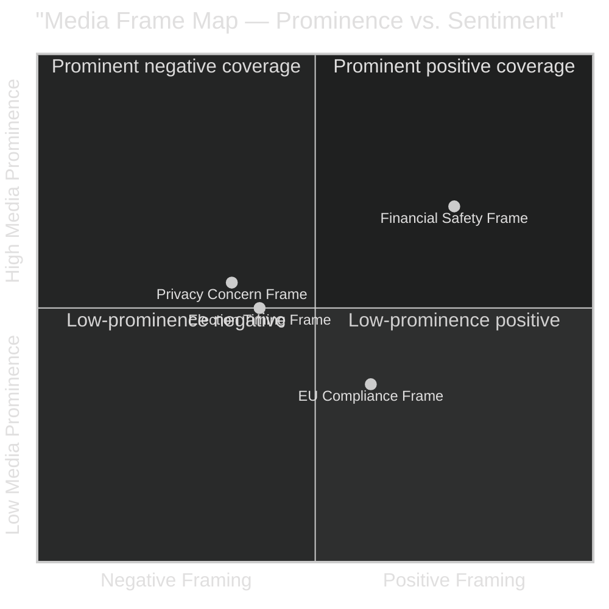

# Media Framing Analysis — Propositions 2026-05-05

**Author**: James Pether Sörling  
**Date**: 2026-05-05  

---

## Anticipated Media Frames

### Frame 1 — "Financial Safety" (Government Frame)

**Narrative**: "Sweden strengthens its tools to monitor household debt and prevent the next financial crisis."  
**Likely sources**: Government press releases; FI communications; Riksbank FSR references  
**Tone**: Reassuring, technically authoritative  
**Target audience**: Financial press, general public (credibility signal)  
**Examples**: Dagens Industri, Finanstidningen, SVT Nyheter ekonomi

### Frame 2 — "Privacy Concern" (Civil Society / Privacy Frame)

**Narrative**: "New law gives FI authority to collect detailed household income and debt data from banks — who has access?"  
**Likely sources**: Integritetsskyddsmyndigheten (IMY) press releases; civil society organisations; V/SD potential reaction  
**Tone**: Questioning, cautious  
**Target audience**: Privacy-conscious media; social media  
**Examples**: Nyhetsbolaget, Civil Rights Defenders, potentially Aftonbladet opinion pieces

### Frame 3 — "EU Compliance" (Technical/EU Frame)

**Narrative**: "Sweden filling EU-mandated data gap — joining Nordic peers in household debt monitoring."  
**Likely sources**: EU affairs desks; SNS (Studieförbundet Näringsliv & Samhälle) analysis  
**Tone**: Matter-of-fact, comparative  
**Target audience**: Policy community, EU affairs audience

### Frame 4 — "Election Timing" (Political/Cynical Frame)

**Narrative**: "Government files financial regulation four months before election — competence signal or policy substance?"  
**Likely sources**: Oppositionspolitiker interview; political commentary  
**Tone**: Sceptical, analytical  
**Target audience**: Political journalists, commentary readers

## Editorial Positioning Predictions

| Publication | Likely Frame | Tone |
|------------|-------------|------|
| Dagens Nyheter | Financial Safety + EU | Neutral-positive |
| Svenska Dagbladet | Financial Safety (government-supportive) | Positive |
| Aftonbladet | Privacy Concern + Election Timing | Sceptical |
| Expressen | Election Timing | Critical |
| Dagens Industri | Financial Safety + Technical | Positive |
| ETC | Privacy Concern | Critical |

**Overall media coverage probability**: MEDIUM — proposition is technical; likely to receive specialist rather than general coverage unless privacy controversy emerges.
