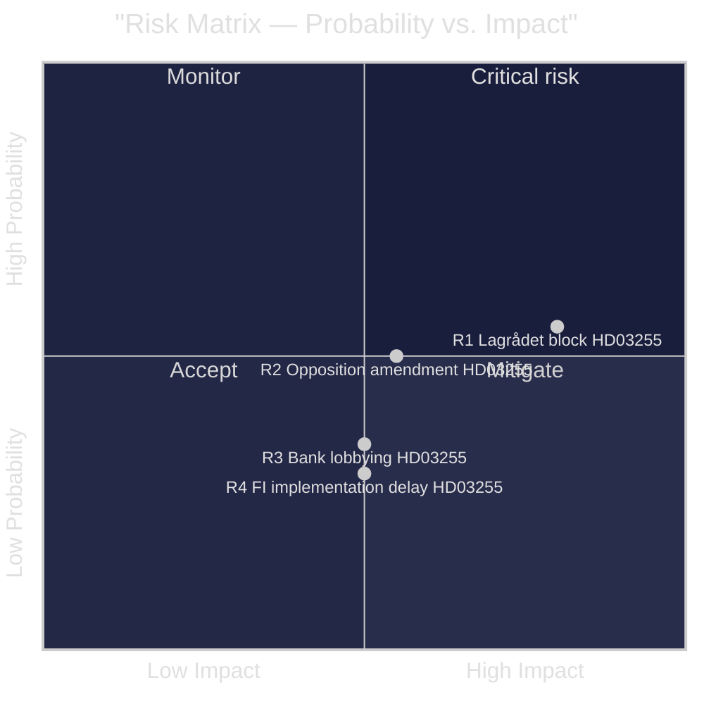

# Risk Assessment — Propositions 2026-05-05

**Author**: James Pether Sörling  
**Date**: 2026-05-05  
**Methodology**: Political Risk Methodology — Riksdagsmonitor  

---

## Risk Register

### R1 — Lagrådet Constitutional Block (Probability: MEDIUM | Impact: HIGH)

**Description**: The Council on Legislation (Lagrådet) may find Proposition 2025/26:255 incompatible with RF 2:6 (protection of private life and personal data) unless the statutory language specifies adequate privacy safeguards, data retention limits, and anonymisation standards.  
**Evidence**: HD03255 triggers Lagrådet review (statutory data collection from private persons). Referral pending as of 2026-05-05.  
**Mitigation**: Government typically pre-consults Lagrådet; sample-survey design is a proportionality argument.  
**Timeline**: Lagrådet yttrande expected before 2026-06-15 kammarvotering.  
**Admiralty**: B2 (source A confirmed document; probability assessment inferred from institutional pattern)

### R2 — Opposition Amendment Diluting Analytical Value (Probability: MEDIUM | Impact: MEDIUM)

**Description**: Social Democrats (S) or Left Party (V) may propose amendments requiring shorter data retention periods, higher anonymisation thresholds, or restrictions on individual-level disaggregation — reducing the survey's macro-prudential utility.  
**Evidence**: Historical pattern — S has supported financial stability measures but questioned data-minimisation sufficiency in FI amendments (2021–2022 capital requirements transposition).  
**Mitigation**: Government majority in chamber; FiU committee likely to report without fundamental changes.  
**Admiralty**: C3 (historical pattern extrapolated; no direct documentary evidence for this cycle)

### R3 — Bank Lobbying Reducing Survey Scope (Probability: LOW-MEDIUM | Impact: MEDIUM)

**Description**: Swedish Bankers' Association (Bankföreningen) may lobby to reduce survey frequency, sample size, or data granularity during the FiU consultation process.  
**Evidence**: Banks bear compliance costs; HD03255 imposes new reporting obligations on credit institutions.  
**Mitigation**: FI has institutional interest in comprehensive data; government coalition backing.  
**Admiralty**: C3 (pattern inference; no direct documentary evidence)

### R4 — Implementation Delay at Finansinspektionen (Probability: LOW | Impact: MEDIUM)

**Description**: FI may require longer than projected to build the IT infrastructure for survey execution, delaying the first data collection beyond Q3 2026.  
**Evidence**: HD03255 creates a new data-collection modality requiring system development; FI's current workload (Basel IV implementation, DORA) is high.  
**Mitigation**: FI has existing data collection channels from banks (COREP/FINREP). Incremental build feasible.  
**Admiralty**: B2

---

## Institutional Risk Dimensions

| Dimension | Level | Evidence |
|-----------|-------|----------|
| Constitutional/Privacy | MEDIUM | HD03255 triggers Lagrådet; RF 2:6 proportionality required |
| Financial Stability | LOW | This proposition *reduces* financial stability risk long-term by enabling better data |
| Political Coalition | LOW | M+L co-signatories; Tidö government majority; FiU on track |
| Implementation | LOW-MEDIUM | FI capacity constraints; IT development required |
| EU Compliance | LOW | Proposition is EU-aligned; addresses ESRB gap |

