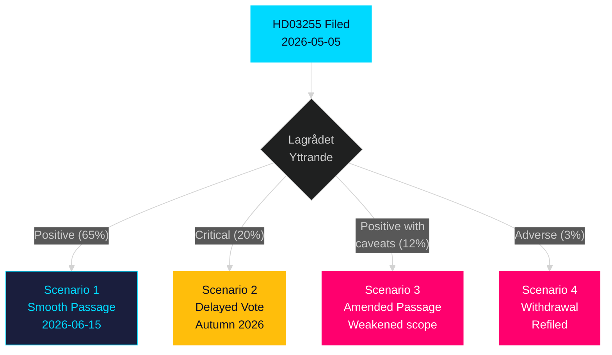

# Scenario Analysis — Propositions 2026-05-05

**Author**: James Pether Sörling  
**Date**: 2026-05-05  

---

## Scenario Tree

### Scenario 1 — Base Case: Smooth Passage (Probability: 65%)

**Description**: HD03255 passes FiU45 committee report with minor technical amendments; Lagrådet issues positive yttrande with proportionality observations; kammarvotering passes 2026-06-15 with broad cross-party support; FI begins survey preparations Q3 2026.  
**Conditions**: Government majority holds; Lagrådet satisfied with anonymisation provisions; opposition accepts privacy assurances.  
**Outcome**: Finansinspektionen gains sample-survey authority by July 2026; first household debt data collected in H2 2026; Riksbank FSR 2026 benefits.  
**Evidence**: H6D1plan confirms 2026-06-15 schedule; no opposition signal found; FiU track record on technical FI amendments.  
**Confidence**: MODERATE-HIGH

### Scenario 2 — Lagrådet Delays (Probability: 20%)

**Description**: Lagrådet identifies significant constitutional concerns about RF 2:6 compliance; issues critical yttrande requiring government to revise the proposition; FiU45 delayed; vote pushed to autumn 2026 (riksmöte 2026/27).  
**Conditions**: Lagrådet finds inadequate statutory anonymisation provisions; privacy language too vague for RF 2:6 standard.  
**Outcome**: FI authority delayed 3–6 months; government must file revised proposition; Riksbank FSR 2026 proceeds without new survey data.  
**Evidence**: HD03255 triggers Lagrådet review (statutory data collection from individuals); RF 2:6 proportionality is a live question.  
**Confidence**: LOW-MODERATE

### Scenario 3 — Opposition Privacy Amendments Weaken Survey (Probability: 12%)

**Description**: S and/or V secure FiU committee report minority statement; government accepts limited privacy amendments reducing survey granularity (e.g., income aggregation, shorter retention, excluding LTV microdata); proposition passes but analytical utility is reduced.  
**Conditions**: Opposition rallies privacy coalition; government makes tactical concession to broaden support.  
**Outcome**: Survey authority granted but scope narrowed; FI data quality below macro-prudential optimum; ESRB gap partially addressed.  
**Evidence**: Opposition consultation rights in FiU; HD03255 involves individual-level data; S track record on GDPR strictness.  
**Confidence**: LOW

### Scenario 4 — Full Withdrawal (Probability: 3%)

**Description**: Government withdraws HD03255 following adverse Lagrådet yttrande and coalition disagreement (e.g., SD privacy-populist pivot); refiles as a more limited administrative data expansion rather than sample survey.  
**Conditions**: Lagrådet critical yttrande + coalition partner defection + negative public attention.  
**Outcome**: Status quo maintained; FI data gap persists; significant political cost to government.  
**Evidence**: No signal of this scenario; included as tail risk.  
**Confidence**: VERY LOW

