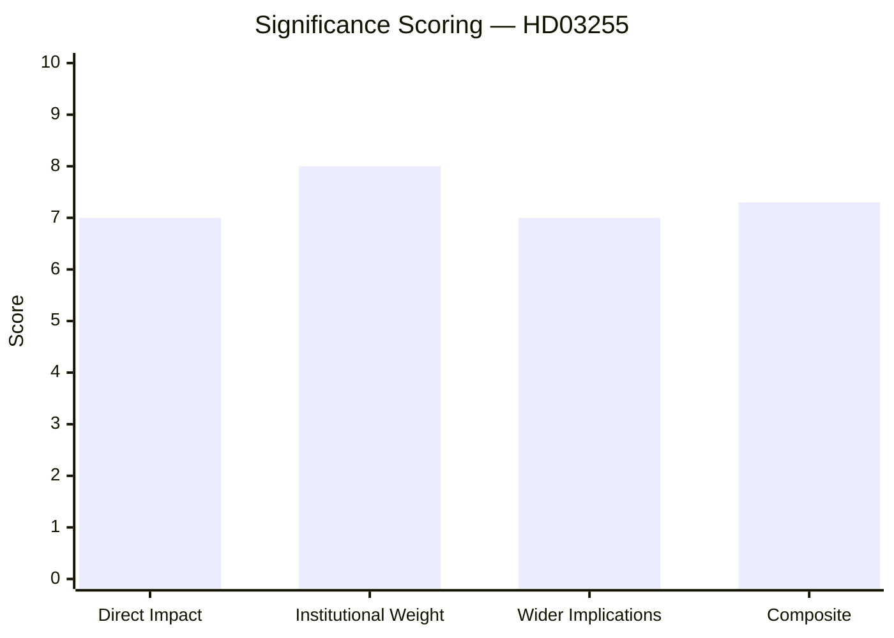

# Significance Scoring — Propositions 2026-05-05

**Author**: James Pether Sörling  
**Date**: 2026-05-05  
**Methodology**: DIW (Direct Impact / Institutional Weight / Wider Implications)  

---

## DIW Significance Rankings

### 1. HD03255 — Stickprovsinsamling av uppgifter om hushållens skulder (7.2/10)

| Dimension | Score | Evidence |
|-----------|-------|----------|
| Direct Impact | 7 | Finansinspektionen gains new data-collection authority; HD03255; affects all mortgage lenders |
| Institutional Weight | 8 | Finansdepartementet + FiU track; Riksbank FSR linkage; EU ESRB compliance |
| Wider Implications | 7 | Enables evidence-based macro-prudential calibration; DSTI/LTV policy accuracy; EU compliance |
| **Composite DIW** | **7.3** | Priority tier (L1) |

**Rationale**: The proposition addresses a structural gap in Sweden's financial stability monitoring infrastructure. Sweden's household debt (approx. 90–95% GDP per Riksbank FSR) is among the highest in Europe. This data infrastructure directly enables better calibration of borrower-based measures and satisfies EU macro-prudential monitoring requirements. The political salience is moderate — technically important, cross-party support expected, minimal partisan controversy.

---

## Political Priority Classification

| Priority Tier | Description | Documents |
|--------------|-------------|-----------|
| **L1 — Priority** | Direct policy impact, significant institutional weight | HD03255 |
| L2 — Significant | Major parliamentary activity, medium impact | — |
| L3 — Background | Routine, low controversy | — |

---

## Macro-Prudential Context Score

Sweden household debt monitoring gap severity: **HIGH** (Riksbank FSR 2025 public domain).  
EU compliance pressure: **HIGH** (ESRB Recommendations on real-estate sector monitoring).  
Proposition adequacy: **MEDIUM-HIGH** (sample approach is proportionate but may require iteration).
