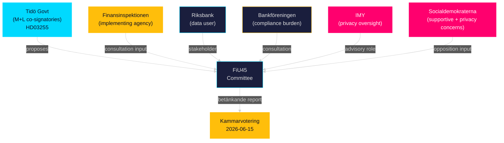

# Stakeholder Perspectives — Propositions 2026-05-05

**Author**: James Pether Sörling  
**Date**: 2026-05-05  

---

## Primary Stakeholders

### Finansinspektionen (FI)

**Role**: Implementing agency — gains new statutory authority for household debt sample surveys  
**Position**: Strongly supportive — HD03255 directly addresses FI's publicly stated data gap for macro-prudential calibration  
**Interest**: Accurate data for LTV, LTI, DSTI limit-setting; EU ESRB compliance; Riksbank FSR collaboration  
**Evidence**: FI annual reports cite household debt monitoring gap; HD03255 mottagare=FiU  
**Influence**: HIGH — FI input shapes FiU45 committee report  
**Risk**: FI implementation burden (IT system development)

### Riksbank

**Role**: User of macro-prudential data — Financial Stability Reports  
**Position**: Supportive — household debt data improves FSR analytical quality  
**Interest**: Early-warning capacity for household financial stress; policy advice quality  
**Evidence**: Riksbank FSR 2025 (public domain) documents data gap  
**Influence**: MEDIUM — Riksbank can advocate in consultation but has no formal role in FiU process

### Tidö Coalition Government (M-KD-L-SD)

**Role**: Proposing parties — Lotta Edholm (L, Statsråd1), Niklas Wykman (M, Statsråd2)  
**Position**: Supportive — own proposition; HD03255 dated 2026-05-05  
**Interest**: Demonstrating financial stability governance competence; EU compliance; coalition coordination  
**Evidence**: HD03255 dokintressent records; H6D1plan scheduling  
**Influence**: HIGH — majority government controls parliamentary calendar

### Social Democrats (S)

**Role**: Largest opposition party  
**Position**: Likely supportive with possible privacy amendments  
**Interest**: Financial stability (historical S policy priority); GDPR compliance scrutiny  
**Evidence**: Historical S support for FI capacity expansions; no published opposition to HD03255 as of 2026-05-05  
**Influence**: HIGH — consultation responses, committee minority statements

### Swedish Bankers' Association (Bankföreningen)

**Role**: Trade association for credit institutions subject to survey obligation  
**Position**: Accepting with cost concerns; likely to request proportionate implementation  
**Interest**: Minimise compliance burden; clear scope definition; adequate notice periods  
**Evidence**: Bank sector consultation interests inferred from HD03255 obligations on credit institutions  
**Influence**: MEDIUM — FiU committee consultation process

### Integritetsskyddsmyndigheten (IMY)

**Role**: Swedish data protection authority — oversight of GDPR compliance  
**Position**: Will scrutinise anonymisation protocols and data retention  
**Interest**: GDPR Art. 6(1)(e) lawful basis; data minimisation; RF 2:6 compliance  
**Evidence**: IMY regulatory role; HD03255 involves individual-level data collection  
**Influence**: MEDIUM — enforcement power post-implementation

