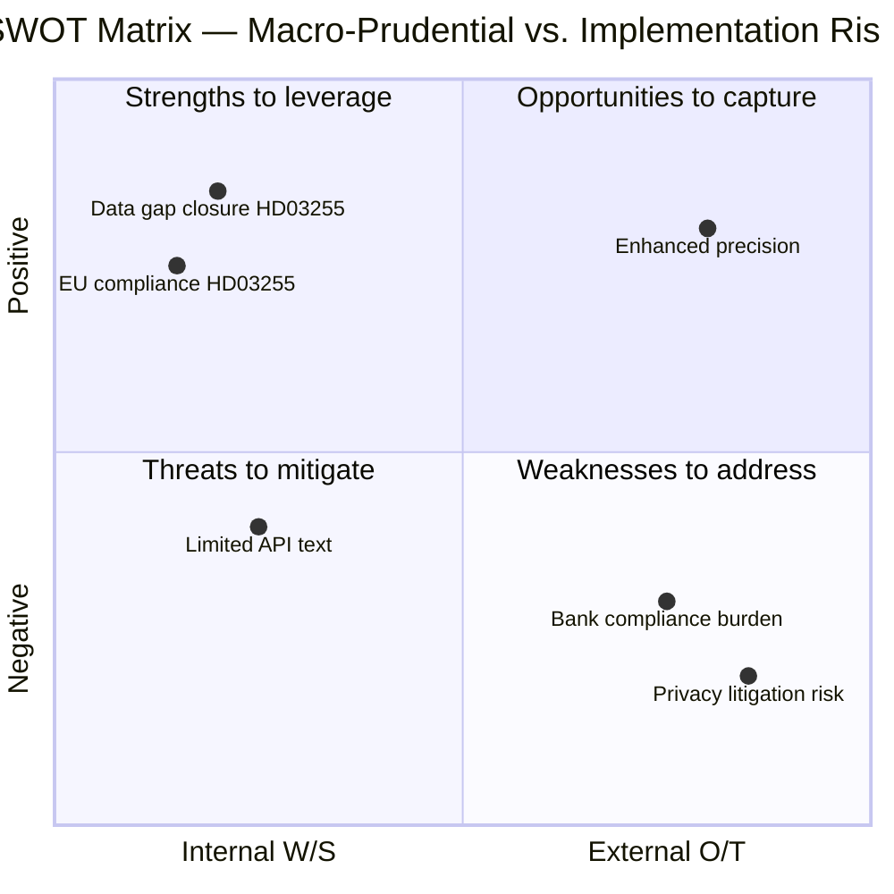

# SWOT Analysis — Propositions 2026-05-05

**Author**: James Pether Sörling  
**Date**: 2026-05-05  
**Framework**: Political SWOT — Swedish Government Propositions  

---

## Strengths

- **Closes a critical data gap**: HD03255 creates a legal basis for FI to collect granular household debt/income data; Riksbank FSR 2025 explicitly identifies this as a monitoring weakness
- **Proportionate design**: Sample survey rather than full-registry collection balances macro-prudential need vs. privacy rights (GDPR Art. 6(1)(e)); HD03255 metadata confirms sample methodology
- **Cross-ministry coordination**: Co-signatories Lotta Edholm (L) and Niklas Wykman (M) signal Tidö coalition cohesion on financial stability policy; HD03255 organ=Finansdepartementet
- **EU compliance alignment**: Proposition aligns Sweden with ESRB Recommendation on residential real-estate monitoring — reduces regulatory non-compliance risk; HD03255 datum 2026-05-05
- **Pre-recess timetable**: FiU45 scheduled for 2026-06-15 kammarvotering (H6D1plan) — demonstrates legislative efficiency and government agenda control

---

## Weaknesses

- **Limited proposition text available**: Full prose analysis of HD03255 not yet indexed in riksdag API; title and routing metadata only — reduces certainty about specific statutory language
- **Potential scope ambiguity**: "Stickprovsinsamling" (sample collection) leaves methodology details (sampling frequency, sample size, bank coverage threshold) unspecified in available metadata; HD03255 API data
- **Implementation lead time**: FI will require IT system development (6–12 months estimated) before first survey can run; delivery Q3/Q4 2026 at earliest; HD03255 implementation lag risk
- **Privacy safeguards not yet detailed**: Lagrådet review pending; RF 2:6 proportionality analysis not complete; may trigger amendments; HD03255 Lagrådet referral status unknown

---

## Opportunities

- **Enhanced macro-prudential precision**: New data enables evidence-based calibration of DSTI (debt-service-to-income) limits and LTV caps; reduces blunt-instrument risk in borrower-based measures; HD03255 linkage
- **IMF Article IV improvement**: Next IMF consultation (2027) can cite structured household debt data as improvement; reduces risk of IMF recommendation repetition; HD03255 + Riksbank FSR context
- **Nordic data leadership**: Sweden can benchmark methodology against Norway (which has advanced household debt register) and Denmark; HD03255 enables comparable analysis
- **SCB collaboration possibility**: Potential to integrate FI sample data with Statistics Sweden (SCB) household wealth surveys; HD03255 cross-agency synergy
- **Financial crisis early-warning**: Granular data enables earlier detection of household debt stress before it becomes systemic; HD03255 macro-prudential value

---

## Threats

- **Privacy litigation risk**: Data collection at individual level (even sampled) creates GDPR litigation exposure if anonymisation protocols are insufficient; HD03255 + EU GDPR framework
- **Bank compliance burden**: Major banks (Swedbank, SEB, Handelsbanken, Nordea SE operations) face IT and compliance costs; potential lobbying for reduced scope or frequency; HD03255 credit institution obligations
- **Political amendment risk**: Opposition may add amendments to strengthen privacy safeguards or impose stricter data-retention limits that could reduce analytical value of the survey; FiU45 deliberation
- **Lagrådet blocking risk**: If Council on Legislation identifies constitutional incompatibility with RF 2:6, proposition may need significant redrafting, delaying chamber vote beyond 2026-06-15; HD03255 Lagrådet referral pending

