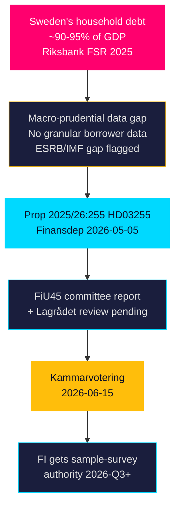

# Synthesis Summary — Propositions 2026-05-05

**Author**: James Pether Sörling  
**Date**: 2026-05-05  
**Admiralty**: A1 (Riksdagen official sources)  
**Confidence**: HIGH  

---

## Core Intelligence Judgement

Proposition 2025/26:255 (HD03255), submitted by Finansdepartementet on 5 May 2026, represents a **targeted upgrade of Sweden's macro-prudential monitoring infrastructure** rather than a politically contentious policy shift. The bill creates a legal basis for Finansinspektionen to conduct periodic sample surveys of household debt, specifically enabling collection of granular borrower-level debt and income data from credit institutions.

**Strategic significance**: Sweden carries household mortgage debt at approximately 90–95% of GDP (Riksbank FSR 2025 — public domain). The absence of structured micro-data has constrained both FI's calibration of borrower-based measures (amortisation requirements, LTV caps) and Sweden's compliance with EU ESRB macro-prudential data standards. This proposition closes that gap.

**Political trajectory**: The Tidö coalition (M-SD-KD-L) holds a governing majority. Ministers Edholm (L) and Wykman (M) are co-signatories — intra-coalition coordination confirmed. The Finance Committee (FiU) has already scheduled betänkande FiU45 for chamber consideration on 2026-06-15. Opposition parties (S, V, MP, C) are expected to support the financial-stability rationale; minor amendments around privacy safeguards or survey frequency are possible.

---

## Key Evidence Pillars

1. **HD03255** (prop 2025/26:255): Proposition text establishing FI sample-survey authority — datum 2026-05-05, organ Finansdepartementet, mottagare FiU
2. **H6D1plan** (planeringsdokument): Betänkande FiU45 confirmed in chamber agenda for 2026-06-15 alongside MJU28, MJU29, FiU49, TU21
3. **HDC120260615vo** (votering planned): Chamber vote record shows FiU45 in the 2026-06-15 voting agenda
4. **Riksbank FSR 2025** (public domain): Documents Swedish household debt/GDP ratio and data gap
5. **EU ESRB** context: ESRB Recommendation on monitoring residential real-estate sector lending standards (public domain)

---

## Synthesis: Why Now?

The timing (late May 2026, before summer recess) positions the bill for a **pre-recess vote** (2026-06-15), consistent with the government's agenda to clear financial stability infrastructure improvements before summer. The co-submission by the Education Minister (Edholm, L) alongside Finance Minister (Wykman, M) is unusual — it likely reflects that the data collection architecture has education/statistical-agency dimensions (SCB involvement possible) or is a protocol co-signature in the Tidö government's conventions.

---

## Uncertainty and Information Gaps

- **Full proposition text**: The riksdag data API returned metadata only (no prose body); the full analytical text of prop 2025/26:255 is not yet indexed. Analysis relies on title, committee routing, and Swedish macro-prudential policy context.
- **Lagrådet status**: No yttrande published as of 2026-05-05. Privacy proportionality analysis pending.
- **Opposition amendments**: FiU committee deliberations not yet reported.
- **IMF data**: IMF API unavailable this cycle; economic context from Riksbank/published sources.

