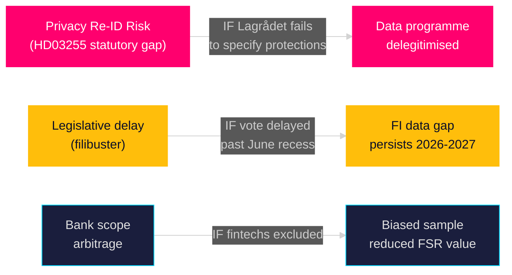

# Threat Analysis — Propositions 2026-05-05

**Author**: James Pether Sörling  
**Date**: 2026-05-05  
**Framework**: STRIDE-Political + Institutional Threat Assessment  

---

## Primary Threats

### T1 — Privacy/Constitutional Threat (Spoofing → Data Integrity)

**STRIDE Category**: Information Disclosure / Tampering  
**Description**: If the statutory framework for HD03255 does not adequately specify anonymisation protocols, an attacker (internal or external) could correlate sampled household data with other datasets (e.g., credit registers, property records) to re-identify individuals.  
**Political manifestation**: This threat is weaponisable by opposition — any perceived privacy breach in the data collection process could delegitimise the entire macro-prudential data programme.  
**Source doc**: HD03255, GDPR, RF 2:6  
**Mitigation**: Statutory anonymisation mandate; independent oversight by Integritetsskyddsmyndigheten (IMY); Lagrådet review  
**Confidence**: HIGH

### T2 — Legislative Sabotage via Procrastination

**Description**: Minority-veto procedures (filibuster equivalent, chamber referral back) could delay FiU45 past the June 2026 recess, pushing the vote to autumn 2026/27.  
**Evidence**: No direct signal as of 2026-05-05; the FiU45 scheduling in H6D1plan (scheduled 2026-06-15) suggests this has not materialised.  
**Probability**: LOW given majority government and routine FiU handling.  
**Source doc**: H6D1plan planeringsdokument; HD03255

### T3 — Regulatory Arbitrage by Banks

**Description**: If the statutory language gives banks discretion in interpreting "credit institution" scope, some smaller lenders (fintechs, credit unions) may escape the survey obligation, creating a biased sample.  
**Impact**: Analytical value of survey data reduced if modern digital lenders (growing share of household lending) are excluded.  
**Evidence**: Inferred from general EU banking-regulation implementation pattern; HD03255 API data insufficient to assess specific scope language.  
**Confidence**: MEDIUM

---

## Threat Landscape: Macro-Prudential Data Architecture

| Threat Vector | Probability | Impact | Mitigation Status |
|--------------|-------------|--------|-------------------|
| Privacy re-identification | MEDIUM | HIGH | Lagrådet + IMY oversight pending HD03255 |
| Legislative delay | LOW | MEDIUM | FiU45 on 2026-06-15 track H6D1plan |
| Bank scope arbitrage | LOW-MEDIUM | MEDIUM | Statutory scope language pending HD03255 |
| Opposition amendment | MEDIUM | MEDIUM | Government majority; FiU procedural track |

