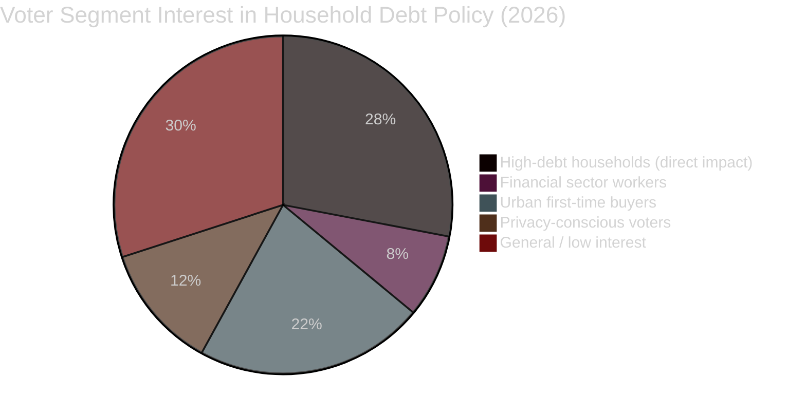

# Voter Segmentation — Propositions 2026-05-05

**Author**: James Pether Sörling  
**Date**: 2026-05-05  

---

## Relevance Assessment

HD03255 is a technical financial regulation proposition. Its direct voter relevance is LOW for almost all segments, but the *policy domain* (household debt, housing, financial stability) has HIGH relevance for several key voter segments in 2026.

## Voter Segment Map

| Segment | Relevance | Concern | Party Alignment |
|---------|-----------|---------|----------------|
| Urban first-time homeowners | MEDIUM-HIGH | Affected by LTI/DSTI limits that FI may tighten using survey data | M, L, C |
| High-debt suburban families | HIGH | Policy implications of survey data on borrowing limits | M, S |
| Financial sector workers | MEDIUM | FI authority expansion affects employer regulatory burden | M, L |
| Privacy-sensitive voters | LOW-MEDIUM | RF 2:6 concerns about household data collection | V, possible SD |
| EU-positive voters | LOW | EU compliance angle (ESRB) | MP, L, C |
| General population | VERY LOW | Proposition too technical for mass mobilisation | All |

## Household Debt as a 2026 Swing Issue

The *underlying policy domain* — household debt, housing affordability, financial stability — IS a significant 2026 election issue. HD03255 feeds the policy infrastructure debate indirectly:

- **Tidö government narrative**: "We are strengthening financial oversight tools to prevent the next housing crisis"
- **Opposition narrative**: "The government's macro-prudential approach focuses on monitoring rather than addressing housing shortage and affordability"

## Policy Salience vs. Electoral Impact Matrix

**Direct impact of HD03255**: LOW for all segments — no individual is directly affected by a sample survey *authority* in the short term.  
**Indirect impact**: MEDIUM — survey data will inform LTV/LTI policy decisions that directly affect borrowers and housing markets.  
**Electoral timing**: The electoral impact of survey data is post-election (data not available until 2027).

**Conclusion**: HD03255 has negligible direct electoral impact in 2026; its value is in the competence signalling narrative for the government coalition.
