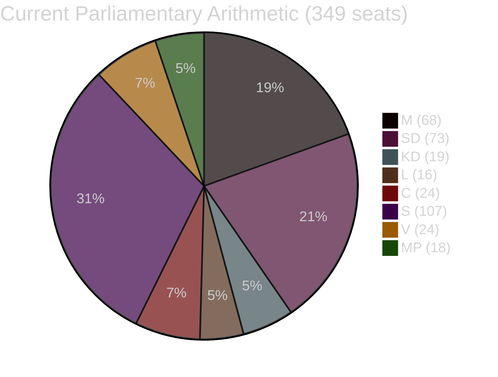

# Coalition Mathematics — Realtime Pulse 2026-05-05

**Author**: James Pether Sörling  
**Date**: 2026-05-05  

---

## Current Parliamentary Arithmetic (2022 Election, 349 seats)

| Party | Seats | Bloc | Key Documents Today |
|-------|-------|------|-------------------|
| S | 107 | Opposition | HD10458–HD10463 interpellations |
| SD | 73 | Tidö | HD10459, HD024143, HD024145 |
| M | 68 | Tidö | All government bills |
| C | 24 | Tidö-adjacent (conditional) | HD024146 ⚠️ reserved |
| V | 24 | Opposition | HD024142, HD024148 |
| KD | 19 | Tidö | KU39 |
| L | 16 | Tidö | KU39 |
| MP | 18 | Opposition | HD024141, HD024147 |

**Majority threshold**: 175 of 349

---

## Active Vote Scenarios (May–June 2026)

### All government bills (HD03255, KU39, prop. 2025/26:242):
Tidö bloc: M(68)+SD(73)+KD(19)+L(16) = **176** ✅ Majority by 1 seat

### HD024146 equivalent (if C formally votes against):
Tidö bloc without C: 176 (C already in opposition bloc on this bill)  
Still majority: **176 vs. 173** ✅

### Catastrophic scenario (C leaves Tidö on all bills):
M(68)+SD(73)+KD(19)+L(16) = 176  
vs. S(107)+V(24)+MP(18)+C(24) = 173  
Still **Tidö majority** — because C defection adds 24 to opposition but Tidö retains 176

**Key insight**: The Tidö coalition is structurally resilient. Even full C defection would not break the majority in the current Parliament. The arithmetic crisis scenario requires an extraordinary event (M or SD MPs absent or defect).

---

## Pivotal Vote Table

| Vote Context | Tidö (core) | Opposition | C position | Winner |
|-------------|------------|------------|------------|--------|
| HD03255 (FI mandate) | 176 | 149 | Abstain/support | Tidö ✅ |
| KU39 recommendations | 176 | 149 | Support | Tidö ✅ |
| HD024146 type (youth crime) | 176 | 149 | Against | Tidö ✅ (176 v 173) |
| Budget vote (hypothetical no confidence) | 176 | 173 | Against | Tidö ✅ (barely) |

---

## Fragility Index

**Current majority cushion**: +1 seat (176 vs 175 required)  
**Fragility rating**: HIGH — one unforeseen absence or defection eliminates majority  
**Risk events**:
- Parliamentary illnesses/absences: always present
- Extraordinary MP resignation: rare but possible
- SD internal discipline failure: very low probability

The Tidö majority is mathematically small but operationally solid because all four coalition parties are whipped. C's reserved position (HD024146) matters for coalition optics but not mathematical outcomes.

