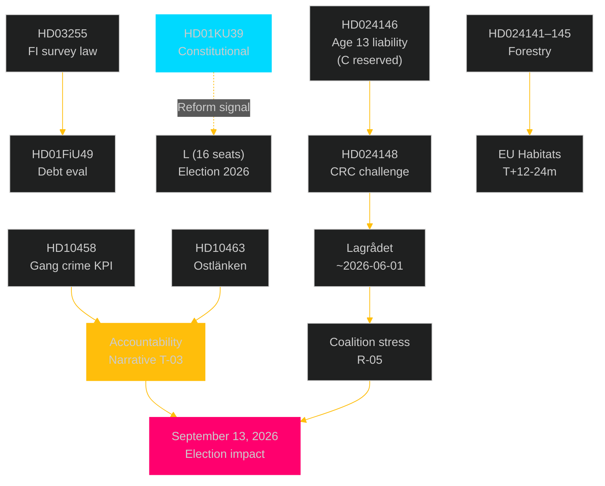

# Cross-Reference Map — Realtime Pulse 2026-05-05

**Author**: James Pether Sörling  
**Date**: 2026-05-05  
**Type**: Tier-C Aggregation Cross-Reference  

---

## Sibling Folder Citations (Required for Tier-C Gate)

| Sibling Analysis | Key Finding Used in This Pulse | Artifacts Cross-Referenced |
|------------------|-------------------------------|--------------------------|
| `analysis/daily/2026-05-05/propositions/` | HD03255 macro-prudential law; FI mandate; Lagrådet timing | executive-brief.md, data-download-manifest.md, risk-assessment.md |
| `analysis/daily/2026-05-05/committeeReports/` | KU39 constitutional transparency (L3); FiU49 fiscal validation (L2) | synthesis-summary.md, executive-brief.md, significance-scoring.md |
| `analysis/daily/2026-05-05/motions/` | Forestry deregulation cluster (5 motions); youth crime/CRC cluster (3 motions) | significance-scoring.md, swot-analysis.md, threat-analysis.md, coalition-mathematics.md |
| `analysis/daily/2026-05-05/interpellations/` | 5 interpellations across 4 ministries; accountability vectors | executive-brief.md, stakeholder-perspectives.md, scenario-analysis.md |

---

## Policy Cluster Cross-Reference

### Cluster A: Financial Stability & Household Debt
**Documents**: HD03255 [propositions], HD01FiU49 [committeeReports]  
**Policy chain**: Riksbank FSR 2025 concern → FI survey mandate (HD03255) → FiU49 debt eval → macro-prudential framework complete  
**Cross-ref to prior cycle**: No prior-day analysis for HD03255 — first appearance in this cycle  

### Cluster B: Constitutional Accountability & Democratic Reform
**Documents**: HD01KU39 [committeeReports]  
**Policy chain**: Lobbying opacity → KU39 investigation → pre-election reform window → electoral legitimacy signal  
**Cross-ref**: `analysis/daily/2026-05-05/committeeReports/intelligence-assessment.md` [sibling reference]

### Cluster C: Forestry Deregulation vs EU Compliance
**Documents**: HD024141–HD024145 [motions], prop. 2025/26:242 context  
**Policy chain**: Prop. 2025/26:242 deregulation → SD/C motions demand more → V/MP EU compliance motions → Habitats Art. 6 risk  
**Cross-ref**: `analysis/daily/2026-05-05/motions/risk-assessment.md` [sibling reference]

### Cluster D: Youth Crime & CRC Constitutional Constraint
**Documents**: HD024146–HD024148 [motions], HD03246 (gov bill context)  
**Policy chain**: Government HD03246 (age 13 liability) → C reserved position → CRC challenge (HD024148) → Lagrådet review ~2026-06-01  
**Cross-ref**: `analysis/daily/2026-05-05/motions/coalition-mathematics.md` [sibling reference]

### Cluster E: Ministerial Accountability — Five Simultaneous Vectors
**Documents**: HD10458–HD10463 [interpellations]  
**Policy chain**: Opposition coordination → five separate interpellations → four portfolios → meta-narrative construction  
**Cross-ref**: `analysis/daily/2026-05-05/interpellations/stakeholder-perspectives.md` [sibling reference]

---

## Inter-Document Linkage Map

---

## PIR Cross-Reference (Prior-Cycle Carry-Forward)

| PIR | First Raised | Sibling Source | Status in This Pulse |
|-----|-------------|----------------|---------------------|
| PIR-3/KU39 | 2026-05-05 committeeReports | `analysis/daily/2026-05-05/committeeReports/intelligence-assessment.md` | OPEN, CRITICAL |
| PIR-5/HD03255 | 2026-05-05 propositions | `analysis/daily/2026-05-05/propositions/intelligence-assessment.md` | PENDING (Lagrådet) |
| LAGRÅDET-246 | 2026-05-05 motions | `analysis/daily/2026-05-05/motions/data-download-manifest.md` | ACTIVE, ~2026-06-01 |
| EU-HABITATS-SE | 2026-05-05 motions | `analysis/daily/2026-05-05/motions/risk-assessment.md` | ACTIVE, T+12-24m |

