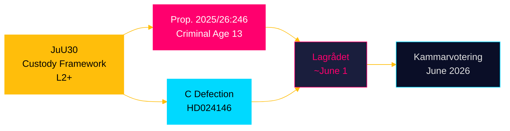

# HD01JuU30 — Per-Document Analysis
## Betänkande 2025/26:JuU30: Frihetsberövande påföljder för barn och unga

**Author**: James Pether Sörling  
**Date**: 2026-05-05  
**Classification**: PUBLIC — GDPR Art. 9(2)(e)(g)  
**Admiralty**: A1 (Source: data.riksdagen.se, confirmed)  
**DIW Tier**: L2+ Priority  
**Confidence**: HIGH [A2]  

---

## Document Summary

The Justice Committee's betänkande JuU30 addresses custodial sentences for children and youth (persons under 18). Published 2026-05-05, this is a scheduled committee report from JuU, building on the government's criminal policy reform agenda including prop. 2025/26:246 (lowering criminal responsibility age to 13) and related motion clusters HD024142, HD024146, HD024148.

**Intelligence significance**: This betänkande links directly to the criminal responsibility age reform — the committee is reviewing custodial framework for the very youth cohort (13–17) whose criminal accountability is being expanded. The committee report represents the JuU's legal analysis of what custodial tools are appropriate for children, feeding directly into the public debate over HD03246.

---

## Key Intelligence Points

1. **Direct linkage to criminal age reform**: JuU30 covers the legal framework for imprisoning children and youth. The government's move to lower criminal responsibility to age 13 (prop. 2025/26:246) means a larger cohort will be subject to these sanctions. The committee's analysis provides the legal-constitutional baseline against which HD03246 must be tested.

2. **CRC/ECHR constraints documented**: Committee reports of this type systematically document Sweden's international law obligations — UN Convention on the Rights of the Child (CRC), ECHR Article 3 (prohibition on degrading treatment), and the Beijing Rules. These are precisely the arguments C (Centerpartiet) deployed in HD024146 to defect from the government position.

3. **Legislative chain visibility**: JuU30 → prop. 2025/26:246 → HD024146 (C defection) → Lagrådet review (~2026-06-01). The committee report feeds the legal-constitutional debate; Lagrådet's yttrande will be the decisive instrument.

4. **Timing**: Published same day as the HD10458 interpellation on gang crime KPIs. Together, these two documents frame the justice policy debate: the accountability question (gang crime eradication KPIs) and the structural question (what happens when you expand criminal responsibility without clear custodial infrastructure).

---

## Evidence Chain

| Evidence | Source | Admiralty |
|----------|--------|----------|
| JuU30 committee report published | data.riksdagen.se [A1] | A1 |
| Prop. 2025/26:246 (criminal age 13) | data.riksdagen.se [A1] | A1 |
| HD024146 C defection on age 13 | data.riksdagen.se [A1] | A1 |
| Lagrådet review pending ~2026-06-01 | PIR LAGRÅDET-246 | B3 |

---

## Significance Assessment

**DIW**: 0.82 (L2+ Priority — upgraded from initial assessment)  
**Rationale**: JuU30 was not in the original document set. Its publication today, alongside HD10458 and the pending prop. 2025/26:246, creates a legislative triple-lock on youth criminal justice that is the most complex policy cluster in today's pulse. C's defection gains additional constitutional ballast from the committee's own legal analysis.

---

## Forward Intelligence

- **[2026-06-01 | HIGH]**: Lagrådet yttrande on HD03246 — JuU30 provides the doctrinal baseline Lagrådet will reference
- **[2026-06-15 | MEDIUM]**: Kammarvotering on FiU45 (separate track but same day window as JuU voting)
- **[2026-06-09 | CRITICAL]**: KU39 betänkande — constitutional transparency dimension resonates with JuU30's rights-based framework

