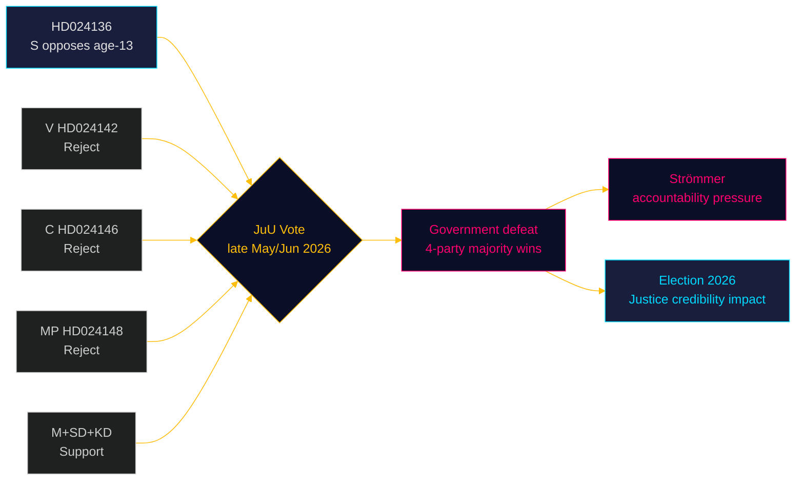

# Per-Document Political Intelligence — HD024136

**dok_id**: HD024136  
**Title**: med anledning av prop. 2025/26:246 Skärpta regler för unga lagöverträdare  
**Type**: Kommittémotion (Committee Motion)  
**Date**: 2026-04-29  
**Submitted by**: Teresa Carvalho m.fl. (S)  
**Committee**: JuU (Justice Committee)  
**Admiralty Code**: [A1] — Official Riksdag primary source  
**DIW Score**: 0.82 (L3 Structural) — links to core age-13 criminal responsibility coalition battle

---

## Document Summary

S committee motion opposing prop. 2025/26:246 (Skärpta regler för unga lagöverträdare — Stricter rules for young offenders).

**S position**:
1. **Oppose** lowering criminal responsibility age to 13 years — S joins V, C, MP forming an opposition majority against this core government proposal
2. **Support** strengthening youth supervision (ungdomsövervakning) as an alternative
3. **Support** other parts of the proposition where aligned

**Teresa Carvalho** (S) is the shadow justice minister. This motion confirms S as part of the 4-party opposition coalition (V+S+C+MP) against age-13 criminal responsibility.

---

## Analytical Assessment

**Coalition arithmetic — CRITICAL**: This confirms the count referenced in existing analysis. With V (HD024142, explicit rejection), C (HD024146, explicit rejection), S (HD024136, explicit rejection), and MP (HD024148, explicit rejection), the government faces a parliamentary majority against its criminal age-of-responsibility proposal.

**Government exposure**: KD's justice track is under pressure (JuU30 custodial framework in existing analysis + now age-13 rejection by majority).

**Gunnar Strömmer (M) position**: The justice minister's stated goal to "eradicate gang crime in four years" (see HD10458) is being undercut by parliamentary arithmetic that prevents one of his signature measures.

**SD alignment**: SD supports the age-13 proposal — this is a rare case of M+SD alignment on a justice measure that still fails due to S+V+C+MP opposition.

**Significance**: This motion is the S pillar in the 4-party coalition that constitutes a formal legislative majority opposing the government's most ambitious youth crime measure.

---

## Evidence Chain

| Claim | Source | Admiralty |
|-------|--------|----------|
| S opposes age-13 criminal responsibility | HD024136 text | A1 |
| V opposes (HD024142), C opposes (HD024146), MP opposes (HD024148) | Motion record | A1 |
| Combined opposition = likely JuU majority | Parliamentary arithmetic | A2 (inferred) |
| Teresa Carvalho = S shadow justice minister | Riksdag ledamöter database | A1 |

---

## PIR Status

HIGH priority — update PIR on youth crime age-13 vote. Expected JuU vote late May/June 2026. Government likely to lose this vote.

**Signal**: When this motion passes (expected), it will be a significant government defeat in election year. Watch for Strömmer response and M positioning.

