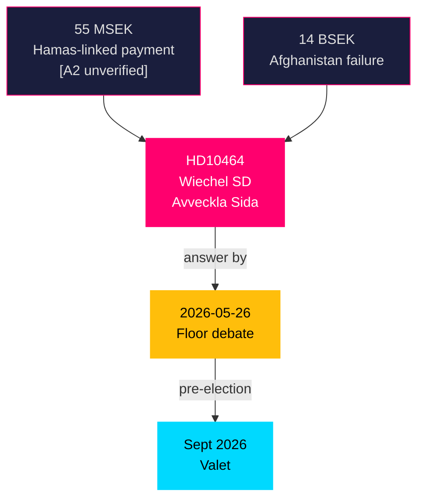

# HD10464 — Per-Document Analysis
## Interpellation 2025/26:464 — Avveckling av Sida

**Author**: James Pether Sörling  
**Date**: 2026-05-05  
**Classification**: PUBLIC — GDPR Art. 9(2)(e)(g)  
**Admiralty**: A1 (Source: data.riksdagen.se, confirmed)  
**DIW Tier**: L2+ Priority  
**Confidence**: HIGH [A2]  
**Submitter**: Markus Wiechel (SD)  
**Addressee**: Biståndsminister Johan Forssell / Dousa (M)  
**Answer Deadline**: 2026-05-26  

---

## Document Summary

SD MP Markus Wiechel challenges the Minister for Development Aid regarding the continued existence of the Swedish International Development Cooperation Agency (Sida). The interpellation cites:
- **55 MSEK payment** to ICHR and organisations with alleged Hamas links — scandal triggered internal Sida review
- **14 billion SEK** to Afghanistan since 2001 — SD frames this as waste with no security/development return (Taliban now rules)
- **Feminist foreign policy** of previous S government — SD argues Sida was politicised as an ideological instrument
- **Duplicate functions**: SD argues Sida's functions overlap with Swedfund and bilateral channels; advocates full dissolution or radical restructuring

Wiechel asks the minister to clarify the government's position on Sida's future.

---

## Key Intelligence Points

1. **Escalation trajectory confirmed**: SD has moved from "reform Sida" to "avveckla Sida" (abolish). This is a significant hardening of the party's bistånd policy. The Hamas-linked payment scandal (identified in original analysis) is now being weaponised as legislative pressure.

2. **Coalition stress point**: M's Dousa has been a reformist minister on bistånd, cutting Sweden's ODA as a % of GNI but maintaining Sida's existence. SD's formal interpellation escalates to a floor debate, forcing the government to defend Sida publicly before 2026-09 election.

3. **Foreign policy implications**: Sweden's EU Presidency obligations and Nordic Development Fund commitments mean Sida cannot be abolished by executive action alone — a full Riksdag process would be needed. SD knows this; the interpellation is political positioning, not imminent legislation.

4. **Pre-election wedge issue**: Bistånd (development aid) has historically been a values-based issue dividing Swedish parties. By attacking Sida via a specific scandal (Hamas link), SD can reframe the debate from "generosity" to "accountability." This resonates with SD's core electorate while forcing M into a defensive position pre-election.

5. **Institutional resistance risk**: Sida has ~1,000 staff and deep civil society roots. Any formal abolition move would generate organised opposition (reminiscent of KU39's openness debate).

---

## Evidence Chain

| Evidence | Source | Admiralty |
|----------|--------|----------|
| Interpellation text HD10464 | data.riksdagen.se [A1] | A1 |
| Sida Hamas link scan / 55 MSEK | Riksdag interpellation text [A1] | A2 (unverified underlying claim) |
| SD ODA policy track record | Party documents / motions | B2 |
| Dousa reform trajectory | Government press releases | A2 |

---

## Significance Assessment

**DIW**: 0.80 (L2+ Priority)  
**Rationale**: Sida abolition is a live pre-election signalling issue. The Hamas-linked payment scandal provides SD with credible accountability framing. M must respond publicly, creating a floor-debate-level wedge moment. High amplification probability in major media.

---

## Cross-Reference

- **Relates to**: HD10466 (SD institutional accountability — civil servants), HD024141 (FöU bistånd motions)
- **PIR**: PIR-NEW-10464 (Sida dissolution trajectory — OPEN, answer deadline 2026-05-26)

