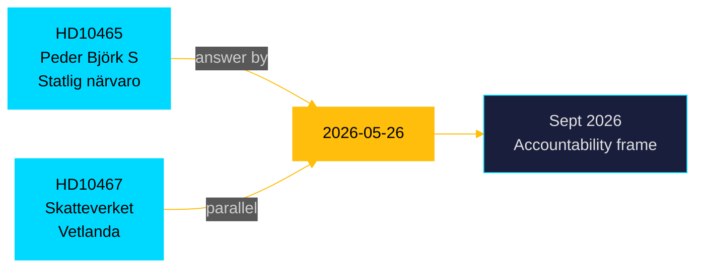

# HD10465 — Per-Document Analysis
## Interpellation 2025/26:465 — Statlig närvaro och service

**Author**: James Pether Sörling  
**Date**: 2026-05-05  
**Classification**: PUBLIC — GDPR Art. 9(2)(e)(g)  
**Admiralty**: A1 (Source: data.riksdagen.se, confirmed)  
**DIW Tier**: L3 Standard  
**Confidence**: HIGH [A1]  
**Submitter**: Peder Björk (S)  
**Addressee**: Civilminister Erik Slottner (KD)  
**Answer Deadline**: 2026-05-26  

---

## Document Summary

S MP Peder Björk demands accountability from KD Civilminister Slottner regarding the systematic reduction of state service presence across Sweden since 2022:
- **148 → 125 service offices** (servicekontor) with ~10 more planned for closure
- **130 MSEK budget cut** to service office network
- Closures in Piteå, Arvika, Ånge, Landskrona, Motala, Östhammar
- Skatteverket, Försäkringskassan, Arbetsförmedlingen all reducing physical presence
- S frames this as SD-government "deliberately dismantling" accessible state presence, especially for elderly and digitally excluded citizens

---

## Key Intelligence Points

1. **Pre-election accountability narrative**: S is building a "decentralisation vs. centralisation" accountability case against the government. State service withdrawal from rural and mid-sized towns resonates with voters in those areas — many of whom are not core SD voters.

2. **Coalition vulnerability**: KD (Slottner's party) has traditionally been a defender of local service and family values. Being accountable for closing 23 servicekontor is a KD vulnerability — S is deliberately targeting this ministry.

3. **Complementary to HD10467**: Both HD10465 and HD10467 (Skatteverket Vetlanda) are part of S/opposition's coordinated pre-election offensive on state service withdrawal. Together they build a stronger narrative than individually.

4. **Counterfactual risk**: Slottner/government will likely point to digitalisation efficiency gains and argue savings were reallocated to core welfare. S's answer strategy will need to address this directly.

---

## Significance Assessment

**DIW**: 0.62 (L3 Standard)  
**Rationale**: Important accountability track but limited legislative consequence — the interpellation will generate floor debate, some media, but no policy change before 2026-09 election. The state service withdrawal is a documented policy direction; Slottner's answer is unlikely to reverse it.

---

## Cross-Reference

- **Relates to**: HD10467 (Skatteverket Vetlanda), HD10464 (SD institutional attacks)
- **PIR**: PIR-NEW-10465 (State service withdrawal trajectory — S accountability offensive, answer deadline 2026-05-26)

