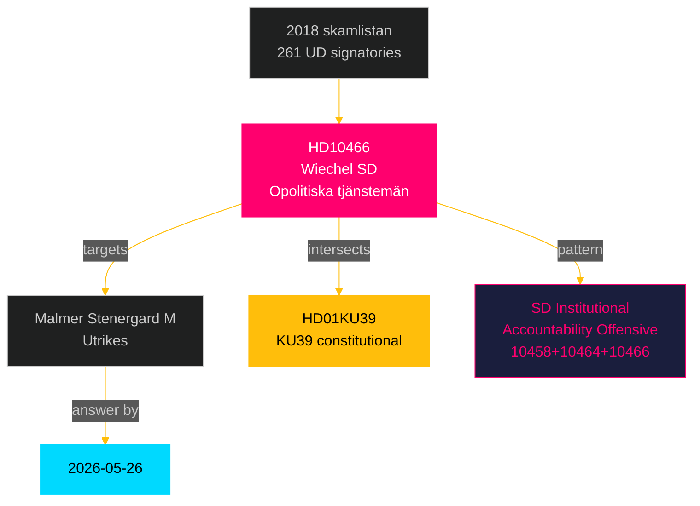

# HD10466 — Per-Document Analysis
## Interpellation 2025/26:466 — Opolitiska tjänstemän vid Regeringskansliet

**Author**: James Pether Sörling  
**Date**: 2026-05-05  
**Classification**: PUBLIC — GDPR Art. 9(2)(e)(g)  
**Admiralty**: A1 (Source: data.riksdagen.se, confirmed)  
**DIW Tier**: L2+ Priority  
**Confidence**: HIGH [A2]  
**Submitter**: Markus Wiechel (SD)  
**Addressee**: Utrikesminister Maria Malmer Stenergard (M)  
**Answer Deadline**: 2026-05-26  

---

## Document Summary

SD's Markus Wiechel challenges Foreign Minister Malmer Stenergard on the 2018 "skamlistan" incident — when 261 UD (Foreign Ministry) officials signed a public protest letter against the incoming centre-right coalition. SD is demanding:
- An accounting of the 261 signatories' current career placements, salary trajectories, and assignments
- Whether any were promoted or rewarded following their political protest
- Whether the Foreign Minister will ensure politically neutral civil servants are hired

The interpellation invokes the principle of opolitiska tjänstemän (politically neutral civil service) as enshrined in RF Chapter 12.

---

## Key Intelligence Points

1. **Constitutional dimension**: RF 12:2 protects civil servant decisions from direct political instruction — but does not protect public political mobilisation by civil servants against incoming governments. SD is framing their demand as compatible with constitutional norms, while critics see it as a "nomenklatura" purge attempt.

2. **Resonance with KU39**: KU39 (already in original analysis) examines transparency in government decision-making. HD10466 adds a dimension: were UD's "political" civil servants steering policy during the S government's final years? This is the deep state narrative that resonates with SD's core voter base but alarms constitutional scholars.

3. **Target selection**: Malmer Stenergard replaced Ann Linde (S) as Foreign Minister and has navigated Sweden's NATO accession carefully. SD using an interpellation to force her to take a public position on civil servant accountability places her in a difficult position — either defend UD staff (appearing as S-sympathetic) or signal support for career audits (alarming international partners about democratic norms).

4. **Pre-election positioning**: SD is running a coherent "institutional accountability" offensive across multiple ministerial portfolios in the 2026 pre-election period: Sida (HD10464), UD civil servants (HD10466), gang crime KPIs (HD10458). The pattern is deliberate: SD is positioning as the party demanding institutional accountability before voters in September.

5. **Risk**: International observers (EU institutions, US, Nordic partners) monitoring democratic backsliding may flag this interpellation cluster. Sweden's press freedom and Rechtstaat record could come under scrutiny if an HD10466-type audit were actually implemented.

---

## Evidence Chain

| Evidence | Source | Admiralty |
|----------|--------|----------|
| Interpellation text HD10466 | data.riksdagen.se [A1] | A1 |
| 2018 "skamlistan" (261 UD officials' letter) | Swedish media / UD records | B2 |
| RF Chapter 12 (civil service neutrality) | Grundlag | A1 |
| Malmer Stenergard's prior statements on UD | Government press | A2 |

---

## Significance Assessment

**DIW**: 0.82 (L2+ Priority — HIGH significance)  
**Rationale**: SD's institutional accountability offensive represents the highest-significance non-legislative story cluster today. HD10466 specifically targets democratic norms (civil service neutrality) and has international echo potential. Media amplification probability: high. Constitutional scholars will respond.

---

## Cross-Reference

- **Relates to**: HD01KU39 (constitutional transparency), HD10464 (SD institutional accountability theme)
- **PIR**: PIR-NEW-10466 (Civil service accountability / democratic backsliding risk — OPEN, answer deadline 2026-05-26)

