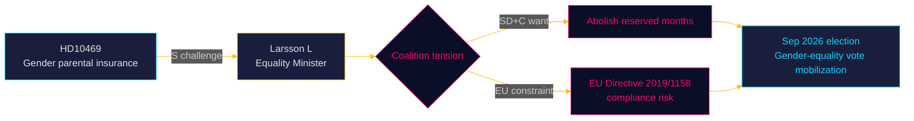

# Per-Document Political Intelligence — HD10469

**dok_id**: HD10469  
**Title**: En jämställd föräldraförsäkring  
**Type**: Interpellation  
**Date**: 2026-05-05  
**Submitted by**: Sanne Lennström (S)  
**Directed to**: Jämställdhetsminister Nina Larsson (L)  
**Answer deadline**: 2026-05-26  
**Admiralty Code**: [A1] — Official Riksdag primary source  
**DIW Score**: 0.68 (L2 Moderate) — intersects gender equality, election-year controversy

---

## Document Summary

S MP Sanne Lennström challenges Equality Minister Nina Larsson (L) on the government's inaction on gender-equal parental insurance. Key data cited:
- Fathers take only **31%** of parental leave (Försäkringskassan data)
- The wage gap between men and women diverges significantly during early parenthood
- Women face pension poverty consequences
- **Two riksdag parties have announced they want to abolish reserved months** — which would violate EU Directive on Work-Life Balance

**Core question**: What concrete measures will the minister take to achieve gender-equal parental insurance?

---

## Analytical Assessment

**Political significance**: L2 Moderate, with pre-election amplification potential.

**EU Dimension — HIGH**: The mention of the Work-Life Balance Directive (EU 2019/1158) raises a compliance issue. If Sweden abolishes mandatory reserved months, it may be in breach of EU law. This is an unusually strong legal constraint argument that the minister will need to address.

**Coalition dimension**: The "two parties wanting to abolish reserved months" almost certainly refers to SD and C. SD has consistently opposed what they call "quota coercion" (kvotering). C has historically oscillated on this issue. L is in a difficult position as the equality minister in a government dependent on SD.

**Election relevance**: MEDIUM-HIGH. Gender equality + parental insurance is a key mobilization issue for S's core electorate, particularly younger women voters. With elections in Sep 2026, this interpellation is timed for maximum pre-campaign salience.

**Realpolitik**: Larsson (L) is unlikely to announce new mandatory measures given coalition dynamics. The interpellation will likely produce a defensive answer about the government's existing voluntary approach (subsidized parental education, incentives).

---

## Evidence Chain

| Claim | Source | Admiralty |
|-------|--------|----------|
| Fathers take 31% of parental leave | Försäkringskassan (cited in HD10469) | B2 (cited secondary) |
| Wage gap diverges during early parenthood | Academic/policy literature (cited implicitly) | B3 |
| Two parties want to abolish reserved months | Political record (unnamed parties, plausible SD+C) | B2 |
| EU Work-Life Balance Directive relevant | EU Directive 2019/1158 | A1 external |

---

## PIR Status

Feeds into Gender Equality PIR (roll-forward to Sep 2026 election). Connects to L's coalition positioning and SD's gender-equality opposition narrative.

