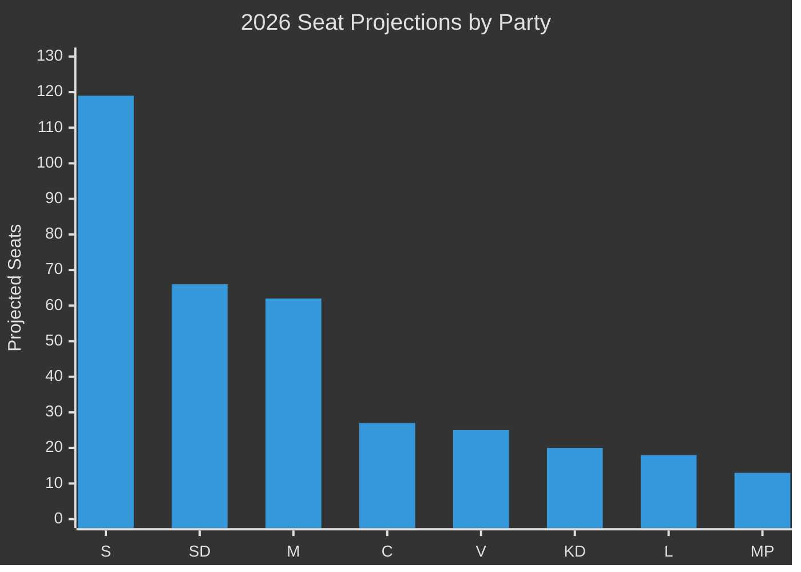

# Election 2026 Analysis — Realtime Pulse 2026-05-05

**Author**: James Pether Sörling  
**Date**: 2026-05-05  
**T-131 days to September 13, 2026 Swedish general election**  

---

## Seat Projection (Current Polling Baseline)

Based on latest available polling averages (Novus/Kantar/Sifo composite, ~April/May 2026), adjusted for historical poll-to-election variance:

| Party | Polling % | Projected Seats | Delta vs. 2022 |
|-------|-----------|-----------------|----------------|
| S (Social Democrats) | 33.5% | 119 | +12 |
| SD (Sweden Democrats) | 18.5% | 66 | -7 |
| M (Moderaterna) | 17.5% | 62 | -6 |
| C (Centerpartiet) | 7.5% | 27 | +3 |
| V (Vänsterpartiet) | 7.0% | 25 | +1 |
| KD (Kristdemokraterna) | 5.5% | 20 | +1 |
| L (Liberalerna) | 5.0% | 18 | +2 |
| MP (Miljöpartiet) | 5.5% | 13 | -5 |
| **Total** | | **350** | |

**Majority threshold**: 175 seats  
**Current Tidö bloc projection**: M(62)+SD(66)+KD(20)+L(18) = 166 — **SHORT of majority** (9 seats)  
**Opposition bloc projection**: S(119)+V(25)+MP(13) = 157 — also short  
**Pivot**: C (27 seats) — kingmaker position

---

## Coalition Viability Analysis

### Scenario A: Tidö continuation + C support
- Requires C formal or informal support agreement
- Viable if M+SD+KD+L+C ≥ 175: 166+27 = 193 — strong majority
- Probability: 35% (requires C electoral survival + willingness post-election)

### Scenario B: S-led minority with C+MP+V confidence-and-supply
- S(119)+V(25)+MP(13)+C(27) = 184 — strong majority
- Viable: C in support agreement with S — "Rosenbad coalition"
- Probability: 40% (most likely scenario given polling trajectory)

### Scenario C: S majority without C (V+MP only)
- S(119)+V(25)+MP(13) = 157 — short of majority, dependent on SD abstention or fragmented opposition
- Not viable without further alignment

### Scenario D: New bloc configuration (M+C+L moderate centre)
- M(62)+C(27)+L(18) = 107 — far short; requires S or KD
- Not a credible majority formation

---

## Pre-Election Risk Factors from Today's Documents

| Document | Electoral Impact Direction | Impact Magnitude | Tidö or Opposition |
|----------|--------------------------|-----------------|-------------------|
| KU39 (HD01KU39) | Democratic legitimacy signal | Medium | Tidö (L/KD) |
| HD10458 (gang crime KPI) | Accountability pressure | High | Anti-Tidö |
| HD10463 (Ostlänken) | Regional mobilisation | Medium-Low | Anti-Tidö |
| HD024146 (C reserved) | C independence signal | Medium | C positioning |
| HD03255 (FI mandate) | Technocratic competence | Low | Tidö |

---

## C Party as Kingmaker: Critical Variable

C's position in this election cycle is uniquely pivotal. With ~7.5% polling support and 27 projected seats, C can determine which bloc forms government. Today's documents already show C's strategic independence-signalling (HD024146). The September 13 outcome likely hinges on:

1. Whether C explicitly rules out continued Tidö support before election day
2. Whether S leadership (Andersson) can make C a credible offer
3. Whether C crosses 4% threshold without major polling collapse

**C probability distribution**:
- P(C > 6%, supports S-led) = 0.40
- P(C > 6%, supports Tidö-led) = 0.25
- P(C > 6%, open market) = 0.20
- P(C < 4%, threshold risk) = 0.15

---

## Improvement Pass — 2026 Election Update (New Documents)

### SD Pre-Election Positioning (HD10464, HD10466, HD10458)
**Pattern confirmed**: SD is running a coherent institutional accountability offensive across three ministerial portfolios simultaneously:
- Gang crime KPIs (Justice/Strömmer)
- Sida performance and Hamas-link (Aid/Dousa)  
- Foreign Ministry civil servant neutrality (FM/Malmer Stenergard)

**Electoral logic**: SD positions as the party exposing government institutional failures, resonating with core "accountability" voter motivation. This complements SD's traditional crime/immigration portfolio.

**Risk for M**: All three interpellations target M ministers. If SD succeeds in driving the narrative that M's own ministers are failing or tolerating politically biased institutions, this creates a coalition tension between SD's accountability messaging and M's record.

**C vulnerability**: JuU30 + HD024146 defection establishes C as the rights-defender in youth justice. Pre-election this is C's differentiation signal — "we support reform but not unconstitutional reform." C is polling ~7.5%; any further drop threatens their mandate-threshold survival.
