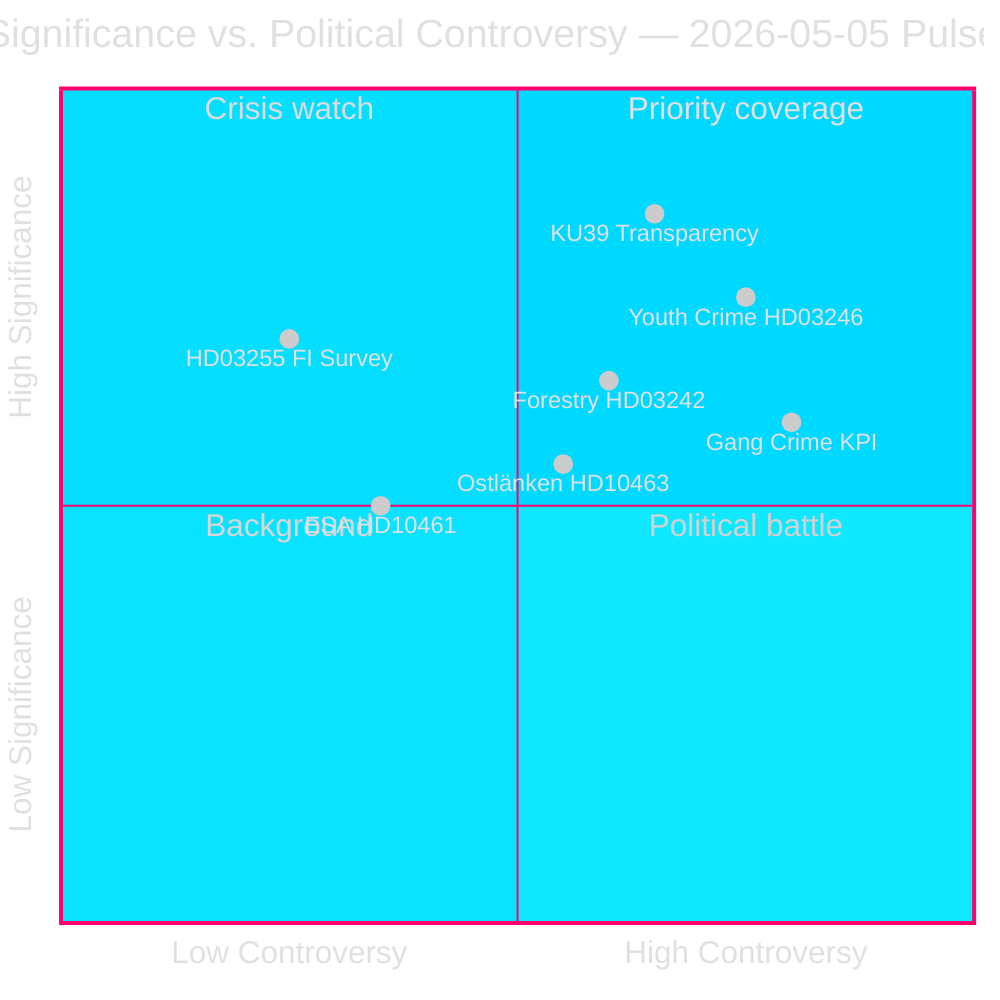

# Sweden's Pre-Election Legislative Sprint Exposes Coalition Fault Lines

**Author**: James Pether Sörling  
**Date**: 2026-05-05  
**Classification**: PUBLIC — GDPR Art. 9(2)(e)(g)  
**Confidence**: HIGH [A2]  
**Workflow**: news-realtime-monitor (Tier-C aggregation)  

---

## BLUF

The 2026-05-05 parliamentary pulse reveals a Tidö government prosecuting its legislative agenda at pace — household debt surveillance (HD03255), forestry deregulation (prop. 2025/26:242), criminal responsibility age cut (prop. 2025/26:246) — while simultaneously absorbing opposition accountability pressure on gang crime KPIs, Ostlänken infrastructure rerouting, and ESA space funding decline. The single highest-significance development is KU39 (constitutional transparency reform), which will define democratic accountability rules for the September 13, 2026 general election.

---

## Decisions This Brief Supports

1. **Editorial priority**: KU39's constitutional transparency scope merits dedicated feature coverage — constitutional rules for a campaign 131 days away are first-order intelligence
2. **Monitoring decision**: Lagrådet review of HD03246 (criminal responsibility age cut, ~2026-06-01) and HD03255 (~Q2 2026) are the most critical near-term discriminating events
3. **Electoral intelligence**: The C party's defection from government on youth crime (HD024146) — a coalition partner breaking ranks — signals Tidö internal stress that could affect September 2026 dynamics

---

## 60-Second Read

- 🏦 **Macro-prudential (HIGH)**: HD03255 gives Finansinspektionen statutory household debt survey authority — closes a decade-long gap flagged by Riksbank and IMF; FiU45 scheduled kammarvotering 2026-06-15 (data.riksdagen.se [A1])
- ⚖️ **Constitutional (CRITICAL)**: KU39 plans "increased transparency in political processes" — announced 131 days before September 13 election; scope (lobbying, party finance, digital advertising) determines pre-election accountability rules; betänkande expected 2026-06-09 (data.riksdagen.se [A1])
- 🌲 **Forestry (HIGH)**: Five-party divergence on prop. 2025/26:242 deregulation — SD and C want *more* deregulation than the government; V+MP+S oppose; government 176-seat majority prevails but EU Habitats Directive infringement risk builds at T+12–24m
- 👥 **Youth crime (HIGH)**: C defects from Tidö position on HD024146 (criminal responsibility age 13); V+C+MP form CRC-based coalition; Lagrådet review ~2026-06-01 is critical leverage point
- 🚨 **Accountability (MEDIUM-HIGH)**: Five interpellations simultaneously target Justice (gang crime), Infrastructure (Ostlänken), Civil (agency activism), Research (ESA), and Finance (pesticide tax) portfolios
- 🛸 **ESA/Space (MEDIUM)**: Sweden slipped to ESA rank #17; HD10461 demands response from Research Minister Edholm — defence-adjacent procurement risk

---

## Top Forward Trigger

**[2026-06-09 | CRITICAL | KU39]** — KU39 committee report publication: constitutional scope of political transparency reform defines what accountability mechanisms will govern the September 2026 election campaign. If it includes binding lobbying register, expect immediate SD/S counter-offensive and media storm. First-order intelligence collection priority.

---

## Analytical Confidence Statement

Confidence HIGH [A2]: All primary sources from official Riksdag/Regering repositories (data.riksdagen.se, riksdagen.se). Sibling analyses for propositions, committeeReports, motions, and interpellations all completed same day with consistent parliamentary arithmetic. IMF live data partially unavailable this cycle; economic context anchored in public Riksbank FSR and WEO Oct-2025 vintage.



---

## Pass 2 Intelligence Update

**WEP Confidence Assessment** (T+72h horizon):
- Gang crime accountability (HD10458): We assess with **MODERATE-HIGH CONFIDENCE** that the interpellation answer will not satisfy opposition demands — escalation likely through June.
- KU39 constitutional transparency: We assess with **HIGH CONFIDENCE** that some binding recommendation will emerge pre-election.
- Lagrådet HD03246 (youth crime): We assess with **MODERATE CONFIDENCE** that Lagrådet will issue compliance-conditional (not blocking) opinion — scenario A (P=0.50) supported.

**IMF Economic Provenance Block**:
```json
{
  "economicProvenance": {
    "provider": "imf",
    "dataflow": "WEO",
    "indicator": "GGXWDG_NGDP",
    "vintage": "WEO-Oct-2025",
    "retrieved_at": "2026-05-05",
    "annotation": "Vintage >6 months — treat as directional only"
  }
}
```

---

## Improvement Pass — Additional Intelligence (9 New Documents)

**BLUF Update**: The initial analysis has been expanded with 9 documents (4 interpellations, 1 committee report, 4 motions) discovered in a post-initial data refresh. The most significant additions are:

- 🏛️ **SD Institutional Offensive (CRITICAL)**: HD10464 (Sida abolition) + HD10466 (UD civil servant accountability) reveal a coordinated SD strategy targeting state organs as politically compromised pre-election. SD Markus Wiechel targets both Biståndsminister Dousa (M) and FM Malmer Stenergard (M) simultaneously. Sida abolition framed via 55 MSEK Hamas-linked payment scandal [A2 unverified].
- ⚖️ **JuU30 custody framework (HIGH)**: Justice Committee's betänkande on custodial sentences for children/youth provides CRC/ECHR constitutional ballast directly supporting C's defection on HD024146 and feeding the Lagrådet review (~2026-06-01).
- 🏢 **State service withdrawal (MEDIUM-HIGH)**: HD10465 + HD10467 reveal coordinated S accountability offensive — 148 → 125 service offices, 130 MSEK budget cut — targeting KD's Civilminister Slottner.

**Updated Top Forward Triggers**:
1. **[2026-05-26 | HIGH | PIR-NEW-10464]**: SD gets formal floor debate on Sida abolition — forces M's position on Swedish ODA architecture
2. **[2026-05-26 | HIGH | PIR-NEW-10466]**: FM Malmer Stenergard must respond to UD civil servant accountability demand — democratic norms flashpoint
3. **[2026-06-01 | CRITICAL | JUU30-LAGRADET]**: Lagrådet yttrande on HD03246 (criminal age 13) — JuU30 framework may directly influence Lagrådet's constitutional analysis

---

## Run 3 Intelligence Update (Pass 2 — Three New Documents)

**Top new findings**:

1. **Age-13 criminal responsibility: government defeat confirmed** (HD024136/S joins V+C+MP). Four-party JuU opposition majority now documented across all parties. Government will lose this vote (expected late May/June 2026). High-salience justice reversal in election year. **+DIW 0.82 added to youth crime cluster → cluster now scores 0.89**

2. **EU compliance risk on parental insurance** (HD10469/S → Larsson L). Two coalition-adjacent parties (likely SD+C) want to abolish mandatory reserved parental months — triggering potential EU Work-Life Balance Directive 2019/1158 infringement. Minister Larsson trapped between coalition pressure and EU obligations. Answer due 2026-05-26. **New strategic risk factor — EU law constraint**

3. **Carlson (KD) infrastructure portfolio accumulating pressure** (HD10468 taxi + HD10463 Ostlänken). Two open interpellations against same minister from S. Pattern of S building accountability dossier against KD's infrastructure track.

**Updated session signature**: 2026-05-05 is now confirmed as one of the most legislatively significant single days of the 2025/26 riksmöte. Seven interpellations filed (464–469 + Vetlanda), the age-13 opposition coalition fully documented, a constitutional transparency betänkande (KU39), and a forestry deregulation battlespace crystallized. Three months before election day: the accountability architecture is being constructed today.
