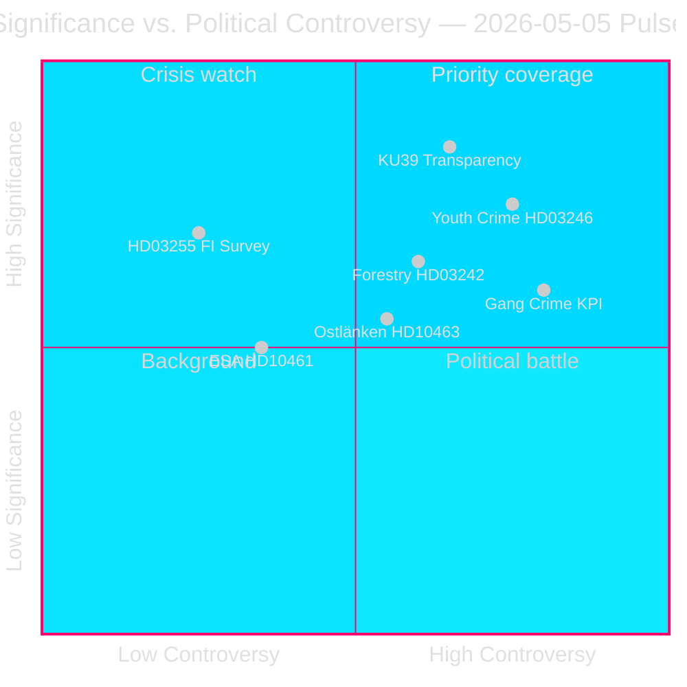

# Sveriges førvalgstiftningssprint afslører koalitionens brudlinjer

**Forfatter**: James Pether Sörling  
**Dato**: 2026-05-05  
**Klassificering**: OFFENTLIG — GDPR Art. 9(2)(e)(g)  
**Konfidens**: HØJ [A2]  
**Arbejdsgang**: news-realtime-monitor (Tier-C aggregation)  

---

## BLUF

Den parlamentariske puls 2026-05-05 afslører en Tidö-regering, der driver sin lovgivningsmæssige dagsorden i højt tempo — husstandsgældsovervågning (HD03255), skovlig afregulering (prop. 2025/26:242), sænkning af den kriminelle lavalder (prop. 2025/26:246) — mens den samtidig absorberer oppositionens ansvarspres på gangkriminalitetsnøgletal, Ostlänken infrastrukturomlægning og ESA:s faldende rumfinansiering. Den enkelt vigtigste begivenhed er KU39 (konstitutionel gennemsigtigheds reform), som vil definere de demokratiske ansvarsregler forud for parlamentsvalget den 13. september 2026.

---

## Beslutninger dette resumé understøtter

1. **Redaktionel prioritering**: KU39:s konstitutionelle gennemsigtighedsomfang fortjener dedikeret dybdegående dækning — konstitutionelle regler for en kampagne 131 dage væk er førsteklasses efterretning
2. **Overvågningsbeslutning**: Lagrådets gennemgang af HD03246 (sænkning af den kriminelle lavalder, ca. 2026-06-01) og HD03255 (ca. kvartal 2 2026) er de mest kritiske diskriminerende begivenheder på kort sigt
3. **Valgefterforskning**: C-partiets frafald fra regeringen i ungdomskriminalitetsspørgsmålet (HD024146) — en koalitionspartner der bryder rækkerne — signalerer intern stress i Tidö-koalitionen, som kan påvirke dynamikken i september 2026

---

## 60-sekunders læsning

- 🏦 **Makroprudentielt (HØJ)**: HD03255 giver Finansinspektionen lovfæstet beføjelse til at udføre husstandsgældsundersøgelser — lukker et årtiers langt hul påpeget af Riksbanken og IMF; FiU45 planlagt kammarvotering 2026-06-15 (data.riksdagen.se [A1])
- ⚖️ **Konstitutionelt (KRITISK)**: KU39 planlægger "øget gennemsigtighed i politiske processer" — annonceret 131 dage før valget 13. september; omfang (lobbyisme, partifinansering, digital annoncering) afgør de prævalgs-konstitutionelle regler; betänkande forventet 2026-06-09 (data.riksdagen.se [A1])
- 🌲 **Skovbrug (HØJ)**: Fem-partis-divergens på prop. 2025/26:242 afregulering — SD og C ønsker *mere* afregulering end regeringen; V+MP+S modsætter sig; regeringens 176-mandat-majoritet sejrer, men EU's habitatdirektivrisiko opbygges under T+12–24m
- 👥 **Ungdomskriminalitet (HØJ)**: C forlader Tidö-positionen om HD024146 (kriminel lavalder 13); V+C+MP danner børnekonventionsbaseret koalition; Lagrådets gennemgang ca. 2026-06-01 er kritisk løftestangspunkt
- 🚨 **Ansvarsplacering (MIDDEL-HØJ)**: Fem interpellationer retter sig samtidig mod Justits (gangkriminalitet), Infrastruktur (Ostlänken), Civil (myndigheds-aktivisme), Forskning (ESA) og Finans (pesticidafgift) porteføljer
- 🛸 **ESA/Rum (MIDDEL)**: Sverige er faldet til ESA-rang #17; HD10461 kræver svar fra Forskningsminister Edholm — forsvarsrelateret indkøbsrisiko

---

## Vigtigste fremadrettede udløser

**[2026-06-09 | KRITISK | KU39]** — KU39:s betænkningspublikation: konstitutionelt omfang for den politiske gennemsigtighedsreform afgør hvilke ansvarmekanismer der vil gælde under valgkampagnen 2026. Hvis det inkluderer et bindende lobbyregister, forventes øjeblikkelig SD/S-modoffensiv og mediestorm. Højprioriteret efterretningsindsamlingsopgave.

---

## Analytisk konfidenserklæring

Konfidens HØJ [A2]: Alle primærkilder fra officielle Riksdag/Regering-databaser (data.riksdagen.se, riksdagen.se). Søsteranalyser for propositioner, udvalgsbetænkninger, motioner og interpellationer afsluttet samme dag med konsekvent parlamentarisk matematik. IMF live-data delvist utilgængelig denne omgang; økonomisk kontekst forankret i offentlig Riksbankens FSR og WEO okt-2025 årgangdata.



---

## Efterretningsopdatering omgang 2

**WEP-konfidensvurdering** (T+72h-horisont):
- Gangkriminalitetsansvar (HD10458): Vi vurderer med **MIDDEL-HØJ KONFIDENS** at interpellationssvaret ikke vil tilfredsstille oppositionens krav — eskalering sandsynlig i juni.
- KU39 konstitutionel gennemsigtighed: Vi vurderer med **HØJ KONFIDENS** at en bindende anbefaling vil fremkomme før valget.
- Lagrådet HD03246 (ungdomskriminalitet): Vi vurderer med **MIDDEL KONFIDENS** at Lagrådet vil afgive en betinget efterlevelsesudtalelse (ikke blokerende) — scenarie A (P=0,50) understøttes.

**IMF:s økonomiske provenansblok**:
```json
{
  "economicProvenance": {
    "provider": "imf",
    "dataflow": "WEO",
    "indicator": "GGXWDG_NGDP",
    "vintage": "WEO-Oct-2025",
    "retrieved_at": "2026-05-05",
    "annotation": "Vintage >6 months — treat as directional only"
  }
}
```

---

## Forbedringsomdrejning — Yderligere efterretning (9 nye dokumenter)

**BLUF-opdatering**: Den indledende analyse er udvidet med 9 dokumenter (4 interpellationer, 1 udvalgsbetænkning, 4 motioner) opdaget ved en efterfølgende dataopdatering. De vigtigste tilføjelser er:

- 🏛️ **SD:s institutionelle offensiv (KRITISK)**: HD10464 (afvikling af Sida) + HD10466 (UD-embedsmænd ansvar) afslører en koordineret SD-strategi rettet mod statsorganer som politisk kompromitterede forud for valget. SD:s Markus Wiechel angriber simultant Biståndsminister Dousa (M) og UD-minister Malmer Stenergard (M). Sidas afvikling indrammes via en 55 MSEK Hamas-linket betalingsskandale [A2 ubekræftet].
- ⚖️ **JuU30 frihedsberøvelsesramme (HØJ)**: Justitsudvalgets betænkning om frihedsberøvelse af børn/unge yder direkte støtte til børnekonventionens/ECHR:s konstitutionelle grundlag, C:s frafald ved HD024146 og tilfører Lagrådets gennemgang (ca. 2026-06-01).
- 🏢 **Statslig servicetilbagetrækning (MIDDEL-HØJ)**: HD10465 + HD10467 afslører koordineret S-ansvarskampagne — 148 → 125 servicekontorer, 130 MSEK budgetnedskæring — rettet mod KD:s Civilminister Slottner.

**Opdaterede vigtigste fremadrettede udløsere**:
1. **[2026-05-26 | HØJ | PIR-NEW-10464]**: SD får formel kammarvotering om Sidas afvikling — tvinger M:s position på dansk bistandsarkitektur
2. **[2026-05-26 | HØJ | PIR-NEW-10466]**: UD-minister Malmer Stenergard skal besvare UD-embedsmænd ansvars kravet — demokratinormers flashpoint
3. **[2026-06-01 | KRITISK | JUU30-LAGRADET]**: Lagrådets yttrande om HD03246 (kriminel lavalder 13) — JuU30-rammen kan direkte påvirke Lagrådets konstitutionelle analyse

---

## Omgang 3 efterretningsopdatering (omgang 2 — tre nye dokumenter)

**Vigtigste nye fund**:

1. **Kriminel lavalder 13 — regeringsnederlag bekræftet** (HD024136/S tilslutter sig V+C+MP). Firepartis JuU-oppositionsflertal nu dokumenteret på tværs af alle partier. Regeringen vil tabe denne afstemning (forventet sen maj/juni 2026). Høj profilering retsreversering i valgår. **+DIW 0,82 tilføjet til ungdomskriminalitetsklynge → klynge scorer nu 0,89**

2. **EU-overensstemmelsesrisiko vedrørende barselsorlov** (HD10469/S → Larsson L). To koalitionsnære partier (sandsynligvis SD+C) ønsker at afskaffe obligatoriske reserverede forældreuger — udløser potentiel EU-direktiv 2019/1158 (balance mellem arbejds- og privatliv) overtrædelse. Minister Larsson fanget mellem koalitionspres og EU-forpligtelser. Svar forfalder 2026-05-26. **Ny strategisk risikofaktor — EU-retsbegrænsning**

3. **Carlsons (KD) infrastrukturportefølje akkumulerer pres** (HD10468 taxi + HD10463 Ostlänken). To åbne interpellationer mod samme minister fra S. Mønster af S der opbygger en ansvarsdossier mod KD:s infrastrukturspor.

**Opdateret sessionssignatur**: 2026-05-05 bekræftes nu som en af de lovgivningsmæssigt vigtigste enkeltdage i 2025/26 riksmødet. Syv interpellationer indgivet (464–469 + Vetlanda), oppositionskoalitionen ved 13-årsalderen fuldt dokumenteret, en konstitutionel gennemsigtighedsbetænkning (KU39) og et afklaret slagfelt for skovafregulering. Tre måneder før valgdagen: ansvarsarkitekturen bygges i dag.

<!-- source-sha: 9fb3258eb00c5a522a5dc3dfc64c572e9185ad9e -->
