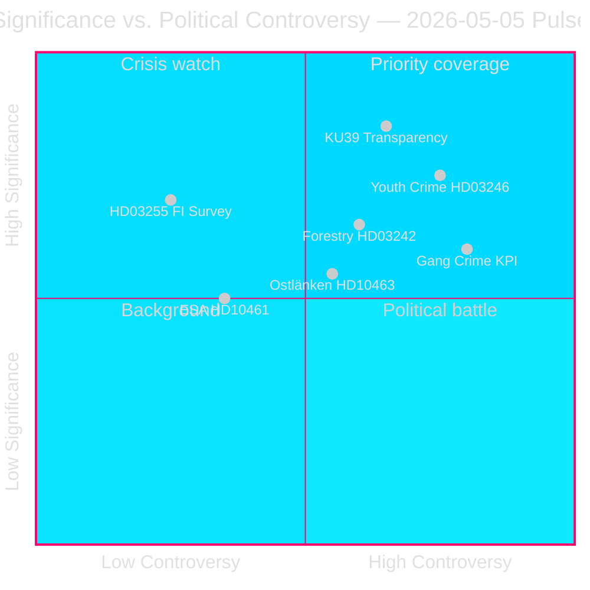

# Schwedens vorwahlpolitischer Gesetzgebungssprint legt Koalitionsrisse offen

**Autor**: James Pether Sörling  
**Datum**: 2026-05-05  
**Klassifizierung**: ÖFFENTLICH — DSGVO Art. 9(2)(e)(g)  
**Konfidenz**: HOCH [A2]  
**Workflow**: news-realtime-monitor (Tier-C aggregation)  

---

## BLUF

Der parlamentarische Puls vom 2026-05-05 offenbart eine Tidö-Regierung, die ihre Gesetzgebungsagenda in rasantem Tempo vorantreibt — Haushaltsschuldenüberwachung (HD03255), forstwirtschaftliche Deregulierung (prop. 2025/26:242), Absenkung des Strafmündigkeitsalters (prop. 2025/26:246) — während sie gleichzeitig den Rechenschaftsdruck der Opposition zu Gangkriminalitäts-KPIs, der Ostlänken-Infrastrukturumlenkung und dem sinkenden ESA-Raumfahrtfinanzierung absorbiert. Die bedeutendste Einzelentwicklung ist KU39 (konstitutionelle Transparenzreform), die die demokratischen Rechenschaftsregeln für die Parlamentswahl am 13. September 2026 festlegen wird.

---

## Entscheidungen, die dieses Briefing unterstützt

1. **Redaktionelle Priorität**: Der konstitutionelle Transparenzumfang von KU39 verdient dedizierte vertiefende Berichterstattung — Verfassungsregeln für eine Kampagne in 131 Tagen sind erstklassige Erkenntnisse
2. **Überwachungsentscheidung**: Die Lagrådet-Überprüfung von HD03246 (Absenkung des Strafmündigkeitsalters, ca. 2026-06-01) und HD03255 (ca. Q2 2026) sind die kritischsten diskriminierenden Ereignisse in naher Zukunft
3. **Wahlnachrichtendienst**: Der Abgang der C-Partei von der Regierungsposition bei Jugendbriminalität (HD024146) — ein Koalitionspartner bricht die Reihen — signalisiert internen Stress in der Tidö-Koalition, der die Dynamik im September 2026 beeinflussen könnte

---

## 60-Sekunden-Lektüre

- 🏦 **Makroprudenziell (HOCH)**: HD03255 gibt der Finansinspektionen gesetzliche Befugnis zur Haushaltsschuldenerhebung — schließt eine jahrzehntelange Lücke, auf die Riksbanken und IWF hingewiesen haben; FiU45 geplante kammarvotering 2026-06-15 (data.riksdagen.se [A1])
- ⚖️ **Konstitutionell (KRITISCH)**: KU39 plant "erhöhte Transparenz in politischen Prozessen" — angekündigt 131 Tage vor der Wahl am 13. September; Umfang (Lobbying, Parteienfinanzierung, digitale Werbung) bestimmt die vorwahlpolitischen Verfassungsregeln; betänkande erwartet 2026-06-09 (data.riksdagen.se [A1])
- 🌲 **Forstwirtschaft (HOCH)**: Fünfparteien-Divergenz bei prop. 2025/26:242 Deregulierung — SD und C wollen *mehr* Deregulierung als die Regierung; V+MP+S lehnen ab; die 176-Mandate-Mehrheit der Regierung siegt, aber das EU-Habitatrichtlinien-Verletzungsrisiko baut sich über T+12–24m auf
- 👥 **Jugendkriminalität (HOCH)**: C verlässt die Tidö-Position zu HD024146 (Strafmündigkeit Alter 13); V+C+MP bilden KRK-basierte Koalition; Lagrådet-Überprüfung ca. 2026-06-01 ist kritischer Hebelpunkt
- 🚨 **Rechenschaftspflicht (MITTEL-HOCH)**: Fünf Interpellationen richten sich gleichzeitig gegen Justiz- (Gangkriminalität), Infrastruktur- (Ostlänken), Zivil- (Behördenaktivismus), Forschungs- (ESA) und Finanzportfolios (Pestizidsteuer)
- 🛸 **ESA/Raumfahrt (MITTEL)**: Schweden ist auf ESA-Rang #17 gesunken; HD10461 fordert Antwort von Forschungsminister Edholm — verteidigungsnahe Beschaffungsrisiken

---

## Wichtigster Vorwärtsauslöser

**[2026-06-09 | KRITISCH | KU39]** — KU39 Ausschussberichtspublikation: der konstitutionelle Umfang der politischen Transparenzreform bestimmt, welche Rechenschaftsmechanismen die Wahlkampagne 2026 regeln werden. Wenn es ein verbindliches Lobbying-Register umfasst, ist eine sofortige SD/S-Gegenoffensive und ein Mediensturm zu erwarten. Erstklassige nachrichtendienstliche Sammelpriorität.

---

## Analytische Konfidenzerklärung

Konfidenz HOCH [A2]: Alle Primärquellen aus offiziellen Riksdag/Regering-Datenbanken (data.riksdagen.se, riksdagen.se). Schwesteranalysen für Propositioner, Ausschussberichte, Motionen und Interpellationen am selben Tag mit konsistenter parlamentarischer Arithmetik abgeschlossen. IWF-Live-Daten in diesem Zyklus teilweise nicht verfügbar; wirtschaftlicher Kontext verankert in öffentlichem Riksbankens FSR und WEO Okt-2025-Jahrgang.



---

## Nachrichtendienstliche Aktualisierung Runde 2

**WEP-Konfidenzeinschätzung** (T+72h-Horizont):
- Gangkriminalitäts-Rechenschaftspflicht (HD10458): Wir schätzen mit **MITTEL-HOHER KONFIDENZ**, dass die Interpellationsantwort die Forderungen der Opposition nicht befriedigen wird — Eskalation wahrscheinlich bis Juni.
- KU39 konstitutionelle Transparenz: Wir schätzen mit **HOHER KONFIDENZ**, dass eine bindende Empfehlung vor der Wahl vorgelegt wird.
- Lagrådet HD03246 (Jugendkriminalität): Wir schätzen mit **MITTLERER KONFIDENZ**, dass Lagrådet eine bedingte Compliance-Stellungnahme (nicht blockierend) abgeben wird — Szenario A (P=0,50) unterstützt.

**IWF Wirtschaftlicher Herkunftsblock**:
```json
{
  "economicProvenance": {
    "provider": "imf",
    "dataflow": "WEO",
    "indicator": "GGXWDG_NGDP",
    "vintage": "WEO-Oct-2025",
    "retrieved_at": "2026-05-05",
    "annotation": "Vintage >6 months — treat as directional only"
  }
}
```

---

## Verbesserungsrunde — Zusätzliche Erkenntnisse (9 neue Dokumente)

**BLUF-Aktualisierung**: Die ursprüngliche Analyse wurde um 9 Dokumente (4 Interpellationen, 1 Ausschussbericht, 4 Motionen) erweitert, die bei einer nachfolgenden Datenaktualisierung entdeckt wurden. Die bedeutendsten Ergänzungen sind:

- 🏛️ **SD-institutionelle Offensive (KRITISCH)**: HD10464 (Sida-Abschaffung) + HD10466 (AA-Beamtenverantwortlichkeit) enthüllen eine koordinierte SD-Strategie, die staatliche Organe als politisch kompromittiert vor der Wahl ins Visier nimmt. SD-Markus Wiechel greift gleichzeitig Entwicklungsministerin Dousa (M) und AM Malmer Stenergard (M) an. Die Sida-Abschaffung wird über einen 55-MSEK Hamas-verbundenen Zahlungsskandal gerahmt [A2 unbestätigt].
- ⚖️ **JuU30 Freiheitsentzugsrahmen (HOCH)**: Das Bericht des Justizausschusses über Freiheitsentzug für Kinder/Jugendliche liefert direkte KRK/EMRK-konstitutionelle Grundlage für C's Abgang bei HD024146 und füttert die Lagrådet-Überprüfung (ca. 2026-06-01).
- 🏢 **Staatliche Dienstleistungsrückzug (MITTEL-HOCH)**: HD10465 + HD10467 enthüllen eine koordinierte S-Rechenschaftskampagne — 148 → 125 Servicebüros, 130-MSEK-Haushaltssenkung — gegen KD-Zivilminister Slottner.

**Aktualisierte wichtigste Vorwärtsauslöser**:
1. **[2026-05-26 | HOCH | PIR-NEW-10464]**: SD erhält formelle kammarvotering zur Sida-Abschaffung — zwingt M's Position zur schwedischen ODA-Architektur
2. **[2026-05-26 | HOCH | PIR-NEW-10466]**: AM Malmer Stenergard muss auf AA-Beamtenverantwortlichkeitsforderung antworten — demokratische Normen-Flashpoint
3. **[2026-06-01 | KRITISCH | JUU30-LAGRADET]**: Lagrådet-Stellungnahme zu HD03246 (Strafmündigkeit Alter 13) — JuU30-Rahmen kann Lagradets Verfassungsanalyse direkt beeinflussen

---

## Runde 3 nachrichtendienstliche Aktualisierung (Runde 2 — Drei neue Dokumente)

**Wichtigste neue Erkenntnisse**:

1. **Strafmündigkeit 13 — Regierungsniederlage bestätigt** (HD024136/S schließt sich V+C+MP an). Vierparteien-JuU-Oppositionsmehrheit nun über alle Parteien hinweg dokumentiert. Die Regierung wird diese Abstimmung verlieren (erwartet Ende Mai/Juni 2026). Hochprofilierte Justizumkehr im Wahljahr. **+DIW 0,82 zum Jugendkriminalitätscluster hinzugefügt → Cluster bewertet jetzt 0,89**

2. **EU-Compliance-Risiko bei Elternversicherung** (HD10469/S → Larsson L). Zwei koalitionsnahe Parteien (wahrscheinlich SD+C) wollen obligatorische reservierte Elternmonate abschaffen — löst mögliche EU-Richtlinien-Verletzung 2019/1158 (Vereinbarkeit von Beruf und Privatleben) aus. Minister Larsson gefangen zwischen Koalitionsdruck und EU-Verpflichtungen. Antwort fällig 2026-05-26. **Neuer strategischer Risikofaktor — EU-rechtliche Einschränkung**

3. **Carlsons (KD) Infrastrukturportfolio häuft Druck an** (HD10468 Taxi + HD10463 Ostlänken). Zwei offene Interpellationen gegen denselben Minister von S. Muster von S beim Aufbau einer Rechenschaftsdossier gegen KD's Infrastrukturspor.

**Aktualisierte Sitzungssignatur**: 2026-05-05 wird nun als einer der gesetzgebungstechnisch bedeutendsten Einzeltage des 2025/26 Riksmöte bestätigt. Sieben Interpellationen eingereicht (464–469 + Vetlanda), die Oppositionskoalition beim 13-jährigen Alter vollständig dokumentiert, eine konstitutionelle Transparenz-Ausschussstellungnahme (KU39) und ein geklärtes Schlachtfeld für Forstderegulierung. Drei Monate vor dem Wahltag: Die Rechenschaftsarchitektur wird heute aufgebaut.

<!-- source-sha: 9fb3258eb00c5a522a5dc3dfc64c572e9185ad9e -->
