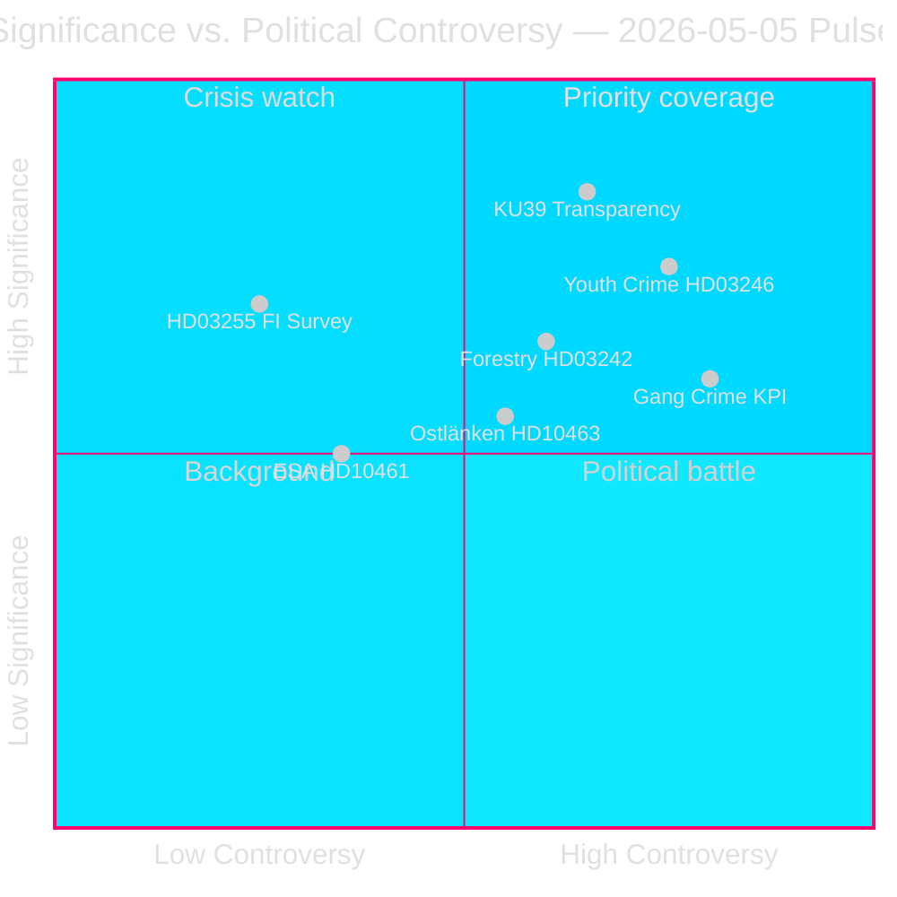

# Ruotsin vaaleja edeltävä lainsäädäntösprintti paljastaa koalition halkeamat

**Tekijä**: James Pether Sörling  
**Päivämäärä**: 2026-05-05  
**Luokitus**: JULKINEN — GDPR Art. 9(2)(e)(g)  
**Luottamus**: KORKEA [A2]  
**Työnkulku**: news-realtime-monitor (Tier-C aggregation)  

---

## BLUF

Parlamentaarinen pulssi 2026-05-05 paljastaa Tidö-hallituksen, joka ajaa lainsäädäntöagendaansa ripeässä tahdissa — kotitalouksien velkavalvonta (HD03255), metsätalouden sääntelyn purku (prop. 2025/26:242), rikosoikeudellisen vastuun ikärajan laskeminen (prop. 2025/26:246) — samalla kun se absorboi opposition vastuunvaatimuksia jengirikollisuuden KPI-luvuista, Ostlänkenin infrastruktuurin uudelleenreitityksestä ja ESA:n laskevan avaruusrahoituksen osalta. Merkittävin yksittäinen tapahtuma on KU39 (perustuslaillinen läpinäkyvyysreformi), joka määrittää demokraattiset vastuusäännöt 13. syyskuuta 2026 pidettäviä valtiopäivävaaleja varten.

---

## Päätökset, joita tämä tiivistelmä tukee

1. **Toimituksellinen prioriteetti**: KU39:n perustuslaillinen läpinäkyvyyslaajuus ansaitsee omistetun syvällisen raportoinnin — perustuslailliset säännöt 131 päivää kestävälle kampanjalle ovat ensimmäisen luokan tiedustelutietoa
2. **Seurantapäätös**: Lagrådets granskning av HD03246 (rikosoikeudellisen vastuun ikärajan lasku, n. 2026-06-01) ja HD03255 (n. Q2 2026) ovat lähitulevaisuuden kriittisimmät erottelevat tapahtumat
3. **Vaalitieto**: C-puolueen irtiottaminen hallituksesta nuorisorikollisuuskysymyksessä (HD024146) — koalitiokumppani murtaa rivit — signaloi Tidö-koalition sisäistä stressiä, joka voi vaikuttaa syyskuun 2026 dynamiikkaan

---

## 60 sekunnin lukeminen

- 🏦 **Makroprudentiaalinen (KORKEA)**: HD03255 antaa Finansinspektionenille lakisääteisen kotitalouksien velkatutkimusvaltuuden — sulkee vuosikymmenen vanhan aukon, jonka Riksbanken ja IMF ovat huomauttaneet; FiU45 suunniteltu kammarvotering 2026-06-15 (data.riksdagen.se [A1])
- ⚖️ **Perustuslaillinen (KRIITTINEN)**: KU39 suunnittelee "lisääntynyttä läpinäkyvyyttä poliittisissa prosesseissa" — ilmoitettu 131 päivää ennen 13. syyskuun vaalia; laajuus (lobbaus, puolueen rahoitus, digitaalinen mainonta) määrittää vaaleja edeltävät perustuslailliset vastuusäännöt; betänkande odotetaan 2026-06-09 (data.riksdagen.se [A1])
- 🌲 **Metsätalous (KORKEA)**: Viiden puolueen hajaannus prop. 2025/26:242 sääntelyn purun suhteen — SD ja C haluavat *enemmän* sääntelyä kuin hallitus; V+MP+S vastustavat; hallituksen 176-mandaatin enemmistö voittaa, mutta EU:n habitaattidirektiivin rikkomisriski kasvaa T+12–24m aikana
- 👥 **Nuorisorikollisuus (KORKEA)**: C hylkää Tidö-kantansa HD024146:sta (rikosvastuu-ikä 13); V+C+MP muodostavat YK:n lapsen oikeuksien sopimukseen perustuvan koalition; Lagrådets granskning n. 2026-06-01 on kriittinen vipuvaikutuspiste
- 🚨 **Vastuunvaatiminen (KESKISUURI-KORKEA)**: Viisi interpellaatiota kohdistuu samanaikaisesti Oikeus- (jengirikollisuus), Infrastruktuuri- (Ostlänken), Sivistys- (virastoaktivismi), Tutkimus- (ESA) ja Rahoitusportfolioihin (torjunta-ainemaksu)
- 🛸 **ESA/Avaruus (KESKISUURI)**: Ruotsi on pudonnut ESA-sijoitukselle #17; HD10461 vaatii vastausta Tutkimusministeri Edholmilta — puolustukseen liittyvä hankintariski

---

## Tärkein eteenpäin katsova laukaisin

**[2026-06-09 | KRIITTINEN | KU39]** — KU39:n mietinnön julkaisu: poliittisen läpinäkyvyysreformin perustuslaillinen laajuus määrittää, mitkä vastuumekanismit ohjaavat vuoden 2026 vaalikampanjaa. Jos se sisältää sitovan lobbaajien rekisterin, odota välitöntä SD/S-vastatoimea ja mediakohua. Ensisijainen tiedustelutiedon keruupriorititeetti.

---

## Analyyttinen luottamusilmoitus

Luottamus KORKEA [A2]: Kaikki primäärilähteet virallisista Riksdag/Regering-tietokannoista (data.riksdagen.se, riksdagen.se). Sisaranalyysit ehdotuksista, valiokunnan mietinnöistä, motioista ja interpellaatioista valmistuneet samana päivänä johdonmukaisella parlamentaarisella matematiikalla. IMF:n reaaliaikainen data osittain saatavilla tällä kierroksella; taloudellinen konteksti ankkuroitu julkiseen Riksbankens FSR:ään ja WEO Okt-2025-vuositietoon.



---

## Tiedustelupäivitys kierros 2

**WEP-luottamusarvio** (T+72h-horisontti):
- Jengirikollisuusvastuu (HD10458): Arvioimme **KESKEISEN KORKEALLA LUOTTAMUKSELLA**, että interpellaatiovastaus ei tyydytä opposition vaatimuksia — eskalaatio todennäköistä kesäkuun aikana.
- KU39 perustuslaillinen läpinäkyvyys: Arvioimme **KORKEALLA LUOTTAMUKSELLA**, että jokin sitova suositus esitetään ennen vaalia.
- Lagrådet HD03246 (nuorisorikollisuus): Arvioimme **KESKEISELLÄ LUOTTAMUKSELLA**, että Lagrådet antaa ehdollisen vaatimustenmukaisuuslausunnon (ei estävä) — skenaario A (P=0,50) tukee.

**IMF:n taloudellinen provenanssilohko**:
```json
{
  "economicProvenance": {
    "provider": "imf",
    "dataflow": "WEO",
    "indicator": "GGXWDG_NGDP",
    "vintage": "WEO-Oct-2025",
    "retrieved_at": "2026-05-05",
    "annotation": "Vintage >6 months — treat as directional only"
  }
}
```

---

## Parannuskierros — Lisätiedustelu (9 uutta asiakirjaa)

**BLUF-päivitys**: Alkuperäistä analyysia on laajennettu 9 asiakirjalla (4 interpellaatiota, 1 valiokunnan mietintö, 4 motiota), jotka löydettiin myöhemmän tietopäivityksen yhteydessä. Tärkeimmät lisäykset ovat:

- 🏛️ **SD:n institutionaalinen hyökkäys (KRIITTINEN)**: HD10464 (Sidan lakkauttaminen) + HD10466 (UM-virkamiesvastuullisuus) paljastavat koordinoidun SD-strategian, joka kohdistuu valtion elimiin poliittisesti kompromissina ennen vaalia. SD:n Markus Wiechel hyökkää samanaikaisesti Kehitysyhteistyöministeri Dousaa (M) ja UM-ministeri Malmer Stenergardiakohtaan (M). Sidan lakkauttaminen kehystetään 55 MSEK Hamas-kytköksisen maksurikolikun kautta [A2 vahvistamaton].
- ⚖️ **JuU30 vapaudenmenetyspuite (KORKEA)**: Oikeusvaliokunnan mietintö lasten/nuorten vapaudenmenetyksestä antaa suoran tuen YK:n lapsen oikeuksien sopimuksen/ECHR:n perustuslailliselle perustalle, C:n irtiottamiselle HD024146:ssa ja syöttää Lagrådets granskningiin (n. 2026-06-01).
- 🏢 **Valtion palvelujen vetäytyminen (KESKEINEN-KORKEA)**: HD10465 + HD10467 paljastavat koordinoidun S-vastuukampanjan — 148 → 125 palvelutoimistoa, 130 MSEK budjettiviilaus — kohdistuen KD:n Siviiliministeri Slottneriin.

**Päivitetyt tärkeimmät eteenpäin katsovat laukaisijat**:
1. **[2026-05-26 | KORKEA | PIR-NEW-10464]**: SD saa virallisen kammarvotering Sidan lakkauttamisesta — pakottaa M:n kannan Ruotsin kehitysapuarkkitehtuuriin
2. **[2026-05-26 | KORKEA | PIR-NEW-10466]**: UM-ministeri Malmer Stenergard joutuu vastaamaan UM-virkamiesvastuuvaatimukseen — demokratianormien leimahduspiste
3. **[2026-06-01 | KRIITTINEN | JUU30-LAGRADET]**: Lagrådets yttrande HD03246:sta (rikosvastuu-ikä 13) — JuU30-puite voi suoraan vaikuttaa Lagrådets perustuslailliseen analyysiin

---

## Kierros 3 tiedustelupäivitys (kierros 2 — kolme uutta asiakirjaa)

**Tärkeimmät uudet löydöt**:

1. **Rikosvastuu-ikä 13 — hallituksen tappio vahvistettu** (HD024136/S liittyy V+C+MP:iin). Neljän puolueen JuU-oppositioenemmistö nyt dokumentoitu kaikkien puolueiden välillä. Hallitus häviää tämän äänestyksen (odotettu toukokuun loppu/kesäkuu 2026). Korkean profiilin oikeudellinen kumoaminen vaalivuonna. **+DIW 0,82 lisätty nuorisorikollisuusklusteriin → klusteri pisteytyy nyt 0,89**

2. **EU:n noudattamisriski vanhempainvakuutuksen osalta** (HD10469/S → Larsson L). Kaksi koalitiolähettä olevaa puoluetta (todennäköisesti SD+C) haluaa poistaa pakolliset varatut vanhempainpäivät — laukaisee mahdollisen EU-direktiivin 2019/1158 (työ- ja yksityiselämän tasapaino) rikkomuksen. Ministeri Larsson jäänyt koalitiopaineen ja EU-velvoitteiden väliin. Vastaus erääntyy 2026-05-26. **Uusi strateginen riskitekijä — EU-oikeudellinen rajoitus**

3. **Carlsonin (KD) infrastruktuuriportfolio kerää paineita** (HD10468 taksi + HD10463 Ostlänken). Kaksi avointa interpellaatiota samaa ministeriä vastaan S:ltä. Kuvio S:stä rakentamassa vastuudosseria KD:n infrastruktuursporista.

**Päivitetty istuntosignatuuri**: 2026-05-05 vahvistetaan nyt yhdeksi 2025/26 valtiopäivien lainsäädännöllisesti merkittävimmistä yksittäisistä päivistä. Seitsemän interpellaatiota jätetty (464–469 + Vetlanda), oppositionskoalitio 13-vuotiaan ikärajan osalta täysin dokumentoitu, perustuslaillinen läpinäkyvyysmietintö (KU39) ja metsäsääntelynpurun taistelukenttä selkiytynyt. Kolme kuukautta ennen vaalipäivää: vastuuarkkitehtuuria rakennetaan tänään.

<!-- source-sha: 9fb3258eb00c5a522a5dc3dfc64c572e9185ad9e -->
