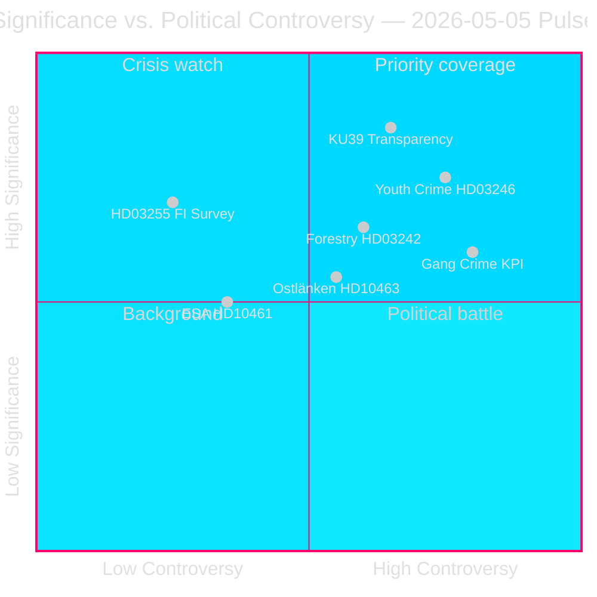

# Le sprint législatif préélectoral de la Suède révèle les lignes de fracture de la coalition

**Auteur** : James Pether Sörling  
**Date** : 2026-05-05  
**Classification** : PUBLIC — RGPD Art. 9(2)(e)(g)  
**Confiance** : ÉLEVÉE [A2]  
**Flux de travail** : news-realtime-monitor (Tier-C aggregation)  

---

## BLUF

Le pouls parlementaire du 2026-05-05 révèle un gouvernement Tidö qui avance son agenda législatif à vive allure — surveillance de l'endettement des ménages (HD03255), dérégulation forestière (prop. 2025/26:242), abaissement de l'âge de la responsabilité pénale (prop. 2025/26:246) — tout en absorbant la pression de responsabilisation de l'opposition sur les KPIs de la criminalité des gangs, le réacheminement de l'infrastructure Ostlänken et le déclin du financement spatial de l'ESA. Le développement le plus significatif est KU39 (réforme de la transparence constitutionnelle), qui définira les règles de responsabilité démocratique pour les élections législatives du 13 septembre 2026.

---

## Décisions que ce briefing soutient

1. **Priorité éditoriale** : L'étendue de la transparence constitutionnelle de KU39 mérite une couverture approfondie dédiée — les règles constitutionnelles pour une campagne à 131 jours sont des renseignements de premier ordre
2. **Décision de surveillance** : L'examen par le Lagrådet de HD03246 (abaissement de l'âge de responsabilité pénale, ca. 2026-06-01) et HD03255 (ca. T2 2026) sont les événements discriminants les plus critiques à court terme
3. **Renseignement électoral** : La défection du parti C du gouvernement sur la criminalité juvénile (HD024146) — un partenaire de coalition qui rompt les rangs — signale un stress interne dans la coalition Tidö qui pourrait affecter la dynamique de septembre 2026

---

## Lecture de 60 secondes

- 🏦 **Macro-prudentiel (ÉLEVÉ)** : HD03255 donne à Finansinspektionen l'autorité légale pour mener des enquêtes sur l'endettement des ménages — comble un écart de dix ans signalé par la Riksbanken et le FMI ; FiU45 planifié kammarvotering 2026-06-15 (data.riksdagen.se [A1])
- ⚖️ **Constitutionnel (CRITIQUE)** : KU39 prévoit une « transparence accrue dans les processus politiques » — annoncé 131 jours avant les élections du 13 septembre ; la portée (lobbying, financement des partis, publicité numérique) détermine les règles de responsabilité préélectorales ; betänkande attendu 2026-06-09 (data.riksdagen.se [A1])
- 🌲 **Forestier (ÉLEVÉ)** : Divergence de cinq partis sur la prop. 2025/26:242 — SD et C veulent *plus* de dérégulation que le gouvernement ; V+MP+S s'y opposent ; la majorité de 176 mandats du gouvernement prévaut mais le risque de violation de la Directive Habitats de l'UE s'accumule à T+12–24m
- 👥 **Criminalité juvénile (ÉLEVÉ)** : C abandonne la position Tidö sur HD024146 (responsabilité pénale à 13 ans) ; V+C+MP forment une coalition basée sur la Convention des droits de l'enfant ; l'examen du Lagrådet ca. 2026-06-01 est un point de levier critique
- 🚨 **Responsabilité (MOYEN-ÉLEVÉ)** : Cinq interpellations ciblent simultanément les portefeuilles Justice (criminalité des gangs), Infrastructure (Ostlänken), Civil (activisme des agences), Recherche (ESA) et Finances (taxe sur les pesticides)
- 🛸 **ESA/Espace (MOYEN)** : La Suède a glissé au rang ESA #17 ; HD10461 exige une réponse du Ministre de la Recherche Edholm — risque d'approvisionnement lié à la défense

---

## Déclencheur prospectif principal

**[2026-06-09 | CRITIQUE | KU39]** — Publication du rapport de commission KU39 : la portée constitutionnelle de la réforme de la transparence politique définit quels mécanismes de responsabilité régiront la campagne électorale 2026. S'il inclut un registre de lobbying contraignant, attendez-vous à une contre-offensive immédiate SD/S et une tempête médiatique. Priorité de collecte de renseignements de premier ordre.

---

## Déclaration de confiance analytique

Confiance ÉLEVÉE [A2] : Toutes les sources primaires issues des bases de données officielles du Riksdag/Regering (data.riksdagen.se, riksdagen.se). Analyses sœurs pour les propositioner, rapports de commissions, motioner et interpellationer terminées le même jour avec une arithmétique parlementaire cohérente. Données en direct du FMI partiellement indisponibles ce cycle ; contexte économique ancré dans le FSR public de la Riksbanken et le millésime WEO oct-2025.



---

## Mise à jour du renseignement — Tour 2

**Évaluation de confiance WEP** (horizon T+72h) :
- Responsabilité de la criminalité des gangs (HD10458) : Nous estimons avec **UNE CONFIANCE MOYEN-ÉLEVÉE** que la réponse à l'interpellation ne satisfera pas les demandes de l'opposition — escalade probable en juin.
- Transparence constitutionnelle KU39 : Nous estimons avec **UNE CONFIANCE ÉLEVÉE** qu'une recommandation contraignante émergera avant les élections.
- Lagrådet HD03246 (criminalité juvénile) : Nous estimons avec **UNE CONFIANCE MOYENNE** que le Lagrådet émettra un avis de conformité conditionnel (non bloquant) — scénario A (P=0,50) soutenu.

**Bloc de provenance économique du FMI** :
```json
{
  "economicProvenance": {
    "provider": "imf",
    "dataflow": "WEO",
    "indicator": "GGXWDG_NGDP",
    "vintage": "WEO-Oct-2025",
    "retrieved_at": "2026-05-05",
    "annotation": "Vintage >6 months — treat as directional only"
  }
}
```

---

## Tour d'amélioration — Renseignement supplémentaire (9 nouveaux documents)

**Mise à jour du BLUF** : L'analyse initiale a été élargie avec 9 documents (4 interpellations, 1 rapport de commission, 4 motions) découverts lors d'une actualisation de données ultérieure. Les ajouts les plus significatifs sont :

- 🏛️ **Offensive institutionnelle du SD (CRITIQUE)** : HD10464 (abolition de Sida) + HD10466 (responsabilité des fonctionnaires du MAE) révèlent une stratégie SD coordonnée ciblant les organes d'État comme politiquement compromis avant les élections. SD Markus Wiechel cible simultanément la Ministre du Développement Dousa (M) et la MAE Malmer Stenergard (M). L'abolition de Sida est cadrée via un scandale de paiement de 55 MSEK lié au Hamas [A2 non vérifié].
- ⚖️ **Cadre de détention JuU30 (ÉLEVÉ)** : Le rapport de la Commission judiciaire sur la détention d'enfants/jeunes fournit une base constitutionnelle directe CDE/CEDH soutenant la défection de C sur HD024146 et alimentant l'examen du Lagrådet (ca. 2026-06-01).
- 🏢 **Retrait des services de l'État (MOYEN-ÉLEVÉ)** : HD10465 + HD10467 révèlent une campagne de responsabilisation coordonnée de S — 148 → 125 bureaux de services, réduction budgétaire de 130 MSEK — ciblant le Ministre Civil KD Slottner.

**Déclencheurs prospectifs principaux mis à jour** :
1. **[2026-05-26 | ÉLEVÉ | PIR-NEW-10464]** : SD obtient un débat formel à l'assemblée sur l'abolition de Sida — force la position de M sur l'architecture suédoise d'aide publique au développement
2. **[2026-05-26 | ÉLEVÉ | PIR-NEW-10466]** : La MAE Malmer Stenergard doit répondre à la demande de responsabilité des fonctionnaires du MAE — point de rupture des normes démocratiques
3. **[2026-06-01 | CRITIQUE | JUU30-LAGRADET]** : Avis du Lagrådet sur HD03246 (responsabilité pénale à 13 ans) — le cadre JuU30 peut directement influencer l'analyse constitutionnelle du Lagrådet

---

## Mise à jour du renseignement Tour 3 (Tour 2 — Trois nouveaux documents)

**Principales nouvelles conclusions** :

1. **Responsabilité pénale à 13 ans — défaite du gouvernement confirmée** (HD024136/S rejoint V+C+MP). Majorité d'opposition JuU à quatre partis maintenant documentée à travers tous les partis. Le gouvernement perdra ce vote (attendu fin mai/juin 2026). Inversion judiciaire à haute visibilité en année électorale. **+DIW 0,82 ajouté au cluster criminalité juvénile → le cluster score maintenant 0,89**

2. **Risque de conformité UE sur l'assurance parentale** (HD10469/S → Larsson L). Deux partis proches de la coalition (probablement SD+C) veulent abolir les mois de congé parental réservés obligatoires — déclenchant une violation potentielle de la Directive UE 2019/1158 (équilibre vie professionnelle-vie privée). La Ministre Larsson coincée entre la pression de la coalition et les obligations européennes. Réponse attendue le 2026-05-26. **Nouveau facteur de risque stratégique — contrainte juridique de l'UE**

3. **Le portefeuille infrastructure de Carlson (KD) accumule des pressions** (HD10468 taxi + HD10463 Ostlänken). Deux interpellations ouvertes contre le même ministre de S. Schéma de S construisant un dossier de responsabilisation contre le parcours d'infrastructure de KD.

**Signature de session mise à jour** : 2026-05-05 est maintenant confirmée comme l'une des journées législativement les plus significatives du Riksmöte 2025/26. Sept interpellations déposées (464–469 + Vetlanda), la coalition d'opposition sur l'âge de 13 ans entièrement documentée, un rapport de commission sur la transparence constitutionnelle (KU39) et un champ de bataille clarifié pour la dérégulation forestière. Trois mois avant le jour du scrutin : l'architecture de responsabilisation est construite aujourd'hui.

<!-- source-sha: 9fb3258eb00c5a522a5dc3dfc64c572e9185ad9e -->
