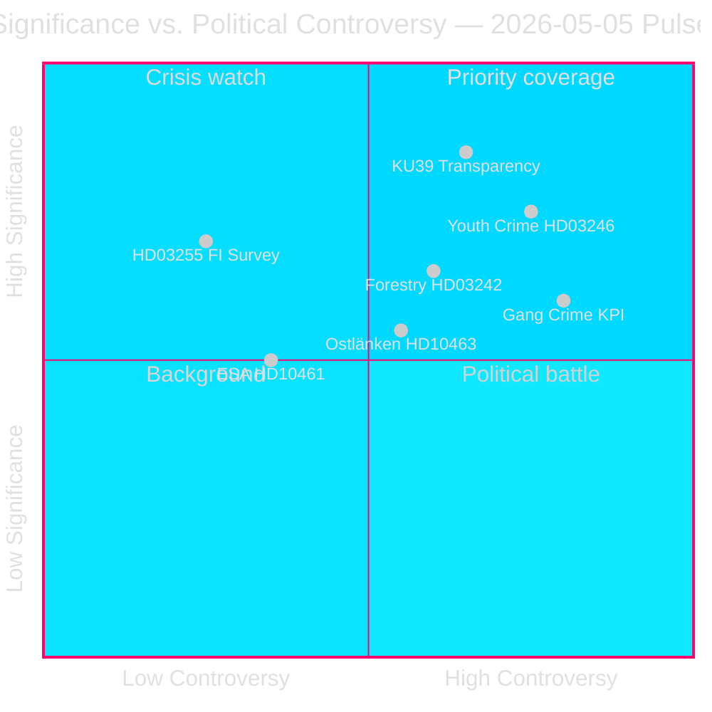

<!-- dir: rtl -->
# הספרינט החקיקתי השבדי לפני הבחירות חושף קווי שבר בקואליציה

**מחבר**: James Pether Sörling  
**תאריך**: 2026-05-05  
**סיווג**: ציבורי — תקנה 9(2)(ה)(ו) GDPR  
**ביטחון**: גבוה [A2]  
**זרימת עבודה**: news-realtime-monitor (Tier-C aggregation)  

---

## תקציר מנהלים

פולס הפרלמנטרי ב-2026-05-05 חושף ממשלת טידו הדוחפת את אג'נדה החקיקה שלה בקצב מואץ — פיקוח על חובות משקי בית (HD03255), ביטול רגולציה ביערנות (prop. 2025/26:242), הפחתת גיל האחריות הפלילית (prop. 2025/26:246) — תוך ספיגה בו-זמנית של לחץ אופוזיציה על מדדי פשיעת כנופיות, הכוונה מחדש של תשתיות אוסטלונקן, ונסיגת מימון ESA. ההתפתחות הבולטת ביותר היא KU39 (רפורמת שקיפות חוקתית), שתקבע כללי אחריותיות לבחירות הפרלמנט ב-13 בספטמבר 2026.

---

## החלטות הנתמכות על ידי תקציר זה

1. **עדיפות עריכתית**: היקף KU39 החוקתי של שקיפות מצדיק סיקור מעמיק ייעודי — כללים חוקתיים ל-131 ימים לפני מערכת בחירות מהווים מודיעין מדרגה ראשונה
2. **החלטת מעקב**: ביקורת לגרודת על HD03246 (~2026-06-01) ועל HD03255 (~Q2 2026) הם האירועים המבחינים הקרובים המשמעותיים ביותר
3. **מודיעין בחירות**: C עוזבת עמדת טידו בנושא פשע נוער (HD024146) — שותפה קואליציונית שוברת שורות — מאותת על מתח פנימי בקואליציית טידו שעשוי להשפיע על דינמיקות ספטמבר 2026

---

## קריאה של 60 שניות

- 🏦 **מאקרו-פרודנציאלי (גבוה)**: HD03255 מעניק ל-Finansinspektionen סמכות חוקית לסקרי חובות משקי בית — סוגר פער עשור שעליו הצביע Riksbanken וקרן המטבע; kammarvotering ל-FiU45 קבועה ל-2026-06-15 (data.riksdagen.se [A1])
- ⚖️ **חוקתי (קריטי)**: KU39 מתכנן "הגדלת שקיפות בתהליכים פוליטיים" — הוכרז 131 יום לפני בחירות 13 בספטמבר; היקף (לוביינג, מימון מפלגות, פרסום דיגיטלי) קובע מנגנוני אחריותיות חוקתיים לפני בחירות; betänkande צפוי 2026-06-09 (data.riksdagen.se [A1])
- 🌲 **יערנות (גבוה)**: חמישה מפלגות חלוקות על prop. 2025/26:242 — SD וC רוצים *יותר* ביטול רגולציה ביחס לממשלה; V+MP+S מתנגדות; רוב 176 המושבים של הממשלה מנצח אך סיכון הפרת הנחיית בתי הגידול האירופאית מצטבר ב-T+12–24m
- 👥 **פשע נוער (גבוה)**: C עוזבת עמדת טידו ב-HD024146 (גיל אחריות 13); V+C+MP יוצרות קואליציה המבוססת על אמנת זכויות הילד; ביקורת לגרודת ~2026-06-01 נקודת מינוף מכרעת
- 🚨 **אחריותיות (בינוני-גבוה)**: חמישה שאילתות מכוונות בו-זמנית למשרד המשפטים (פשיעת כנופיות), תשתיות (אוסטלונקן), אזרחי (פעילות סוכנויות), מחקר (ESA), ופיננסי (מס קוטלי)
- 🛸 **ESA/חלל (בינוני)**: שוודיה נסוגה למקום 17 ב-ESA; HD10461 דורש תגובה ממשרד המחקר Edholm — סיכונים הקשורים לרכישות ביטחוניות

---

## מניע עתידי עיקרי

**[2026-06-09 | קריטי | KU39]** — פרסום דוח ועדת KU39: היקף החוקתי של רפורמת שקיפות פוליטית קובע מנגנוני אחריותיות שישלטו על מערכת בחירות 2026. אם יכלול רישום לוביינג חובה, צפה להתנגדות מיידית מ-SD/S ולסערת תקשורת. עדיפות ראשונה לאיסוף מודיעין.

---

## גילוי ניתוחי ביטחון

ביטחון גבוה [A2]: כל המקורות הראשוניים ממסדי הנתונים הרשמיים של ריקסדאגן/ממשלה (data.riksdagen.se, riksdagen.se). ניתוחים משלימים להצעות חוק, דוחות ועדות, עתירות ושאילתות הושלמו באותו יום עם חשבונות פרלמנטריים עקביים. נתוני קרן המטבע החיים אינם זמינים חלקית בסבב זה; ההקשר הכלכלי מעוגן בדוח יציבות פיננסים Riksbank שנתי ובסקירת WEO אוקטובר 2025.



---

## עדכון מודיעיני — סבב שני

**הערכת ביטחון WEP** (אופק T+72h):
- אחריותיות פשיעת כנופיות (HD10458): מעריכים **בביטחון בינוני-גבוה** שהתגובה לשאילתה לא תספק את דרישות האופוזיציה — הסלמה אפשרית ביוני.
- שקיפות חוקתית KU39: מעריכים **בביטחון גבוה** שהמלצה מחייבת תונפק לפני הבחירות.
- לגרודת HD03246 (פשע נוער): מעריכים **בביטחון בינוני** שלגרודת יפרסם חוות דעת מותנית (לא חוסמת) — תרחיש א' (P=0.50) נתמך.

**בלוק מקור כלכלי IMF**:
```json
{
  "economicProvenance": {
    "provider": "imf",
    "dataflow": "WEO",
    "indicator": "GGXWDG_NGDP",
    "vintage": "WEO-Oct-2025",
    "retrieved_at": "2026-05-05",
    "annotation": "Vintage >6 months — treat as directional only"
  }
}
```

---

## סבב שיפור — מודיעין נוסף (9 מסמכים חדשים)

**עדכון תקציר**: הניתוח הראשוני הורחב ב-9 מסמכים (4 שאילתות, 1 דוח ועדה, 4 עתירות) שהתגלו בעדכון נתונים מאוחר. ההוספות הבולטות:

- 🏛️ **המתקפה המוסדית של SD (קריטי)**: HD10464 (ביטול Sida) + HD10466 (אחריות עובדי משרד החוץ) חושפים אסטרטגיית SD מתואמת המכוונת לרשויות ממשלתיות כבר-מחלוקת פוליטי לפני הבחירות. Markus Wiechel (SD) תוקף בו-זמנית את שרת הפיתוח Dousa (M) ואת שרת החוץ Malmer Stenergard (M). ביטול Sida מסגור דרך שערוריית תשלומים קשורים לחמאס ב-55 מיליון קרונה [A2 לא מאומת].
- ⚖️ **מסגרת עצור JuU30 (גבוה)**: דוח ועדת המשפטים בנושא מעצר ילדים/נוער מספק בסיס חוקתי ישיר UNCRC/ECHR, תומך בנטישת C מ-HD024146 ומזין את ביקורת לגרודת (~2026-06-01).
- 🏢 **נסיגת שירותי ממשלה (בינוני-גבוה)**: HD10465 + HD10467 חושפים מסע אחריותיות מתואם של S — 148→125 סניפי שירות, קיצוץ תקציב 130 מיליון קרונה — המכוון לשר ענייני אזרחים KD Slottner.

**מניעים עתידיים עיקריים מעודכנים**:
1. **[2026-05-26 | גבוה | PIR-NEW-10464]**: SD זוכה לדיון פרלמנטרי רשמי בנושא ביטול Sida — מאלץ M להכריז על עמדתה לגבי מבנה ODA השבדי
2. **[2026-05-26 | גבוה | PIR-NEW-10466]**: שרת החוץ Malmer Stenergard חייבת להגיב לדרישת אחריות עובדי חוץ — נקודת הצתה לסטנדרטים דמוקרטיים
3. **[2026-06-01 | קריטי | JUU30-LAGRADET]**: חוות דעת לגרודת על HD03246 (גיל אחריות 13) — מסגרת JuU30 עשויה להשפיע ישירות על ניתוח חוקתי של לגרודת

---

## עדכון סבב שלישי (סבב שני — שלושה מסמכים חדשים)

**ממצאים חדשים בולטים**:

1. **גיל אחריות פלילית 13 — תבוסת ממשלה מאושרת** (HD024136/S מצטרפת ל-V+C+MP). רוב אופוזיציוני מ-4 מפלגות בוועדת המשפטים מתועד בכל המפלגות כעת. הממשלה תפסיד את ההצבעה הזו (צפוי סוף מאי/יוני 2026). היפוך שיפוטי בולט בשנת בחירות. **נוסף +DIW 0.82 לאשכול פשע נוער → האשכול רושם כעת 0.89**

2. **סיכוני תאימות EU על ביטוח הורות** (HD10469/S → Larsson L). שתי מפלגות קרובות לקואליציה (כנראה SD+C) רוצות לבטל חודשי חופשת אבהות שמורים חובה — מעורר הפרה פוטנציאלית של הנחיית EU 2019/1158 (איזון עבודה-חיים). שרה Larsson לכודה בין לחץ קואליציה להתחייבויות אירופאיות. תגובה נדרשת 2026-05-26. **גורם סיכון אסטרטגי חדש — מגבלה משפטית אירופאית**

3. **תיק תשתיות Carlson (KD) צובר לחצים** (HD10468 מוניות + HD10463 אוסטלונקן). שתי שאילתות פתוחות כנגד אותו שר מ-S. דפוס S בונה תיק אחריות נגד מסלול תשתיות KD.

**חתימת הסבב המעודכנת**: 2026-05-05 מאושרת כיום כאחד הימים החקיקתיים המשמעותיים ביותר בריקסמוטה 2025/26. שבע שאילתות הוגשו (464–469 + וויטלנדה), קואליציית האופוזיציה סביב גיל 13 תועדה במלואה, דוח ועדת שקיפות חוקתית (KU39) יצא וזירת הקרב לביטול רגולציה ביערנות התבהרה. שלושה חודשים לפני יום הקלפי: מבנה האחריות נבנה כיום.

<!-- source-sha: 9fb3258eb00c5a522a5dc3dfc64c572e9185ad9e -->
