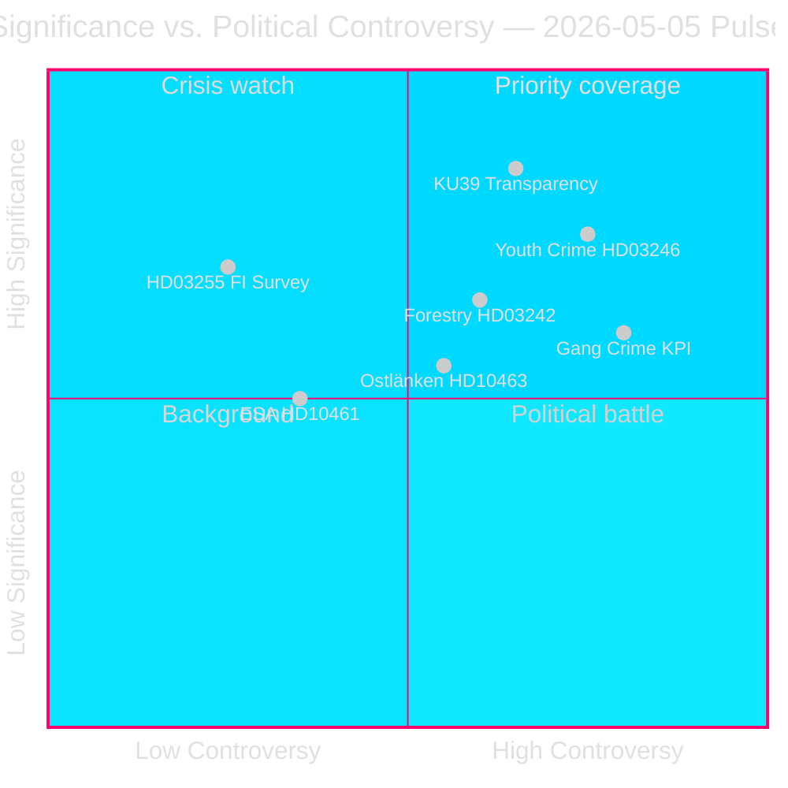

# Zweedens pre-verkiezingswetgevingssprint onthult breuklijnen in de coalitie

**Auteur**: James Pether Sörling  
**Datum**: 2026-05-05  
**Classificatie**: OPENBAAR — AVG Art. 9(2)(e)(g)  
**Betrouwbaarheid**: HOOG [A2]  
**Workflow**: news-realtime-monitor (Tier-C aggregation)  

---

## BLUF

De parlementaire pols van 2026-05-05 onthult een Tidö-regering die haar wetgevingsagenda in hoog tempo vooruit duwt — huishoudensschuldbewaking (HD03255), bosbouwderegulering (prop. 2025/26:242), verlaging van de minimumleeftijd voor strafrechtelijke aansprakelijkheid (prop. 2025/26:246) — terwijl ze tegelijkertijd de verantwoordingsdruk van de oppositie absorbeert over KPI's voor bendemisdrijven, herleiding van de Ostlänken-infrastructuur en het afnemende ESA-ruimtefinanciering. De meest significante ontwikkeling is KU39 (constitutionele transparantiehervorm), die de democratische verantwoordingsregels zal bepalen voor de parlementsverkiezingen van 13 september 2026.

---

## Beslissingen die dit briefing ondersteunt

1. **Redactionele prioriteit**: De constitutionele transparantiereikwijdte van KU39 verdient toegewijde diepgaande berichtgeving — grondwettelijke regels voor een campagne 131 dagen weg zijn eersteklas inlichtingen
2. **Bewakingsbeslissing**: De Lagrådet-toetsing van HD03246 (verlaging minimumleeftijd strafrechtelijke aansprakelijkheid, ca. 2026-06-01) en HD03255 (ca. Q2 2026) zijn de meest kritische discriminerende gebeurtenissen op korte termijn
3. **Verkiezingsinlichtingen**: Het vertrek van partij C van de regeringspositie inzake jeugdcriminaliteit (HD024146) — een coalitiegenoot die de rijen doorbreekt — signaleert interne spanning in de Tidö-coalitie die de dynamiek van september 2026 kan beïnvloeden

---

## 60-secondenlezing

- 🏦 **Macroprudentieel (HOOG)**: HD03255 geeft de Finansinspektionen wettelijke bevoegdheid voor huishoudensschuldenquêtes — sluit een tienjarig hiaat aangewezen door de Riksbanken en het IMF; FiU45 geplande kammarvotering 2026-06-15 (data.riksdagen.se [A1])
- ⚖️ **Constitutioneel (KRITIEK)**: KU39 plant "verhoogde transparantie in politieke processen" — aangekondigd 131 dagen voor de verkiezingen van 13 september; reikwijdte (lobbyen, partijfinanciering, digitale reclame) bepaalt de pre-electorale constitutionele verantwoordingsregels; betänkande verwacht 2026-06-09 (data.riksdagen.se [A1])
- 🌲 **Bosbouw (HOOG)**: Vijfpartijen-divergentie over prop. 2025/26:242 deregulering — SD en C willen *meer* deregulering dan de regering; V+MP+S verzetten zich; de 176-mandaat-meerderheid van de regering prevaleert maar het EU-habitatrichtlijnrisico bouwt op over T+12–24m
- 👥 **Jeugdcriminaliteit (HOOG)**: C verlaat de Tidö-positie over HD024146 (strafrechtelijke aansprakelijkheid leeftijd 13); V+C+MP vormen IVRK-gebaseerde coalitie; Lagrådet-toetsing ca. 2026-06-01 is kritiek hefboompunt
- 🚨 **Verantwoording (MIDDEL-HOOG)**: Vijf interpellaties richten zich gelijktijdig op Justitie- (bendemisdrijven), Infrastructuur- (Ostlänken), Civiel- (agentschapsactivisme), Onderzoeks- (ESA) en Financiën-portefeuilles (pesticidentaks)
- 🛸 **ESA/Ruimte (MIDDEL)**: Zweden is gezakt naar ESA-rang #17; HD10461 eist antwoord van Onderzoeksminister Edholm — defensiegerelateerd inkooprisico

---

## Belangrijkste vooruitkijkende trigger

**[2026-06-09 | KRITIEK | KU39]** — KU39-commissierapportpublicatie: de grondwettelijke reikwijdte van de politieke transparantiehervorm bepaalt welke verantwoordingsmechanismen de verkiezingscampagne 2026 zullen regelen. Als het een bindend lobbyregister omvat, verwacht een onmiddellijke SD/S-tegenoffensief en mediastorm. Eerste prioriteit voor informatieverzameling.

---

## Analytische betrouwbaarheidsverklaring

Betrouwbaarheid HOOG [A2]: Alle primaire bronnen uit officiële Riksdag/Regering-databases (data.riksdagen.se, riksdagen.se). Zusteranalyses voor propositioner, commissierapporten, motioner en interpellationer dezelfde dag afgesloten met consistente parlementaire rekenkunde. IMF live-gegevens gedeeltelijk niet beschikbaar in deze cyclus; economische context verankerd in de publieke Riksbankens FSR en WEO okt-2025-vintage.



---

## Inlichtingenupdate — Ronde 2

**WEP-betrouwbaarheidsbeoordeling** (T+72u-horizon):
- Verantwoording voor bendemisdrijven (HD10458): Wij beoordelen met **MIDDEL-HOGE BETROUWBAARHEID** dat het interpellatie-antwoord de eisen van de oppositie niet zal bevredigen — escalatie waarschijnlijk tot juni.
- KU39 constitutionele transparantie: Wij beoordelen met **HOGE BETROUWBAARHEID** dat er vóór de verkiezingen een bindende aanbeveling zal komen.
- Lagrådet HD03246 (jeugdcriminaliteit): Wij beoordelen met **MIDDEL BETROUWBAARHEID** dat Lagrådet een voorwaardelijk nalevingsadvies (niet-blokkerend) zal uitbrengen — scenario A (P=0,50) ondersteund.

**IMF Economisch herkomstblok**:
```json
{
  "economicProvenance": {
    "provider": "imf",
    "dataflow": "WEO",
    "indicator": "GGXWDG_NGDP",
    "vintage": "WEO-Oct-2025",
    "retrieved_at": "2026-05-05",
    "annotation": "Vintage >6 months — treat as directional only"
  }
}
```

---

## Verbeteringsronde — Aanvullende inlichtingen (9 nieuwe documenten)

**BLUF-update**: De oorspronkelijke analyse is uitgebreid met 9 documenten (4 interpellaties, 1 commissierapport, 4 moties) ontdekt bij een navolgende gegevensupdate. De meest significante toevoegingen zijn:

- 🏛️ **SD-institutionele offensief (KRITIEK)**: HD10464 (afschaffing van Sida) + HD10466 (BuZa-ambtenarenaansprakelijkheid) onthullen een gecoördineerde SD-strategie gericht op staatsorganen als politiek gecompromitteerd vóór de verkiezingen. SD Markus Wiechel valt simultaan Ontwikkelingsminister Dousa (M) en BuZa-minister Malmer Stenergard (M) aan. De Sida-afschaffing wordt ingekaderd via een 55-MSEK Hamas-gekoppelde betalingsschandaal [A2 niet geverifieerd].
- ⚖️ **JuU30 vrijheidsbeneming-kader (HOOG)**: Het rapport van de Justitiecommissie over vrijheidsbeneming van kinderen/jongeren biedt directe IVRK/EVRM-constitutionele grondslag ter ondersteuning van C's afvalligheid bij HD024146 en voedt de Lagrådet-toetsing (ca. 2026-06-01).
- 🏢 **Terugtrekking staatsdiensten (MIDDEL-HOOG)**: HD10465 + HD10467 onthullen een gecoördineerde S-verantwoordingscampagne — 148 → 125 servicekantoren, 130-MSEK-bezuiniging — gericht op KD-Civielminister Slottner.

**Bijgewerkte belangrijkste vooruitkijkende triggers**:
1. **[2026-05-26 | HOOG | PIR-NEW-10464]**: SD krijgt formeel kamerdebat over Sida-afschaffing — dwingt M's positie op Zweedse ODA-architectuur
2. **[2026-05-26 | HOOG | PIR-NEW-10466]**: BuZa-minister Malmer Stenergard moet antwoorden op de eis voor BuZa-ambtenarenaansprakelijkheid — democratische normen-flashpunt
3. **[2026-06-01 | KRITIEK | JUU30-LAGRADET]**: Lagrådet-advies over HD03246 (strafrechtelijke aansprakelijkheid leeftijd 13) — het JuU30-kader kan Lagrådets constitutionele analyse direct beïnvloeden

---

## Ronde 3 inlichtingenupdate (Ronde 2 — Drie nieuwe documenten)

**Belangrijkste nieuwe bevindingen**:

1. **Strafrechtelijke aansprakelijkheid 13 — regeringsnederlaag bevestigd** (HD024136/S sluit zich aan bij V+C+MP). Vierpartijen-JuU-oppositiemeerderheid nu gedocumenteerd over alle partijen heen. De regering zal deze stemming verliezen (verwacht eind mei/juni 2026). Spraakmakende juridische ommekeer in een verkiezingsjaar. **+DIW 0,82 toegevoegd aan jeugdcriminaliteitscluster → cluster scoort nu 0,89**

2. **EU-nalevingsrisico bij ouderschapsverzekering** (HD10469/S → Larsson L). Twee coalitie-nabije partijen (waarschijnlijk SD+C) willen verplichte gereserveerde ouderschapsverlofmaanden afschaffen — triggert mogelijke EU-richtlijnschending 2019/1158 (evenwicht tussen werk en privéleven). Minister Larsson gevangen tussen coalitiedruk en EU-verplichtingen. Antwoord vervalt 2026-05-26. **Nieuw strategisch risicofactor — EU-juridische beperking**

3. **Carlsons (KD) infrastructuurportfolio accumuleert druk** (HD10468 taxi + HD10463 Ostlänken). Twee open interpellaties tegen dezelfde minister van S. Patroon van S dat een verantwoordingsdossier opbouwt tegen KD's infrastructuurspoor.

**Bijgewerkte sessiehandtekening**: 2026-05-05 wordt nu bevestigd als een van de wetgevend meest significante afzonderlijke dagen van het Riksmöte 2025/26. Zeven interpellaties ingediend (464–469 + Vetlanda), de oppositiecoalitie over de 13-jarige leeftijd volledig gedocumenteerd, een constitutionele transparantie-commissierapport (KU39) en een verhelderd strijdterrein voor bosbouwderegulering. Drie maanden voor verkiezingsdag: de verantwoordingsarchitectuur wordt vandaag gebouwd.

<!-- source-sha: 9fb3258eb00c5a522a5dc3dfc64c572e9185ad9e -->
