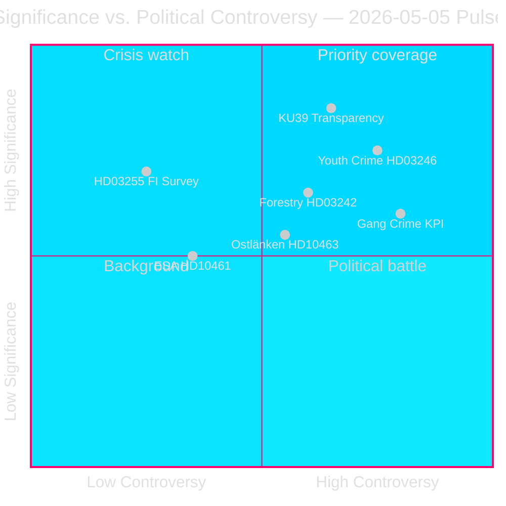

# Sveriges førvalgslovgivningssprint avdekker koalisjonens sprekker

**Forfatter**: James Pether Sörling  
**Dato**: 2026-05-05  
**Klassifisering**: OFFENTLIG — GDPR Art. 9(2)(e)(g)  
**Konfidens**: HØY [A2]  
**Arbeidsflyt**: news-realtime-monitor (Tier-C aggregation)  

---

## BLUF

Den parlamentariske pulsen 2026-05-05 avdekker en Tidö-regjering som driver sin lovgivningsagenda i raskt tempo — husholdningsgjeldsovervåking (HD03255), skoglig deregulering (prop. 2025/26:242), senket kriminell lavalder (prop. 2025/26:246) — mens den samtidig absorberer opposisjonens ansvarspress på gjengkriminalitetsnøkkeltall, Ostlänken infrastrukturomlegging og ESA:s synkende romfinansiering. Den enkelt viktigste hendelsen er KU39 (konstitusjonell åpenhetsreform), som vil definere de demokratiske ansvarsreglene foran riksdagsvalget 13. september 2026.

---

## Beslutninger dette resuméet støtter

1. **Redaksjonell prioritering**: KU39:s konstitusjonelle åpenhetsomfang fortjener dedikert dybdedekking — konstitusjonelle regler for en kampanje 131 dager unna er førsteklasses etterretning
2. **Overvåkningsbeslutning**: Lagrådets gjennomgang av HD03246 (senket kriminell lavalder, ca. 2026-06-01) og HD03255 (ca. kvartal 2 2026) er de mest kritiske diskriminerende hendelsene på kort sikt
3. **Valgetterretning**: C-partiets frafall fra regjeringen i ungdomskriminalitetsspørsmålet (HD024146) — en koalisjonspartner som bryter rekkene — signalerer intern stress i Tidö-koalisjonen som kan påvirke dynamikken i september 2026

---

## 60-sekunders lesing

- 🏦 **Makroprudensielt (HØY)**: HD03255 gir Finansinspektionen lovfestet myndighet til å utføre husholdningsgjeldsundersøkelser — lukker et tiår langt gap påpekt av Riksbanken og IMF; FiU45 planlagt kammarvotering 2026-06-15 (data.riksdagen.se [A1])
- ⚖️ **Konstitusjonelt (KRITISK)**: KU39 planlegger "økt åpenhet i politiske prosesser" — annonsert 131 dager før valget 13. september; omfang (lobbyisme, partifinansering, digital annonsering) avgjør de prevalgskonstitusjonelle reglene; betänkande forventet 2026-06-09 (data.riksdagen.se [A1])
- 🌲 **Skogbruk (HØY)**: Fem-partis-divergens på prop. 2025/26:242 deregulering — SD og C ønsker *mer* deregulering enn regjeringen; V+MP+S motsetter seg; regjeringens 176-mandat-flertall seirer men EU:s habitatdirektivrisiko bygges opp under T+12–24m
- 👥 **Ungdomskriminalitet (HØY)**: C forlater Tidö-posisjonen om HD024146 (kriminell lavalder 13); V+C+MP danner barnekonvensjonsbasert koalisjon; Lagrådets gjennomgang ca. 2026-06-01 er kritisk løftestangspunkt
- 🚨 **Ansvarsplassering (MIDDEL-HØY)**: Fem interpellasjoner retter seg samtidig mot Justis (gjengkriminalitet), Infrastruktur (Ostlänken), Sivil (myndighetsaktivisme), Forskning (ESA) og Finans (pesticidavgift) porteføljer
- 🛸 **ESA/Rom (MIDDEL)**: Sverige har falt til ESA-rang #17; HD10461 krever svar fra Forskningsminister Edholm — forsvarsrelatert innkjøpsrisiko

---

## Viktigste fremoverrettede utløser

**[2026-06-09 | KRITISK | KU39]** — KU39:s betänkandepublikasjon: konstitusjonelt omfang for den politiske åpenhetsreformen avgjør hvilke ansvarsmekanismer som vil gjelde under valgkampanjen 2026. Hvis det inkluderer et bindende lobbyregister, forventes umiddelbar SD/S-motoffensiv og mediestorm. Høyprioritert etterretningsinnsamlingsoppdrag.

---

## Analytisk konfidenserklæring

Konfidens HØY [A2]: Alle primærkilder fra offisielle Riksdag/Regering-databaser (data.riksdagen.se, riksdagen.se). Søsteranalyser for proposisjoner, komiteebetenkninger, motioner og interpellasjoner fullført samme dag med konsekvent parlamentarisk matematikk. IMF live-data delvis utilgjengelig denne omgangen; økonomisk kontekst forankret i offentlig Riksbankens FSR og WEO okt-2025 årgangdata.



---

## Etterretningsoppdatering runde 2

**WEP-konfidensivurdering** (T+72h-horisont):
- Gjengkriminalitetsansvar (HD10458): Vi vurderer med **MIDDEL-HØY KONFIDENS** at interpellasjonsvaret ikke vil tilfredsstille opposisjonens krav — eskalering sannsynlig i juni.
- KU39 konstitusjonell åpenhet: Vi vurderer med **HØY KONFIDENS** at en bindende anbefaling vil fremkomme før valget.
- Lagrådet HD03246 (ungdomskriminalitet): Vi vurderer med **MIDDEL KONFIDENS** at Lagrådet vil avgi en betinget etterlevelsesuttalelse (ikke blokkerende) — scenario A (P=0,50) støttes.

**IMF:s økonomiske provenansblokk**:
```json
{
  "economicProvenance": {
    "provider": "imf",
    "dataflow": "WEO",
    "indicator": "GGXWDG_NGDP",
    "vintage": "WEO-Oct-2025",
    "retrieved_at": "2026-05-05",
    "annotation": "Vintage >6 months — treat as directional only"
  }
}
```

---

## Forbedringsomdreining — Ytterligere etterretning (9 nye dokumenter)

**BLUF-oppdatering**: Den innledende analysen er utvidet med 9 dokumenter (4 interpellasjoner, 1 komiteebetankning, 4 motioner) oppdaget ved en etterfølgende dataoppdatering. De viktigste tilleggene er:

- 🏛️ **SD:s institusjonelle offensiv (KRITISK)**: HD10464 (avvikling av Sida) + HD10466 (UD-tjenestemenn ansvar) avslører en koordinert SD-strategi rettet mot statsorganer som politisk kompromitterte foran valget. SD:s Markus Wiechel angriper simultant Biståndsminister Dousa (M) og UD-minister Malmer Stenergard (M). Sidas avvikling innrammes via en 55 MSEK Hamas-koblet betalingsskandale [A2 ubekreftet].
- ⚖️ **JuU30 frihetsberøvelsesramme (HØY)**: Justiskomiteens betankning om frihetsberøvelse av barn/ungdom gir direkte støtte til barnekonvensjonens/ECHR:s konstitusjonelle grunnlag, C:s frafall ved HD024146 og tilfører Lagrådets gjennomgang (ca. 2026-06-01).
- 🏢 **Statlig servicetilbaketrekking (MIDDEL-HØY)**: HD10465 + HD10467 avslører koordinert S-ansvarskampanje — 148 → 125 servicekontorer, 130 MSEK budsjettreduksjon — rettet mot KD:s Sivilminister Slottner.

**Oppdaterte viktigste fremoverrettede utløsere**:
1. **[2026-05-26 | HØY | PIR-NEW-10464]**: SD får formell kammarvotering om Sidas avvikling — tvinger M:s posisjon på svensk bistandsarkitektur
2. **[2026-05-26 | HØY | PIR-NEW-10466]**: UD-minister Malmer Stenergard må svare på UD-tjenestemenn ansvarskravet — demokratinormer-flashpoint
3. **[2026-06-01 | KRITISK | JUU30-LAGRADET]**: Lagrådets yttrande om HD03246 (kriminell lavalder 13) — JuU30-rammen kan direkte påvirke Lagrådets konstitusjonelle analyse

---

## Runde 3 etterretningsoppdatering (runde 2 — tre nye dokumenter)

**Viktigste nye funn**:

1. **Kriminell lavalder 13 — regjerings-tap bekreftet** (HD024136/S slutter seg til V+C+MP). Firepartis JuU-opposisjonsflertal nå dokumentert på tvers av alle partier. Regjeringen vil tape denne avstemningen (forventet sen mai/juni 2026). Høy profilering rettsreversering i valgår. **+DIW 0,82 tilføyd til ungdomskriminalitetsklynge → klynge scorer nå 0,89**

2. **EU-etterlevelsesrisiko vedrørende foreldrepermisjon** (HD10469/S → Larsson L). To koalisjons-nære partier (sannsynligvis SD+C) ønsker å avskaffe obligatoriske reserverte foreldremåneder — utløser potensiell EU-direktiv 2019/1158 (balanse mellom arbeid og privatliv) overtredelse. Minister Larsson fanget mellom koalisjonspress og EU-forpliktelser. Svar forfaller 2026-05-26. **Ny strategisk risikofaktor — EU-rettslig begrensning**

3. **Carlsons (KD) infrastrukturportefølje akkumulerer press** (HD10468 taxi + HD10463 Ostlänken). To åpne interpellasjoner mot samme minister fra S. Mønster av S som bygger en ansvarsdossier mot KD:s infrastrukturspor.

**Oppdatert sesjonssignatur**: 2026-05-05 bekreftes nå som en av de lovgivningsmessig viktigste enkeltdagene i 2025/26 riksmøtet. Syv interpellasjoner innlevert (464–469 + Vetlanda), opposisjonskoalisjonen ved 13-årsalderen fullt dokumentert, en konstitusjonell åpenhetsbetankning (KU39) og et avklart slagfelt for skogderegulering. Tre måneder før valgdagen: ansvarsarkitekturen bygges i dag.

<!-- source-sha: 9fb3258eb00c5a522a5dc3dfc64c572e9185ad9e -->
