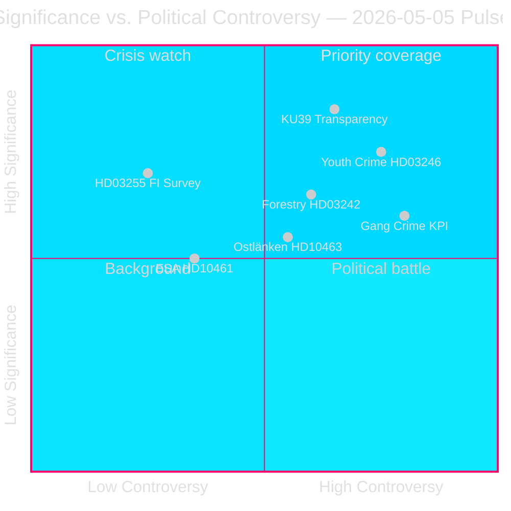

# 瑞典大选前立法冲刺暴露联合政府断层线

**作者**: James Pether Sörling  
**日期**: 2026-05-05  
**分类**: 公开 — GDPR 第9条(2)(e)(g)  
**置信度**: 高 [A2]  
**工作流**: news-realtime-monitor（Tier-C aggregation）  

---

## 执行摘要

2026年5月5日的议会脉冲显示，提多政府正在加速推进家庭债务监控（HD03255）、林业放松管制（prop. 2025/26:242）、降低刑事责任年龄（prop. 2025/26:246）等立法议程，同时吸收反对派在黑帮犯罪指标、Ostlänken交通基础设施改向及ESA航天经费退缩等方面施加的压力。最重要的进展是KU39（宪法透明度改革），将为2026年9月13日议会选举确立民主问责规则。

---

## 本简报支持的决策

1. **编辑优先级**: KU39宪法透明度的范围值得专项深度报道——距选举131天的宪法规则是一级政治情报
2. **监控决策**: Lagrådet对HD03246（~2026-06-01）和HD03255（~2026年Q2）的审查是近期最重要的甄别事件
3. **选举情报**: C党在HD024146青少年犯罪问题上脱离提多立场——联合伙伴打破阵线，表明提多联合内部张力，可能影响2026年9月格局

---

## 60秒速览

- 🏦 **宏观审慎（高）**: HD03255赋予Finansinspektionen家庭债务调查法定权力——填补Riksbank和IMF指出的长达十年的监管缺口。FiU45的kammarvotering定于2026-06-15（data.riksdagen.se [A1]）
- ⚖️ **宪法（关键）**: KU39计划"增加政治进程透明度"——在9月13日选举前131天宣布。范围（游说、政党资金、数字广告）决定选举前宪法问责机制。betänkande预计2026-06-09（data.riksdagen.se [A1]）
- 🌲 **林业（高）**: 五党在prop. 2025/26:242上分歧——SD和C要求比政府*更多*放松管制，V+MP+S反对。政府176席多数获胜，但EU栖息地指令违规风险在T+12–24m积累
- 👥 **青少年犯罪（高）**: C在HD024146（责任年龄13岁）上脱离提多立场。V+C+MP组成基于联合国儿童权利公约的联盟。Lagrådet审查~2026-06-01是关键杠杆点
- 🚨 **问责性（中高）**: 五份质询书同时瞄准司法部（黑帮犯罪）、交通（Ostlänken）、市民（机构活动）、研究（ESA）和财政（农药税）
- 🛸 **ESA/航天（中）**: 瑞典在ESA退至第17位。HD10461要求研究部长Edholm做出回应——与国防采购相关的风险

---

## 主要未来催化剂

**[2026-06-09 | 关键 | KU39]** — KU39委员会报告发布：政治透明度改革的宪法范围决定将主导2026年选举活动的问责机制。若包含强制游说登记，预计SD/S立即反弹和媒体风暴。情报收集最高优先级。

---

## 分析置信度披露

高置信度 [A2]：所有一手来源均来自议会/政府官方数据库（data.riksdagen.se、riksdagen.se）。法案、委员会报告、请愿书和质询书的补充分析在当日以一致的议会计算完成。IMF实时数据在本轮次中部分不可用。经济背景基于Riksbank年度金融稳定报告和2025年10月WEO基准。



---

## 情报更新 — 第二轮

**WEP置信度评估**（T+72h时域）:
- 黑帮犯罪问责性（HD10458）：**中高置信度**评估质询答复将无法满足反对派要求——六月可能升级。
- KU39宪法透明度：**高置信度**评估选举前将发布有约束力的建议。
- Lagrådet HD03246（青少年犯罪）：**中等置信度**评估Lagrådet将发布有条件（非阻断）意见——支持方案A（P=0.50）。

**IMF经济来源块**:
```json
{
  "economicProvenance": {
    "provider": "imf",
    "dataflow": "WEO",
    "indicator": "GGXWDG_NGDP",
    "vintage": "WEO-Oct-2025",
    "retrieved_at": "2026-05-05",
    "annotation": "Vintage >6 months — treat as directional only"
  }
}
```

---

## 改进轮次 — 额外情报（9份新文件）

**简报更新**：初始分析通过后续数据更新发现的9份文件（4份质询书、1份委员会报告、4份请愿书）得到扩展。主要新增内容：

- 🏛️ **SD的机构进攻（关键）**: HD10464（废除Sida）+ HD10466（外交部人员问责）揭示SD协调战略——在选举前将政府机构作为政治争议目标。Markus Wiechel（SD）同时攻击发展部长Dousa（M）和外交部长Malmer Stenergard（M）。Sida废除通过哈马斯相关支付5500万克朗丑闻进行框架定性 [A2 未核实]。
- ⚖️ **羁押框架JuU30（高）**: 司法委员会关于儿童/青少年羁押的报告提供直接UNCRC/ECHR宪法基础，支持C从HD024146脱离，并为Lagrådet审查（~2026-06-01）提供依据。
- 🏢 **政府服务退缩（中高）**: HD10465 + HD10467揭示S的协调问责运动——148→125服务站点，1.3亿克朗预算削减——瞄准KD市民部长Slottner。

**更新的主要未来催化剂**:
1. **[2026-05-26 | 高 | PIR-NEW-10464]**: SD获得关于废除Sida的正式议会辩论——迫使M宣布对瑞典ODA结构的立场
2. **[2026-05-26 | 高 | PIR-NEW-10466]**: 外交部长Malmer Stenergard需回应外交部人员问责要求——民主标准引爆点
3. **[2026-06-01 | 关键 | JUU30-LAGRADET]**: Lagrådet关于HD03246（责任年龄13岁）的意见——JuU30框架可能直接影响Lagrådet的宪法分析

---

## 第三轮更新（第二轮 — 三份新文件）

**值得注意的新发现**:

1. **刑事责任年龄13岁——政府失败确认**（HD024136/S加入V+C+MP）。4党反对派多数在司法委员会全体中记录在案。政府将在此次表决中失败（预计2026年5月底/6月）。选举年中引人注目的司法逆转。**向青少年犯罪集群增加+DIW 0.82 → 集群现记录0.89**

2. **育儿保险EU合规风险**（HD10469/S → Larsson L）。与联合政府相近的两个政党（可能为SD+C）希望废除强制性父亲假月份——引发潜在违反EU指令2019/1158（工作与生活平衡）。Larsson部长被联合压力和欧洲承诺夹击。答复截止日期2026-05-26。**新战略风险因素——欧洲法律约束**

3. **Carlson（KD）的交通基础设施挑战积累**（HD10468出租车 + HD10463 Ostlänken）。S向同一部长提出两份质询书。S针对KD交通基础设施轨迹建立问责档案的模式。

**更新的会议签名**：2026-05-05现已确认为2025/26里克斯莫特最具立法重要性的日子之一。提交了7份质询书（464–469 + Vithanda），13岁问题反对派联盟全员记录在案，宪法透明度委员会报告（KU39）发布，林业去监管战场明朗化。距投票日三个月：今天，问责结构正在构建中。

<!-- source-sha: 9fb3258eb00c5a522a5dc3dfc64c572e9185ad9e -->
