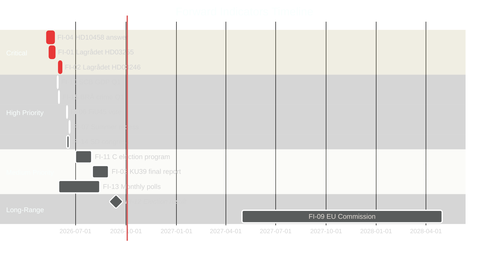

# Forward Indicators — Realtime Pulse 2026-05-05

**Author**: James Pether Sörling  
**Date**: 2026-05-05  
**Minimum 10 dated indicators required by gate check**  

---

## Priority Intelligence Requirements — Forward Indicator Set

| # | Indicator | Expected Date | Significance | PIR Link |
|---|-----------|--------------|-------------|---------|
| FI-01 | Lagrådet yttrande on HD03255 (FI survey mandate) | ~2026-05-20 est. | Confirms or modifies macro-prudential law | PIR-5/HD03255 |
| FI-02 | Lagrådet yttrande on HD03246 (criminal responsibility age 13) | ~2026-06-01 | Critical coalition and constitutional signal | LAGRÅDET-246 |
| FI-03 | KU39 final committee report publication | Pre-election (est. Aug 2026) | Binding or advisory scope of constitutional reform | PIR-3/KU39 |
| FI-04 | HD10458 interpellation answer (Justice Minister Strömmer) | May 2026 riksdag session | Gang crime KPI baseline established or evaded | PIR-NEW-10458 |
| FI-05 | HD10463 interpellation answer (Infrastructure Minister Carlson) | May 2026 riksdag session | Ostlänken capacity analysis credibility | Regional electoral signal |
| FI-06 | FiU45 kammarvotering (budget review context) | 2026-06-15 est. | Fiscal framework for autumn election | Budget benchmark |
| FI-07 | Riksdag summer recess commencement | ~2026-06-20 | Legislative freeze — all pending bills carried or dropped | General legislative calendar |
| FI-08 | Riksbank FSR autumn 2026 publication | October 2026 (post-election) | HD03255 implementation assessment context | Fiscal stability |
| FI-09 | European Commission formal information request re: Swedish forestry | T+12-24m (est. 2027–2028) | EU Habitats infringement trigger | EU-HABITATS-SE |
| FI-10 | SCB quarterly GDP Q1 2026 release | ~2026-05-29 | Economic backdrop for election campaign | Economic indicators |
| FI-11 | C party election campaign program publication | est. June–July 2026 | C independence signal vs Tidö-adjacent | Coalition posture |
| FI-12 | September 13, 2026 election result | 2026-09-13 | Definitive outcome — all scenario resolutions | All PIRs |
| FI-13 | Novus/Kantar/Sifo monthly polls June-August | Monthly through Aug 2026 | Trend indicators for scenario probability updates | Scenario A/B/C |
| FI-14 | SD annual party congress (June 2026 est.) | June 2026 | SD priorities for autumn — agency governance, crime | HD10459 signal |
| FI-15 | BRÅ crime statistics Q1 2026 | ~2026-06-01 | Gang crime trend data for Strömmer accountability | HD10458 context |

---

## Indicator Watch Calendar

---

## Conditional Indicator Triggers

**If FI-02 (Lagrådet HD03246) is negative** → escalate to Scenario C monitoring; FI-11 (C program) significance increases dramatically  
**If FI-04 (HD10458 answer) provides KPI baseline** → Scenario A probability increases to 0.60; de-escalate gang crime risk  
**If FI-13 (polls) shows C below 5%** → FI-12 election outcome scenario shifts toward Scenario B/C  
**If FI-09 (EU Commission) formal request arrives** → EU-HABITATS-SE PIR escalates to HIGH; impact on SD/M forestry deregulation narrative

---

## Updated Forward Indicators — Improvement Pass (9 New Documents)

| # | Indicator | Expected Date | Significance | PIR Link |
|---|-----------|--------------|-------------|---------|
| FI-16 | HD10464 interpellation answer (Sida abolition) | 2026-05-26 | SD floor debate on Sida future — M government ODA position | PIR-NEW-10464 |
| FI-17 | HD10466 interpellation answer (UD civil servants) | 2026-05-26 | FM Malmer Stenergard on civil service neutrality | PIR-NEW-10466 |
| FI-18 | HD10465 interpellation answer (state service withdrawal) | 2026-05-26 | Civilminister Slottner on 23 closed service offices | PIR-NEW-10465 |
| FI-19 | JuU30 → Lagrådet HD03246 reference | ~2026-06-01 | Does Lagrådet cite JuU30 in youth crime yttrande? | JUU30-LAGRADET |
| FI-20 | Media amplification of Sida 55 MSEK Hamas claim | Within 7 days | Will HD10464 claim be substantiated or refuted? | PIR-NEW-10464 |
| FI-21 | Government formal Sida abolition proposal | 2026-07 to 2026-09 | Would require Riksdag act — pre-election legislative window closing | PIR-NEW-10464 |

**Conditional triggers (new)**:
- **If FI-20 (Hamas claim verified)** → HD10464 upgrades from positioning to substantive accountability; Dousa credibility at risk
- **If FI-17 (Malmer Stenergard defends UD staff)** → Constitutional scholars activate; possible EU/Nordic partner concern about Swedish institutional norms
- **If FI-19 (Lagrådet cites JuU30)** → KJ-7 confirmed; C's defection upgraded from "isolated" to "legally grounded"

---

## Run 3 Forward Indicators (New — HD10469, HD024136)

| ID | Indicator | Source | Horizon | Signal |
|----|-----------|--------|---------|--------|
| FI-22 | HD10469 answer by Larsson (L) — EU Work-Life Balance Directive position | HD10469 deadline 2026-05-26 | T+21d | If Larsson avoids EU compliance question → escalation risk to Commission. Watch L's answer for whether government commits to maintain reserved months |
| FI-23 | JuU vote on prop. 2025/26:246 age-13 provision | JuU committee, HD024136+HD024142+HD024146+HD024148 | T+21-45d | Expected government defeat when 4-party majority (V+S+C+MP) votes down age-13. Watch M/KD response: will Strömmer accept or trigger motion of confidence? |
| FI-24 | Transportstyrelsen taxi inspection follow-up | HD10468 deadline 2026-05-26 | T+21d | Carlson (KD) answer to HD10468 will reveal whether government will tighten enforcement or accept status quo. Low salience but accumulates infrastructure portfolio accountability. |
