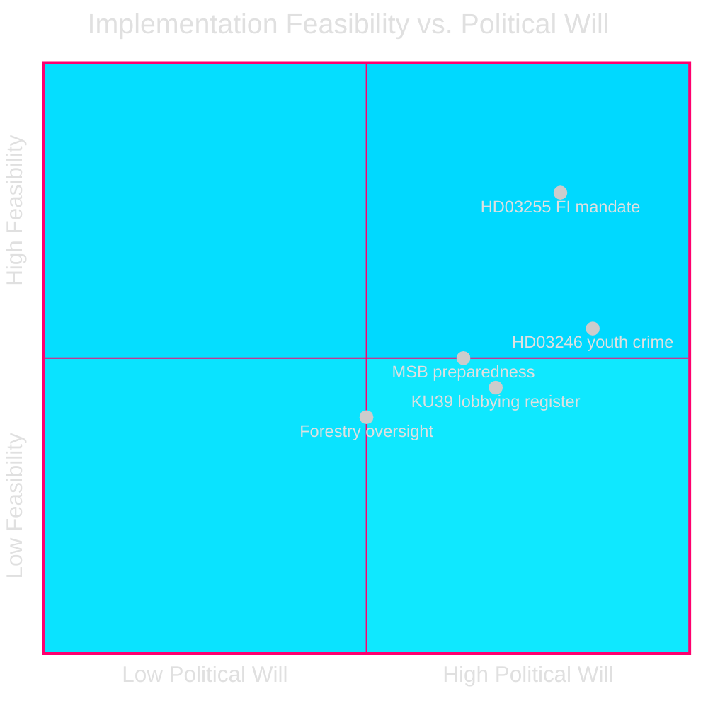

# Implementation Feasibility — Realtime Pulse 2026-05-05

**Author**: James Pether Sörling  
**Date**: 2026-05-05  

---

## Delivery Risk Analysis

| Document | Implementation Challenge | Risk Level | Statskontoret Relevance |
|----------|------------------------|------------|------------------------|
| HD03255 (FI mandate) | Requires FI operational capacity for annual surveys; IT infrastructure for data collection | MEDIUM | YES — FI's analytical capacity may require Statskontoret performance review |
| KU39 (constitutional transparency) | Lobbying register requires new public registry infrastructure; digital ad transparency requires cross-agency coordination | HIGH | YES — new registries historically require Statskontoret feasibility review |
| Prop. 2025/26:242 (forestry) | Enforcement of retained regulations while deregulating others creates inspection ambiguity for Länsstyrelserna | MEDIUM-HIGH | PARTIAL — Statskontoret review of Skogsstyrelsen oversight likely needed |
| HD03246 (youth crime age 13) | BRÅ must develop new juvenile justice methodology; socialtjänsten must expand capacity | HIGH | YES — implementing criminal responsibility at 13 requires major public sector capacity changes |
| MSB preparedness (HD10462 context) | Civil preparedness improvements require multi-agency coordination (MSB, Försvarsmakten, municipalities) | HIGH | YES — Statskontoret has relevant prior reports on MSB coordination efficiency |

---

## Statskontoret Evaluation Tracking

**Relevant Statskontoret mandates that may intersect with today's documents**:

1. **FI institutional capacity review (periodic)**: HD03255 creates new FI mandate; Statskontoret review of FI operational capacity in fiscal 2025/26 is relevant.
2. **BRÅ juvenile crime methodology update**: HD03246 implementation will require BRÅ to extend crime statistics to under-15 age groups; requires Statskontoret approval of methodology changes.
3. **Skogsstyrelsen oversight after deregulation**: If prop. 2025/26:242 passes, Statskontoret should evaluate whether Skogsstyrelsen has appropriate monitoring capacity for retained species protections.

---

## Legislative Timeline to Summer Recess

| Document | Kammarvotering date | Status | Post-recess |
|----------|--------------------|---------|----|
| HD03255 | ~May-June 2026 | Lagrådet pending | Passage likely |
| KU39 | Pre-election publication | Committee report | Not a bill; advisory |
| HD01FiU49 | Annual evaluation — noted | Done | N/A |
| HD024146–HD024148 motions | Beredning → rejected or referred | Not government bills | N/A |
| HD03246 (gov youth crime) | ~June 2026 | Lagrådet opinion ~June 1 | Passage conditional on Lagrådet |

---

## Feasibility Confidence Matrix

---

## Improvement Pass — Implementation Feasibility (New Documents)

### Sida Abolition (HD10464) — Feasibility: VERY LOW (pre-election)
Abolishing Sida requires: government proposal → Riksdag debate → committee review → kammarvotering. Timeline: 12-18 months minimum. Pre-election window closes ~2026-06-20 (summer recess). Feasibility before election: 0%.

### UD Civil Servant Accountability (HD10466) — Feasibility: LOW
Legally, the government cannot conduct career/salary audits based on political opinion expression alone (RF Ch.12 and FOI protections). Any such audit would face immediate Justitiekanslern challenge. The interpellation will produce a ministerial answer refusing the audit. Feasibility of career audit: 0%.

### State Service Restoration (HD10465) — Feasibility: VERY LOW
The 130 MSEK budget cut is embedded in the spring budget. Reversal before election requires supplementary budget. No political will from government. Feasibility of reversal pre-election: <5%.
