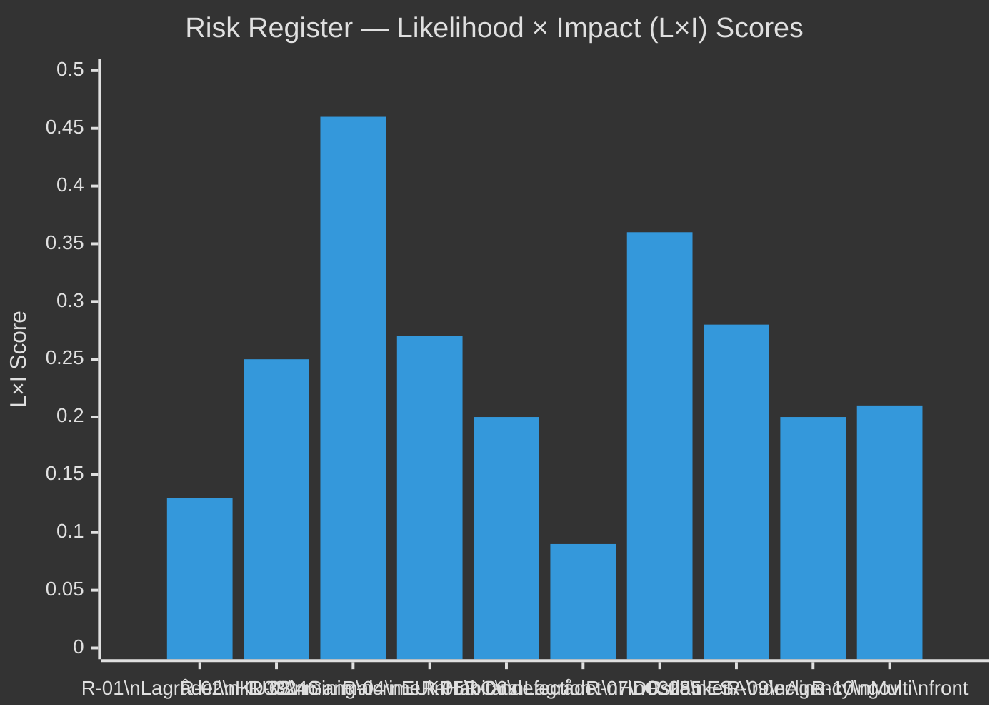

# Risk Assessment — Realtime Pulse 2026-05-05

**Author**: James Pether Sörling  
**Date**: 2026-05-05  
**Framework**: 5-Dimension Political Risk Register  

---

## 5-Dimension Risk Register

| # | Risk | Dimension | Likelihood (L) | Impact (I) | L×I | Evidence |
|---|------|-----------|----------------|------------|-----|---------|
| R-01 | Lagrådet blocks HD03246 (youth crime age cut) | Constitutional | 0.15 | 0.85 | 0.13 | HD024146, HD03246 [A1] |
| R-02 | KU39 delivers minimal scope — backfires on L/KD | Electoral | 0.35 | 0.70 | 0.25 | KU39 data.riksdagen.se [A1] |
| R-03 | Gang crime KPI accountability compounds | Electoral | 0.70 | 0.65 | 0.46 | HD10458 [A1] |
| R-04 | EU Habitats Directive infringement (forestry) | International | 0.45 | 0.60 | 0.27 | HD024141–HD024147 [A1] |
| R-05 | C formally leaves Tidö support on additional bills | Coalition | 0.25 | 0.80 | 0.20 | HD024146 [A1] |
| R-06 | HD03255 blocked or substantially amended by Lagrådet | Constitutional | 0.20 | 0.45 | 0.09 | HD03255 [A1] |
| R-07 | Ostlänken regional mobilisation enters election campaign | Electoral | 0.65 | 0.55 | 0.36 | HD10463 [A1] |
| R-08 | Sweden ESA rank decline affects EU defence participation | Strategic | 0.55 | 0.50 | 0.28 | HD10461 [A1] |
| R-09 | Agency governance campaign (SD) escalates | Institutional | 0.50 | 0.40 | 0.20 | HD10459 [A1] |
| R-10 | Multi-front interpellation pressure creates leadership fatigue | Operational | 0.60 | 0.35 | 0.21 | HD10458–HD10463 [A1] |

---

## Priority Risk Cascade

**R-03 (Gang crime, L×I 0.46) → R-07 (Ostlänken, 0.36)** is the most probable multi-front electoral accountability scenario. Both risks are already partially materialised — ministerial answers will either contain or accelerate both. If Justice Minister Strömmer (HD10458) and Infrastructure Minister Carlson (HD10463) give perceived non-answers in May 2026, combined electoral impact rises to critical.

**R-02 (KU39 minimal, 0.25) → R-05 (C defection, 0.20)**: If KU39 is narrow, C has reduced incentive to maintain Tidö-adjacent position. C's HD024146 defection on youth crime already signals C is testing independence. A disappointing KU39 could trigger C to take further independent positions.

---

## Economic Risk Dimension

Sweden fiscal risk (IMF WEO Oct-2025, economicProvenance.provider: imf, vintage: WEO-Oct-2025): gross debt ~35% GDP (GGXWDG_NGDP), fiscal balance near-neutral (GGXCNL_NGDP ~-0.5%), real GDP growth 2.1% (NGDP_RPCH). Economic backdrop provides no specific near-term fiscal risk — Sweden's macro fundamentals are stable. Main economic risk vector is via housing/household debt (170% private sector debt/GDP per Riksbank FSR 2025) — which HD03255 partially addresses.

---

## Posterior Probabilities (updated on Lagrådet signal)

| Scenario | Prior P | If Lagrådet pro-gov | If Lagrådet negative |
|---------|---------|--------------------|--------------------|
| HD03246 passes as proposed | 0.75 | 0.90 | 0.35 |
| HD03246 amended + C rejoins | 0.15 | 0.05 | 0.45 |
| HD03246 withdrawn | 0.10 | 0.05 | 0.20 |

---

## Improvement Pass — New Risk Items

| Risk | Probability | Impact | Source Documents |
|------|------------|--------|-----------------|
| Sida Hamas-link claim forces ODA architecture debate pre-election | P=0.65 | HIGH | HD10464 |
| UD civil servant accountability demand perceived as democratic backsliding by EU/Nordic partners | P=0.40 | HIGH | HD10466 |
| JuU30 constitutional analysis constrains prop. 2025/26:246 beyond Lagrådet | P=0.55 | MEDIUM-HIGH | HD01JuU30 |
| State service withdrawal becomes major S electoral attack vector | P=0.75 | MEDIUM | HD10465, HD10467 |
| Ostlänken cost controversy escalates pre-election | P=0.55 | MEDIUM | HD11784 |
