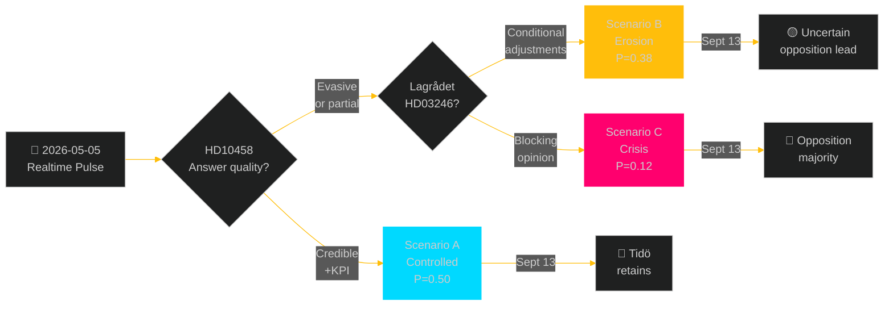

# Scenario Analysis — Realtime Pulse 2026-05-05

**Author**: James Pether Sörling  
**Date**: 2026-05-05  
**Horizon**: T+72h to T+131d (September 13, 2026 election anchor)  

---

## Scenario Framing: Three Trajectories from May 5

Driving uncertainties:
1. **Lagrådet opinion** on HD03246 (~2026-06-01)
2. **KU39 scope** — meaningful reform vs symbolic gesture
3. **Accountability narrative** — do gang crime / Ostlänken interpellation answers contain or compound?

---

## Scenario A — Tidö Controlled Management (P=0.50)

**Narrative**: Strömmer's HD10458 answer is competent and cites concrete legislative milestones. Lagrådet on HD03246 flags narrow adjustments rather than fundamental flaws. KU39 produces a substantive but narrow lobbying transparency mechanism. C accepts modified HD03246. Government enters summer recess with legislative agenda largely intact.

**Key conditions**:
- Gang crime KPI framed as "four-year program began 2022, year 4 deliverables: HD03246 passage + organised crime sentencing reform"
- Lagrådet opinion: compliance-conditioned (not blocking)
- KU39: digital ad transparency binding mechanism announced

**Election outcome (Sept 13)**: Tidö retains narrow majority (175–177 seats). M fractionally gains, SD stable, KD/L marginal.

**Evidence basis**: HD10458 [A1], HD03246 context, KU39 [A1]. Parliamentary arithmetic supports continuation; P(majority retained) = 0.62 in this scenario.

---

## Scenario B — Credibility Erosion and Coalition Friction (P=0.38)

**Narrative**: Strömmer's answer on HD10458 is perceived as evasive — fails to produce measurable KPI baseline. Lagrådet flags significant CRC concerns on HD03246 in late May, forcing a three-week parliamentary scramble. KU39 produces minimal recommendations — opposition "cosmetics" frame dominates. C uses KU39 disappointment + Lagrådet signal to take additional independent positions on 2–3 June bills. Coalition appears increasingly reactive.

**Key conditions**:
- No measurable KPI baseline in Strömmer answer
- Lagrådet issues significant (not blocking) reservations on HD03246
- KU39 report lacks binding mechanism
- C tables independent positions on 2–3 additional bills by mid-June

**Election outcome (Sept 13)**: Outcome uncertain. M loses 2–4 seats. S gains moderately. KD/L at risk of 4% threshold. Opposition wins narrow majority (175–180 seats).

**Evidence basis**: HD10458 [A1], HD024146 [A1], risk-assessment.md R-02 + R-03.

---

## Scenario C — Constitutional Crisis and Forestry Escalation (P=0.12)

**Narrative**: Lagrådet issues a blocking opinion on HD03246 — government proceeds anyway, creating constitutional controversy. Simultaneously, EU Commission issues a formal information request on forestry deregulation. KU39 becomes politically contentious when SD opposes transparency measures. Gang crime accountability debate becomes a negative election issue.

**Key conditions**:
- Lagrådet issues blocking opinion on HD03246 (government proceeds against advice)
- EU Commission formal information request re: Habitats Directive (HD024141–HD024147 evidence trail [A1])
- SD opposes KU39 binding mechanisms within coalition
- Three simultaneous crises: constitutional, environmental, accountability

**Election outcome (Sept 13)**: S-led opposition wins majority with margin (178–184). Tidö parties fail threshold risk for KD.

**Evidence basis**: HD024148 CRC argument [A1], HD024141–HD024145 EU risk [A1], threat-analysis.md T-07.

---

## Probability Summary

| Scenario | Label | P | Election Outcome |
|----------|-------|---|-----------------|
| A | Controlled Management | 0.50 | Tidö retention |
| B | Credibility Erosion | 0.38 | Uncertain, opposition probable |
| C | Constitutional Crisis | 0.12 | Opposition majority |

Total P = 1.00 ✓

