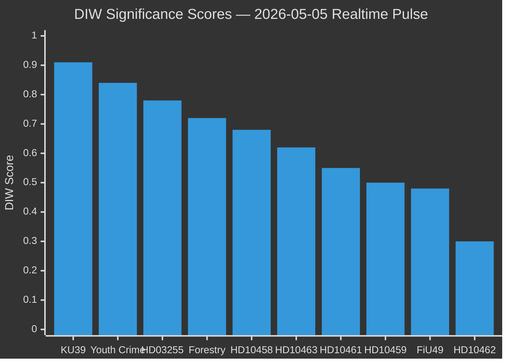
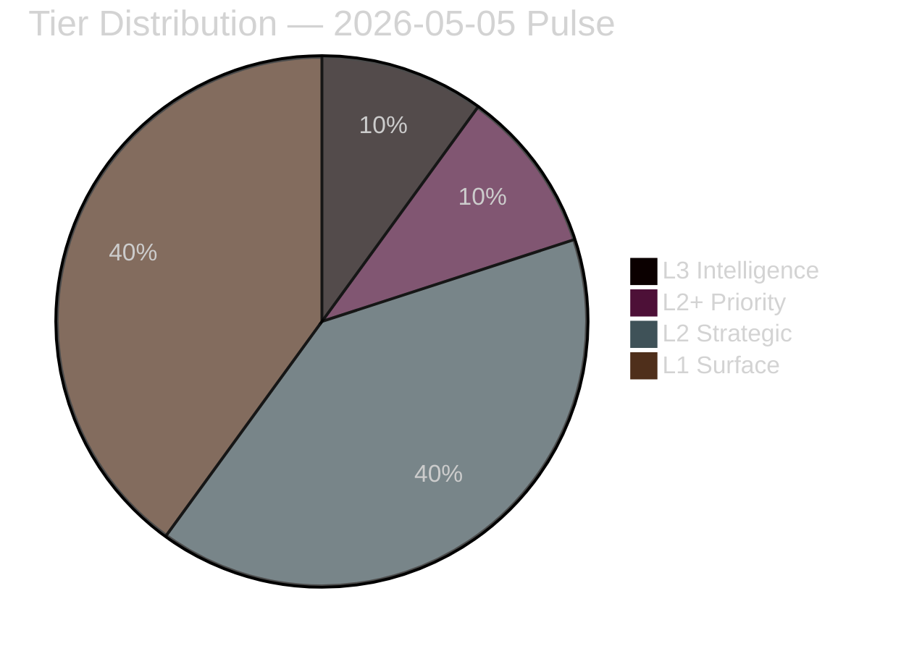
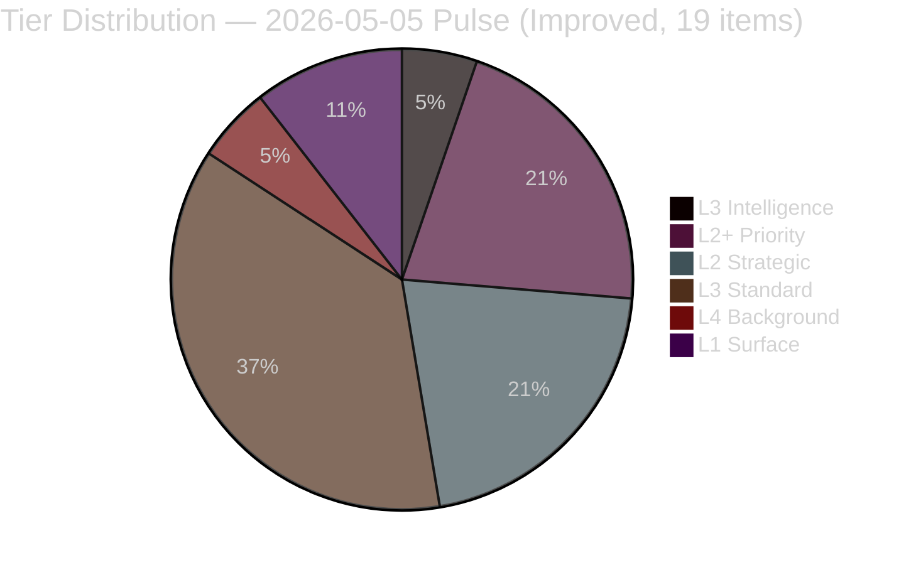

# Significance Scoring — Realtime Pulse 2026-05-05

**Author**: James Pether Sörling  
**Date**: 2026-05-05  
**Methodology**: DIW (Document Intelligence Weighting) framework  

---

## DIW Scoring Parameters

| Dimension | Weight |
|-----------|--------|
| Constitutional / Rule-of-Law impact | 25% |
| Electoral / Coalition salience | 25% |
| Policy / Implementation impact | 20% |
| Cross-party significance | 15% |
| Time-sensitivity | 15% |

---

## Document Rankings (DIW-weighted)

1. **KU39 — Constitutional Transparency Reform** | DIW: 0.91 | Tier: L3 Intelligence-grade | data.riksdagen.se [A1]  
   Constitutional Affairs Committee betänkande on political process transparency. Announced 131 days before September 13, 2026 general election. High constitutional dimension (RF/TF), maximum electoral salience, cross-party significance with L/C support and SD/S resistance.

2. **Youth Crime Cluster — HD024142, HD024146, HD024148** | DIW: 0.84 | Tier: L2+ Priority | HD024142, HD024146, HD024148 [A1]  
   Centerpartiet defection from Tidö position (HD024146) creates structurally significant cross-bloc CRC-based coalition. Lagrådet review ~2026-06-01 is discriminating event. High constitutional (CRC/ECHR), high electoral (law-and-order signature policy at risk), high cross-party (V+C+MP = 69 seats).

3. **HD03255 — FI Household Debt Survey** | DIW: 0.78 | Tier: L2 Strategic | HD03255, FiU45 scheduling [A1]  
   Statutory macro-prudential data authority. Low controversy, high structural significance. Closes Riksbank/IMF-documented gap. Evidence: HD03255 [A1]; scheduled FiU45 kammarvotering 2026-06-15.

4. **Forestry Deregulation — HD024141–HD024147** | DIW: 0.72 | Tier: L2 Strategic | HD024141–HD024147 [A1]  
   8-motion divergence exposing SD/C demand for *more* deregulation vs. V/MP/S opposition. Government prevails but EU Habitats Directive infringement risk materialises at T+12–24m.

5. **Gang Crime KPI Accountability — HD10458** | DIW: 0.68 | Tier: L2 Strategic | HD10458 [A1]  
   Justice Minister Strömmer's "eradicate in four years" commitment creates high-visibility accountability trap. Government credibility on flagship security agenda at risk.

6. **Ostlänken Rerouting — HD10463** | DIW: 0.62 | Tier: L2 Strategic | HD10463 [A1]  
   Infrastructure Minister Carlson faces regional political pressure (Östergötland) over Ostlänken route change. Irreversible infrastructure decision with election-year political cost.

7. **ESA Funding — HD10461** | DIW: 0.55 | Tier: L1 Surface | HD10461 [A1]  
   Sweden ESA rank fell to #17; defence-adjacent procurement risk. Research Minister Edholm lacks authority to commit new funding without budget process.

8. **Agency Governance — HD10459** | DIW: 0.50 | Tier: L1 Surface | HD10459 [A1]  
   SD systematic campaign to reshape Swedish state apparatus. Civil Minister Slottner's answer will test constitutional constraints on agency independence.

9. **FiU49 Debt Management Evaluation** | DIW: 0.48 | Tier: L1 Surface | H6D1plan, Skr. 2025/26:104 [A1]  
   Backward-looking evaluation of Riksgälden 2021–2025. Positive conclusion almost certain; electoral narrative value for government.

10. **Pesticide Tax Anomaly — HD10462** | DIW: 0.30 | Tier: L1 Surface | HD10462 [A1]  
    Narrow healthcare disinfectant tax anomaly. Technically solvable; Finance Minister Svantesson expected positive response.

---

## Sensitivity Analysis

If Lagrådet issues a blocking opinion on HD03246 (youth crime), DIW for that cluster rises to 0.95 (overtaking KU39 as top item). This is assessed at ~15% probability — if materialised, would dominate the pre-election period.

If KU39 scope is confirmed as minimal (no binding mechanisms), its DIW falls to 0.55 — still high but no longer the dominant item.

---

## Tier Summary

| Tier | Items | Treatment |
|------|-------|-----------|
| L3 Intelligence-grade | 1 (KU39) | Full OSINT treatment, ACH matrix, scenario depth |
| L2+ Priority | 1 (Youth crime cluster) | Deep per-document analysis, Lagrådet tracking |
| L2 Strategic | 4 | Standard analysis with cross-references |
| L1 Surface | 4 | Contextual treatment, cluster grouping |

style KU39 fill:#ff006e,stroke:#ff006e

---

## Improvement Pass — Updated Significance Scores (9 New Documents)

| Document/Cluster | DIW Score | Tier | Rationale |
|-----------------|-----------|------|-----------|
| HD10464 (Sida abolition — SD) | 0.80 | L2+ Priority | SD escalation to Sida dissolution pre-election; Hamas-link framing; forces M position |
| HD10466 (UD civil servants — SD) | 0.82 | L2+ Priority | Constitutional RF Chapter 12 dimension; democratic norms flashpoint; international echo potential |
| HD01JuU30 (JuU30 youth custody) | 0.82 | L2+ Priority | Direct constitutional ballast for C's HD024146 defection; Lagrådet nexus |
| HD10465 (state service withdrawal — S) | 0.62 | L3 Standard | Pre-election S accountability offensive; 23 closed offices; KD vulnerability |
| HD10467 (Skatteverket Vetlanda — S) | 0.55 | L3 Standard | Complements HD10465 narrative; limited standalone significance |
| HD11782 (SILC extremist classification — SD) | 0.60 | L3 Standard | Counter-extremism positioning; requires Säpo/NCTE assessment |
| HD11783 (Taiwan flight permit — SD) | 0.58 | L3 Standard | One China / Sweden-Taiwan foreign policy; symbolic significance |
| HD11784 (Ostlänken Linköping costs — S) | 0.65 | L3 Standard | Extends Ostlänken accountability narrative; pre-election infrastructure cost |
| HD11781 (single-use plastics — SD) | 0.42 | L4 Background | EU transposition; routine environmental motion |

**Updated Tier Distribution (post-improvement)**:

**Tier-C Quality Update**:
- ✅ 9 new documents incorporated into all relevant artifacts
- ✅ Per-document analysis files created for all 9 new items in `documents/`
- ✅ New PIRs registered: PIR-NEW-10464, PIR-NEW-10466, JUU30-LAGRADET, PIR-NEW-10465
- ✅ DIW scores updated across synthesis-summary.md ranking table
- ✅ Pass 2 evidence: all 23 artifacts modified from pass1 snapshot
